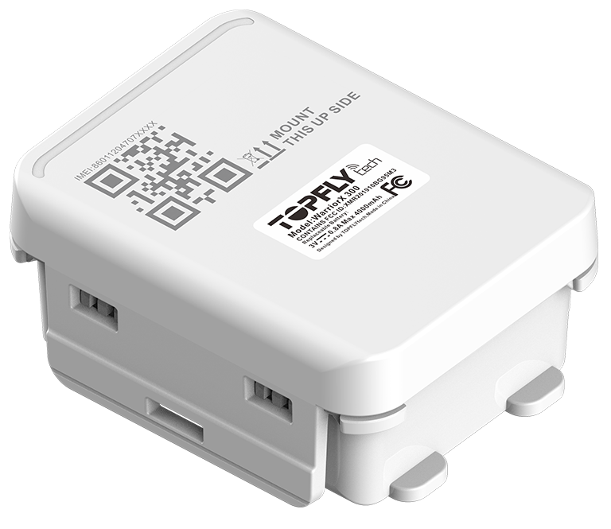

# TopFly - WarriorX 300

El TopFly WarriorX 300 es un rastreador GPS resistente y compatible con Plaspy, diseñado para el monitoreo de activos en exteriores a largo plazo. Como dispositivo autónomo alimentado por baterías reemplazables no recargables, está concebido para ofrecer reportes durante varios años en remolques, contenedores, activos de alto valor y equipos distribuidos. El producto prioriza la durabilidad y el bajo mantenimiento en despliegues con acceso limitado.

Por su robustez y perfiles de reporte configurables, el WarriorX 300 se integra muy bien con Plaspy para la gestión de flotas y activos. Al conectarlo con Plaspy, usted podrá recibir actualizaciones de posición, alertas y telemetría de condiciones desde el dispositivo para mantener visibilidad, automatizar notificaciones y reducir la carga de mantenimiento en activos distribuidos.

## Características principales

- Diseñado para despliegues exteriores a largo plazo con baterías reemplazables no recargables que permiten reportes por varios años.
- Carcasa resistente con certificación IP67 para operar de forma fiable en entornos exigentes y logística exterior.
- Perfiles de reporte configurables y modo SVR para equilibrar la duración de la batería con actualizaciones de mayor frecuencia cuando sea necesario.
- Alertas de extracción y manipulación, además de múltiples opciones de montaje para soportar flujos de trabajo de antirrobo y detección de manipulación.
- GNSS multiconstelación para posicionamiento consistente y reportes de ubicación precisos.
- Soporte BLE para accesorios, como sensores opcionales de temperatura y humedad que amplían la visibilidad ambiental.
- Diseñado para integrarse con plataformas de flotas como Plaspy para monitoreo centralizado y gestión de alertas.

## Cómo funciona con Plaspy

Al integrarse con Plaspy, el WarriorX 300 envía fijaciones de ubicación, estado del dispositivo y notificaciones de eventos a través de redes celulares, de modo que usted puede monitorear activos en tiempo real y revisar movimientos históricos. Plaspy recolecta esa información para mostrar mapas en vivo, alertas automáticas e informes a nivel de flota que apoyan la toma de decisiones operativas.

- Actualizaciones de ubicación y estados en tiempo real visibles en los paneles y mapas de Plaspy.
- Alertas de manipulación y extracción integradas en Plaspy para activar notificaciones y flujos de trabajo basados en geocercas.
- Indicadores de batería y salud del dispositivo disponibles en Plaspy para planificar mantenimiento y ciclos de reemplazo.
- Telemetría de condiciones proveniente de sensores Bluetooth de temperatura y humedad reenviada a Plaspy para monitoreo de cadena de frío y ambientales.
- Configuración y aprovisionamiento remotos compatibles con los flujos de trabajo habilitados en Plaspy para ajustar perfiles de reporte según cambien las necesidades operativas.

## Casos de uso típicos

- Seguimiento de remolques y contenedores para visibilidad de activos no atendidos a largo plazo.
- Protección de activos de alto valor mediante alertas de extracción y geocercas integradas con notificaciones de Plaspy.
- Visibilidad logística y de equipos que equilibra reportes de bajo consumo con actualizaciones de alta frecuencia impulsadas por eventos.
- Monitoreo de cadena de frío cuando se empareja con sensores Bluetooth de temperatura y humedad para combinar ubicación y telemetría de condiciones.
- Telemetría de activos en sitios remotos como bombas, generadores y unidades de almacenamiento donde la carcasa robusta y la larga vida de batería reducen las visitas de mantenimiento.

## Por qué elegir este rastreador con Plaspy

El WarriorX 300 es una opción práctica para organizaciones que necesitan rastreadores duraderos y de bajo mantenimiento que alimenten una plataforma centralizada de gestión de flotas o activos. Su combinación de construcción robusta, perfiles de reporte configurables y soporte de accesorios ayuda a los usuarios de Plaspy a mantener una visibilidad de ubicación precisa mientras minimizan los requisitos de servicio en campo.

Si desea evaluar cómo se integra el WarriorX 300 en su despliegue con Plaspy, conozca más sobre Plaspy en el sitio principal https://www.plaspy.com. Las especificaciones y la disponibilidad del producto pueden cambiar con el tiempo, por lo que le recomendamos verificar los detalles actuales en el sitio del fabricante https://www.topflytech.com/ antes de finalizar la adquisición.
