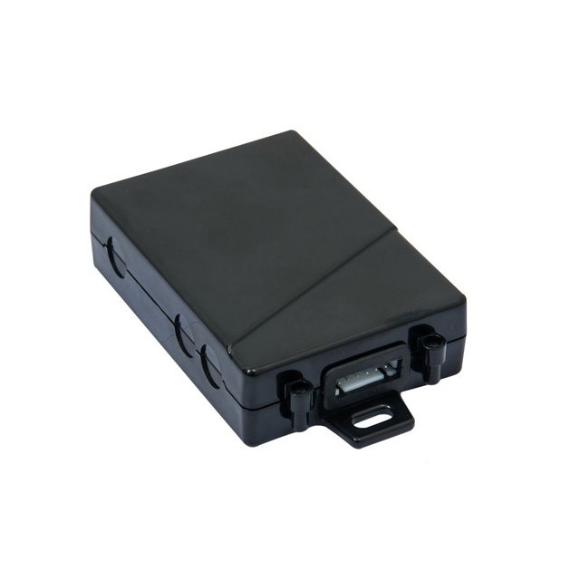

# TopShine - MT01

El TopShine MT01 es un rastreador GPS vehicular 4G compacto pensado para un seguimiento confiable en motocicletas, autos, camiones y bicicletas eléctricas. Combina un formato mini (80 × 58 × 22 mm) con una carcasa resistente a la intemperie, antena integrada y amplio rango de voltaje para facilitar la instalación en entornos exigentes sin perder discreción. El equipo incluye registro de datos integrado, batería de respaldo y entradas inteligentes, además de soporte opcional para sensores como monitoreo de combustible y alertas de seguridad para el conductor.

Como dispositivo compatible con Plaspy, el MT01 entrega ubicación en tiempo real, telemetría y eventos a la plataforma Plaspy para monitoreo y generación de reportes unificados. Plaspy procesa los informes del rastreador y pone a disposición de gestores de flota y operadores posiciones en vivo, alertas por geocerca, eventos del conductor y trazas históricas, permitiendo supervisión centralizada y alertas accionables desde vehículos equipados con MT01.

## Características principales

- Compatible con Plaspy para seguimiento en tiempo real y telemetría de flotas sin interrupciones.
- Amplio rango de voltaje para adaptarse a distintos sistemas eléctricos vehiculares.
- Conectividad celular multibanda 2G/3G/4G con antena integrada para cobertura amplia.
- Registrador de datos interno de 4 MB que preserva ubicaciones y eventos ante pérdidas temporales de conectividad.
- Funciones avanzadas de seguridad y antirobo, incluyendo SOS y control remoto de inmovilizador.
- Integración opcional con sensores para monitoreo de combustible, alcohol y detección de choque, además de identificación de conductor.
- Carcasa compacta y resistente a la intemperie con amplio rango de temperatura operativa para condiciones exigentes.

## Cómo funciona con Plaspy

Cuando está conectado, el MT01 envía datos de ubicación y eventos por la red celular a Plaspy, donde esa información se consolida en mapas, alertas y reportes. Plaspy presenta estos datos en interfaces web y móviles y soporta comandos remotos y cambios de configuración para ajustar el comportamiento de rastreo y los umbrales de alarmas.

- Actualizaciones de ubicación y telemetría en tiempo real disponibles en Plaspy para mapeo y reproducción de rutas.
- Reporte de eventos por incidentes del conductor y del vehículo, como SOS, salidas/entradas de geocercas y alertas por corte de alimentación externa.
- Soporte para monitoreo de combustible cuando se conecta un sensor compatible, permitiendo reportes y visibilidad del consumo en Plaspy.
- Control remoto de inmovilizador y mensajes de confirmación para respaldar flujos de trabajo antirobo.
- Entradas opcionales de seguridad del conductor, como sensores de alcohol y choque, que pueden generar alertas y registros en la plataforma.
- Carga de datos offline desde el registrador del MT01 que conserva trazas históricas para su importación a Plaspy cuando se restablece la conectividad.

## Casos de uso típicos

- Seguimiento de flotas mixtas para autos, camiones, motocicletas y vehículos eléctricos ligeros con monitoreo unificado.
- Flujos de trabajo antirobo y recuperación utilizando corte remoto del motor y alertas por corte de alimentación externa.
- Prevención de robo de combustible y reportes de consumo cuando se conecta un sensor de combustible compatible.
- Monitoreo de seguridad y cumplimiento del conductor con sensores opcionales de alcohol, choque y fatiga.
- Logística y verificación de rutas con reproducción de trazas históricas para análisis operativo.

## Por qué elegir este rastreador con Plaspy

El MT01 ofrece una combinación equilibrada de hardware robusto y funciones orientadas a flotas, ideal para organizaciones que buscan un rastreo confiable compatible con Plaspy. Su tolerancia a voltajes variados y diseño compacto resistente a la intemperie reducen la complejidad de instalación en distintos tipos de vehículo, mientras que el registrador de datos integrado ayuda a mantener continuidad en los registros durante brechas de cobertura. La flexibilidad de entradas y sensores opcionales permite a las flotas ampliar sus capacidades de monitoreo con el tiempo sin necesidad de reemplazar el dispositivo.

Si está evaluando rastreadores para la gestión de flotas con Plaspy, el MT01 es una opción práctica cuando necesita un equipo discreto con alertas basadas en eventos y retención de datos offline. Para conocer más sobre Plaspy y cómo integrar dispositivos MT01 en un flujo de trabajo de gestión de flotas unificado visite https://www.plaspy.com. Las especificaciones, disponibilidad y detalles del fabricante pueden cambiar con el tiempo; verifique la información técnica y las opciones de accesorios actuales en el sitio oficial de TopShine https://www.gztopshine.com/.
