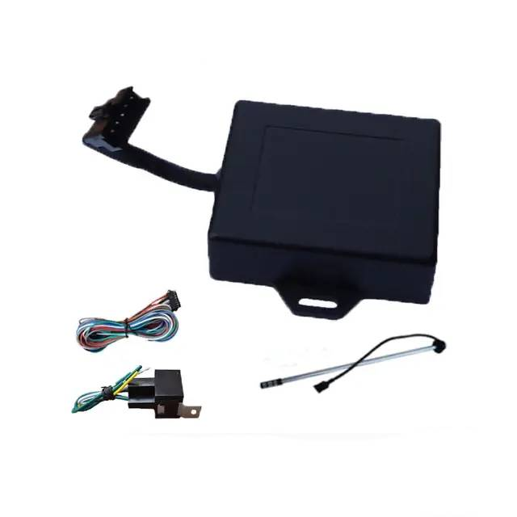

# TopShine - MT08B

El MT08B Portable Motorcycle GPS Tracker de TopShine es un dispositivo compacto e impermeable pensado para ofrecer seguimiento en tiempo real y seguridad vehicular confiable. Diseñado para instalación discreta en motocicletas y vehículos pequeños, el MT08B integra un chipset GNSS SIRF-Star III para posicionamiento y envía ubicación y estado a través de redes GSM globales. Su formato compacto tipo caja de fósforos y sus funciones antirrobo integradas lo hacen ideal para protecciones y tareas de monitoreo donde el espacio es limitado.

Como dispositivo compatible con Plaspy, el MT08B puede enviar ubicación y telemetría a Plaspy mediante SMS o GPRS, habilitando vistas en vivo en el mapa, alertas e informes históricos dentro de la plataforma Plaspy. Esta compatibilidad convierte al MT08B en una opción práctica para administradores de flotas, propietarios de motocicletas y equipos de seguridad que buscan un hardware compacto junto con las herramientas de visibilidad y reporte de Plaspy.

## Características principales

- Compatible con Plaspy para seguimiento en vivo e informes vía SMS o GPRS hacia Plaspy
- GNSS de alta sensibilidad con SIRF-Star III, ofreciendo buen desempeño de posicionamiento y precisión práctica para seguimiento vehicular
- Diseño compacto e impermeable en carcasa tipo caja de fósforos de aproximadamente 62 x 50 x 22 mm, ligero para montajes discretos
- Funciones antirrobo y de seguridad integradas, incluyendo detección de movimiento, geocercas, alertas por exceso de velocidad, notificaciones por corte de energía, SOS y soporte para inmovilizador remoto
- Entradas y salidas configurables para monitoreo de estado de motor o puertas y soporte de controles externos
- Amplio rango de voltaje de funcionamiento y batería interna de respaldo para continuar reportando después de la pérdida de alimentación principal
- Certificaciones del fabricante y garantía que facilitan el despliegue a largo plazo en flotas

## Cómo funciona con Plaspy

Al integrarlo con Plaspy, el MT08B transmite mensajes de posición y estado a los servidores de Plaspy, donde los datos se procesan para visualización en mapas, generación de alertas e informes históricos. Plaspy organiza los mensajes entrantes en actualizaciones de ubicación en vivo, alertas de eventos e historiales en línea de tiempo para que los operadores puedan monitorear activos, investigar incidentes y revisar rutas pasadas.

- Actualizaciones en tiempo real de ubicación y telemetría entregadas a Plaspy para mapeo y seguimiento, incluyendo posición, velocidad y marcas de tiempo
- Alertas de movimiento y seguridad como violaciones de geocerca, eventos de exceso de velocidad y detección de movimiento integradas en Plaspy para atención inmediata
- Eventos de corte de energía y activación de batería de respaldo reportados a Plaspy para soportar flujos de trabajo antirrobo y monitoreo de continuidad
- Eventos de ignición y E/S transmitidos a Plaspy para reflejar el estado del motor o puertas y habilitar acciones de inmovilizador remoto cuando se requiera
- Señales SOS y eventos de escucha bidireccional que pueden registrarse y gestionarse en Plaspy para respuesta a emergencias y verificación

## Casos de uso típicos

- Gestión de flotas para operaciones de entrega pequeñas y servicios de mensajería en motocicleta que requieren seguimiento en vivo e historial de rutas
- Protección antirrobo y recuperación de motocicletas mediante detección de movimiento, alertas por corte de energía y soporte de inmovilizador remoto
- Seguridad de activos para servicios de renta y uso compartido donde se requieren geocercas, registros de eventos y monitoreo del comportamiento del conductor
- Telemetría remota y monitoreo de eventos de puertas, motor o señales relacionadas con combustible vía entradas configurables integradas en los paneles de Plaspy
- Operaciones con exigencias de seguridad que necesitan hardware discreto e impermeable para supervisión continua

## Por qué elegir este rastreador con Plaspy

El MT08B es una opción práctica cuando el tamaño compacto, el posicionamiento confiable y las funciones antirrobo esenciales son prioridades. Su factor de forma y flexibilidad de alimentación lo hacen conveniente para motocicletas y vehículos pequeños, mientras que las entradas configurables y la capacidad de inmovilizador proporcionan el control que los administradores de flota suelen necesitar. Combinado con Plaspy, el MT08B suministra datos oportunos de ubicación y eventos para supervisión operativa, alertas e informes.

Learn more about Plaspy and how compatible devices like the MT08B can fit into your tracking workflows at https://www.plaspy.com. Product specifications, availability and manufacturer details can change over time, so please verify current specifications and documentation with the official manufacturer at https://www.gztopshine.com/.
