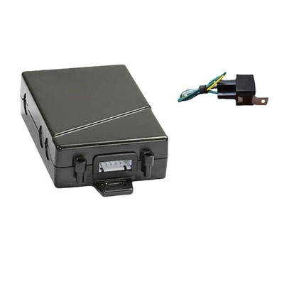

# TopShine - MT101

El TopShine MT101 es un rastreador GPS en línea para motocicletas, de diseño compacto y pensado para montaje discreto y supervisión continua de ubicación. Fabricado con alta sensibilidad y resistencia al agua, el MT101 incorpora antena interna y un factor de forma reducido que facilita su ocultamiento. Entre las capacidades clave del equipo el fabricante destaca soporte de doble SIM con conmutación automática o manual, la posibilidad de cambiar a una red extranjera sin cargos por roaming, detección de interferencia de señal GSM, posicionamiento bidireccional incluso con señal GPS limitada y funciones opcionales como relé para corte de motor, micrófono para escucha y botón SOS de pánico.

Como dispositivo compatible con Plaspy, el MT101 puede alimentar la plataforma con actualizaciones en tiempo real sobre ubicación y estado para visualización en mapas, alertas y supervisión operativa. Plaspy aprovecha las opciones de reporte del MT101 para presentar eventos de geocerca, historial de movimientos, estado de energía y motor, y otras notificaciones junto con sus datos de flota o activos. Esto hace del MT101 una opción práctica para organizaciones que buscan un rastreador compacto para motocicletas integrado en un flujo de trabajo de monitoreo y gestión de flota en Plaspy.

## Aspectos destacados

- Construcción compacta e impermeable con antena integrada para fácil ocultamiento en motocicletas
- Soporte de doble SIM con conmutación automática o manual y selección inteligente de redes extranjeras
- Detección de interferencia (jamming) de señal GSM para ayudar a identificar bloqueos en el rastreo
- Posicionamiento bidireccional que puede entregar información de ubicación aun cuando la señal GPS es débil
- Relé opcional para corte remoto de motor y opciones adicionales de SOS y escucha por micrófono
- Rastreo en tiempo real vía SMS o GPRS para integración con plataformas web y monitoreo continuo
- Amplio rango de voltaje y batería interna recargable de respaldo para mayor resiliencia de energía

## Cómo funciona con Plaspy

Al conectarse a Plaspy, el MT101 envía actualizaciones de ubicación y estado que Plaspy muestra en mapas e informes, permitiendo visibilidad centralizada y alertas para motocicletas y otros vehículos pequeños. La integración se centra en entregar datos de ubicación accionables e información del estado del dispositivo para apoyar las operaciones diarias de flota y seguridad.

- Ubicación en tiempo real y rutas históricas mostradas en los mapas de Plaspy para visibilidad y auditoría
- Alertas por eventos de geocerca, exceso de velocidad, activación de SOS, cortes de energía y detección de jamming
- Estado del dispositivo y encendido/apagado del motor presentados en los paneles de Plaspy para supervisión operativa
- Uso del relé remoto del MT101, cuando está habilitado, para soportar flujos de trabajo de inmovilización dentro de Plaspy
- Informes consolidados y exportes para gestión de flota, cumplimiento y planificación de mantenimiento

## Casos de uso típicos

- Prevención y recuperación de robos de motocicletas con rastreo en tiempo real y soporte SOS
- Gestión de flotas para operaciones de entrega o mensajería en motocicleta
- Protección de activos móviles que se benefician de un rastreador compacto e impermeable
- Programas de alquiler y vehículos compartidos donde el monitoreo discreto y el control remoto son útiles
- Servicios de seguridad y escolta que requieren reporte confiable de posición y manejo de alarmas

## Por qué elegir este rastreador con Plaspy

El MT101 es adecuado para organizaciones que necesitan un rastreador pequeño y resistente con funciones orientadas a motocicletas y otros activos compactos. Su capacidad de doble SIM y la conmutación inteligente de redes resultan prácticas para operaciones que requieren mayor conectividad, mientras que la detección de interferencias y el posicionamiento bidireccional ofrecen resiliencia adicional en entornos con señal deficiente. Las opciones de corte de motor y SOS agregan niveles de seguridad y control cuando se requieren.

Combinado con Plaspy, el MT101 forma parte de una solución de monitoreo centralizada que soporta rastreo basado en mapas, alertas por eventos e informes a nivel de flota. Plaspy presenta el estado y las alertas del MT101 junto con otros dispositivos, ayudando a los operadores a tomar decisiones oportunas sin necesidad de entrar en detalles técnicos del equipo. Si sus requisitos incluyen instalación oculta, posicionamiento de respaldo confiable e integración en una plataforma de gestión de flota, el MT101 con Plaspy es una combinación que vale la pena evaluar.

Para obtener más información sobre Plaspy y cómo funciona con dispositivos como el TopShine MT101 visite https://www.plaspy.com. Las especificaciones del producto y la disponibilidad pueden cambiar con el tiempo, por lo que para los detalles técnicos más recientes y opciones de accesorios verifique las especificaciones actuales en el sitio del fabricante https://www.gztopshine.com/ .
