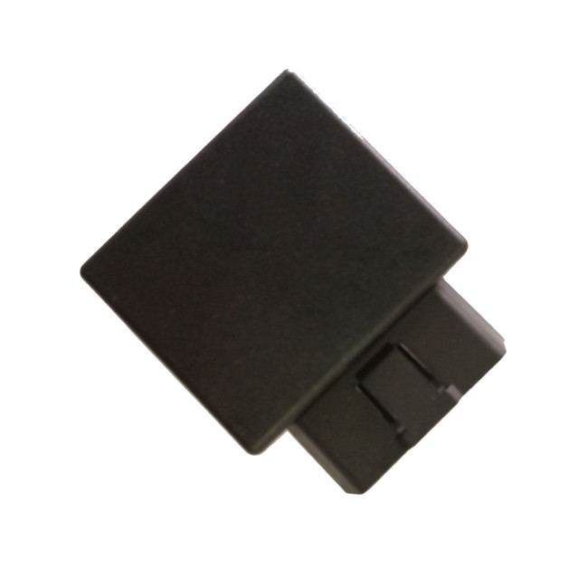

# TopShine - OGT02

El TopShine OGT02 es un rastreador GPS OBD2 4G diseñado para una implementación rápida plug and play en vehículos. Se conecta al puerto OBD II del vehículo, por lo que no requiere cableado ni instalación profesional. El equipo integra comunicación celular, receptor GPS de alta precisión y un acelerómetro incorporado para entregar ubicación continua, alertas por eventos y telemetría del vehículo a plataformas compatibles.

Como dispositivo compatible con Plaspy, el OGT02 aporta las telemáticas esenciales que Plaspy utiliza para la visibilidad de flotas y el control operativo. Actualizaciones de posición, detección de movimiento, reporte de odómetro y reproducción histórica de recorridos están disponibles en los paneles y flujos de alertas de Plaspy, lo que convierte al OGT02 en una opción práctica para gestores de flota, operadores de renta y propietarios que buscan seguimiento y reportes centralizados.

## Características principales

- Instalación OBD II plug and play para despliegues rápidos y mínima inactividad del vehículo
- Compatibilidad con Plaspy para seguimiento en tiempo real, paneles centralizados y alertas
- Conectividad 4G con compatibilidad de respaldo 3G y 2G, y modos de funcionamiento GPRS o SMS
- Posicionamiento GPS de alta precisión junto con acelerómetro integrado para detección de movimiento e impactos
- Telemetría del vehículo vía OBD, incluyendo reporte de odómetro y PIDs de diagnóstico cuando el vehículo los soporte
- Factor de forma compacto y certificado CE, adecuado para entornos vehiculares y despliegues escalables

## Cómo funciona con Plaspy

El OGT02 transmite ubicación y la telemetría OBD disponible a Plaspy a través de enlaces celulares, habilitando el seguimiento en vivo, alertas automáticas y reportes históricos. Plaspy procesa los datos del dispositivo para mostrar posiciones de los vehículos, generar notificaciones a partir de eventos del acelerómetro y completar informes de viajes y estado del vehículo.

- Actualizaciones de ubicación en tiempo real en los mapas de Plaspy para monitoreo de flotas y supervisión de rutas
- Alertas de movimiento y eventos bruscos desde el acelerómetro integrado para detección de robos y monitoreo de seguridad
- Telemetría basada en OBD como odómetro y PIDs de diagnóstico soportados, visibles en los reportes de Plaspy
- Alarmas de geocerca y desplazamiento procesadas por Plaspy para notificar a los gestores sobre movimientos no autorizados
- Reproducción histórica de recorridos accesible dentro de Plaspy para reconstrucción de viajes y revisión de cumplimiento

## Casos de uso típicos

- Gestión de flotas distribuidas con visibilidad centralizada para equipos de despacho y operaciones
- Flotas de alquiler y car sharing donde la instalación plug and play reduce el tiempo fuera de servicio de los vehículos
- Monitoreo antirrobo y respuesta rápida mediante alertas de movimiento y notificaciones de geocerca
- Diagnóstico remoto y flujos de mantenimiento preventivo usando telemetría OBD cuando esté disponible
- Cumplimiento, verificación de rutas y reconstrucción de incidentes mediante reproducción histórica de recorridos

## Por qué elegir este rastreador con Plaspy

El OGT02 ofrece una combinación práctica de simplicidad y capacidades telemáticas para organizaciones que usan Plaspy. Su formato OBD II permite un despliegue rápido y económico, mientras que las señales integradas de GPS y acelerómetro proporcionan a Plaspy la información necesaria para el seguimiento en vivo, alertas de eventos y reportes de viajes. Cuando un vehículo expone PIDs OBD adicionales, Plaspy puede mostrar esos campos para ayudar a correlacionar el comportamiento de conducción con los diagnósticos del vehículo.

Para obtener más información sobre Plaspy y cómo funciona con rastreadores compatibles como el TopShine OGT02 visite https://www.plaspy.com. Product specifications, availability, and manufacturer details can change over time, so please verify current specifications on the TopShine website https://www.gztopshine.com/ before making purchasing or deployment decisions.
