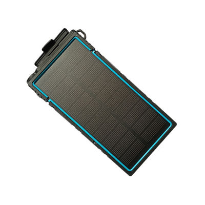

# TopShine - PT20

# 4G PT20 Portable GPS Tracker

El 4G PT20 es un rastreador GPS magnético y compacto diseñado para un seguimiento en tiempo real fiable y compatible con Plaspy de vehículos y activos portátiles. Con conectividad celular 4G/3G/2G, posicionamiento híbrido GPS/LBS y una batería recargable de 2500mAh, el PT20 está diseñado para una instalación encubierta, largos tiempos de espera y reportes continuos de ubicación a plataformas de terceros como Plaspy.

El PT20 admite intervalos de seguimiento configurables, alertas por exceso de velocidad, consultas de historial de rastreo y reenvío de datos en búfer tras zonas sin cobertura celular—características de las que se benefician los gestores de flota y los propietarios para la gestión de flotas, monitorización anti‑robo y auditoría basada en telemetría. Su pequeña carcasa magnética y su amplio rango operativo lo convierten en una opción flexible para despliegues temporales o permanentes donde la portabilidad y la discreción son importantes.

## Puntos destacados

- Compatible con Plaspy: Envía datos de ubicación GPS/LBS en tiempo real a plataformas de rastreo externas mediante protocolos celulares estándar para seguimiento e informes en tiempo real.
- Carcasa magnética compacta: montaje encubierto sencillo en vehículos, remolques y activos portátiles para un despliegue rápido y protección discreta.
- Batería de larga autonomía: celda Li‑ion recargable de 2500mAh con modos de reposo de bajo consumo para una operación prolongada sin intervención.
- Conectividad 4G/3G/2G con almacenamiento en búfer de datos: mantiene el historial de posiciones en zonas GSM sin cobertura y reenvía los datos almacenados cuando la señal se recupera.
- Telemetría y alertas configurables: actualizaciones en tiempo real, notificaciones de exceso de velocidad e informes de alarmas con consultas de rastreo histórico de hasta 30 días.
- Amplio rango de tensión de entrada: DC de +9V a +36V, compatible con sistemas de alimentación de vehículos cuando se requiere energía continua.
- Rangos ambientales robustos: opera de −40°C a 75°C y con humedad del 5% al 95%, apto para condiciones de campo variadas.

## Cómo funciona con Plaspy

El PT20 sube a un servidor de rastreo sus datos de ubicación GPS y LBS utilizando una SIM estándar y un plan de datos celulares. Cuando se usa con Plaspy, los paquetes de posición y alarma del PT20 son recibidos por la capa de ingestión de Plaspy y se muestran en tiempo real en paneles, mapas e informes. El búfer local del dispositivo garantiza que no haya pérdida de datos durante interrupciones temporales de GSM: los puntos almacenados se envían a Plaspy una vez que se restablece la conectividad.

- Actualizaciones de ubicación y telemetría en tiempo real enviadas a Plaspy a través de 4G/3G/2G.
- Informes de exceso de velocidad y alarmas entregados como alertas en Plaspy para acción inmediata del operador.
- Consultas de historial de rastreo de hasta 30 días disponibles a través de las herramientas de informes de Plaspy.
- Reenvío de datos en búfer tras zonas de cobertura celular ausentes mantiene un historial de movimientos preciso en Plaspy.
- Se requiere una tarjeta SIM estándar para el rastreo en vivo y la carga de telemetría.

Nota sobre integraciones: la especificación del PT20 no enumera monitoreo de combustible integrado, entradas de ignición, control de inmovilizador ni sensores Bluetooth. Plaspy aún puede correlacionar la posición del PT20 y la telemetría de alarmas con telemática externa de vehículos, sensores de combustible o sistemas de inmovilizador cuando esas fuentes de datos estén disponibles e integradas a través de Plaspy o gateways compatibles. Confirme el soporte periférico requerido con el proveedor si necesita control directo de ignición o inmovilizador.

## Visión técnica

| Conectividad | 4G / 3G / 2G \(GSM/GPRS\) mediante tarjeta SIM estándar |
| --- | --- |
| Bandas | Soporte general de 4G/3G/2G; no se especifican bandas LTE específicas \(confirmar con el proveedor\) |
| Alimentación y batería | Batería Li‑ion recargable interna de 2500mAh. El fabricante indica autonomía en modo de espera de hasta 3 años en escenarios de bajo consumo; la resistencia real depende del intervalo de informes y de los ajustes. |
| Interfaces | Rango de tensión de entrada DC +9V a +36V / 1.5A; ranura para SIM estándar; dos LEDs de estado para GPS y GSM. No se especifican salidas dedicadas de encendido/relevador o inmovilizador. |
| GNSS | Posicionamiento híbrido GPS y LBS \(GNSS + posicionamiento asistido por torres celulares\) |
| Bluetooth | No especificado en la descripción del producto \(no se listan sensores BLE\) |
| Gestión remota | Sube telemetría a plataformas de rastreo externas; FOTA o gestión de firmware remota por el fabricante no especificados |
| Factor de forma | Rastreador magnético compacto: 14.5 × 7 × 2.3 cm, peso de la unidad 0.16 kg, empaquetado ~0.28 kg |
| Ambiental | Temperatura de operación −40°C a 75°C; humedad 5%–95% |
| Otros | Calificación de velocidad de hasta 515 m/s; dos LEDs indican el estado de GPS y GSM; el paquete incluye cable USB |

## Casos de uso

- Gestión de flotas: seguimiento portátil para vehículos de alquiler, equipos auxiliares o expansión temporal de la flota donde se requiere un despliegue rápido.
- Monitorización anti‑robo: montaje magnético encubierto en coches, remolques o contenedores para informes de ubicación discretos y notificaciones de alarmas.
- Seguimiento de activos: colocar en equipos pesados, generadores o contenedores para localización bajo demanda y auditoría histórica de movimientos.
- Despliegues a corto plazo o de investigación: equipos de campo pueden instalar y retirar rápidamente el PT20 para tareas temporales de vigilancia o rastreo.
- Continuidad de datos en áreas con baja cobertura: almacenamiento en búfer y capacidad de reenvío mantienen un historial de rastreo para su análisis posterior en Plaspy.

## Por qué elegir el PT20 con Plaspy

La combinación del PT20 con Plaspy ofrece una solución de rastreo práctica y rentable para organizaciones que necesitan seguimiento en tiempo real fiable, auditoría y alertas sin cableado complejo. El diseño magnético del PT20 y su batería de larga autonomía reducen el tiempo de instalación y aumentan la flexibilidad de despliegue, mientras que su conectividad celular y posicionamiento híbrido mantienen actualizaciones de ubicación hacia los paneles de Plaspy.

Para gestores de flota enfocados en telemetría, respuesta ante robos e informes históricos, el PT20 ofrece una integración directa con las herramientas de la plataforma de Plaspy y los flujos de trabajo de informes.

Antes de la compra, confirme las bandas celulares específicas, la autonomía real de la batería en su intervalo de informes elegido y si se requiere soporte adicional de I/O \(ignición, inmovilizador\) o sensores Bluetooth para su caso de uso. Cuando se utiliza junto a la plataforma Plaspy y un plan de datos adecuado, el 4G PT20 es un rastreador GPS portátil capaz para la gestión de flotas, la seguridad de vehículos y la telemetría de activos.

