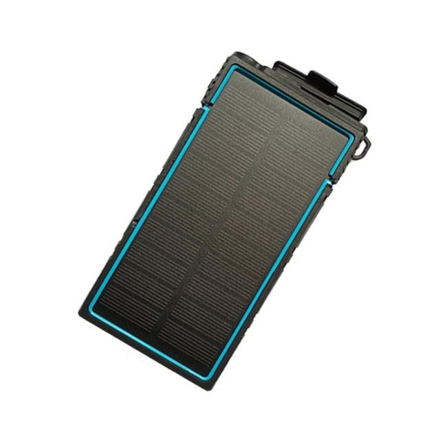

# TopShine - PT50

El TopShine PT50 es un rastreador GPS 4G con panel solar diseñado para el monitoreo prolongado y sin supervisión de contenedores, remolques, embarcaciones, vehículos y otros activos remotos. Pensado para ofrecer durabilidad, el PT50 combina carga solar, una carcasa sellada con certificación IP67 y montaje por adsorción magnética para facilitar despliegues en lugares sin alimentación eléctrica y con mantenimiento esporádico.

Como dispositivo compatible con Plaspy, el PT50 puede transmitir datos de ubicación y eventos a la plataforma para ofrecer visibilidad en tiempo real, alertas y reproducción histórica. Su posicionamiento multimodal y la integración MQTT personalizable permiten a las organizaciones incorporar el PT50 en los flujos de trabajo de Plaspy para supervisión de flotas, protección de activos y telemetría de larga duración sin necesidad de desarrollos personalizados complejos.

## Características principales

- Integración compatible con Plaspy vía web, aplicación móvil, SMS y MQTT personalizable para flujos de trabajo de plataforma e IoT
- Autonomía con energía solar y batería interna para despliegues prolongados sin supervisión
- Posicionamiento multimodal mediante GPS, A-GPS, LBS y WiFi para mejorar la fiabilidad en ubicaciones exteriores e interiores
- Carcasa robusta con certificación IP67 para resistencia al agua y al polvo en entornos marinos y exteriores exigentes
- Montaje por adsorción magnética para fijación rápida en contenedores, remolques y embarcaciones metálicas
- Alertas integradas, incluyendo SOS, geocercas, batería baja y detección de movimiento para vigilancia de seguridad
- Diseño compacto y ligero, apto para instalaciones discretas en una variedad de activos

## Cómo funciona con Plaspy

Al emparejarse con Plaspy, el PT50 envía actualizaciones de ubicación y notificaciones de eventos a la plataforma para que los equipos puedan rastrear activos, responder a incidentes y revisar rutas históricas. Plaspy ingiere los mensajes del dispositivo, normaliza la telemetría y presenta la información mediante paneles, reportes e integraciones que apoyan la toma de decisiones operativas.

- Actualizaciones de ubicación en tiempo real y transmisión de eventos a los paneles de Plaspy para visibilidad inmediata
- Alertas de geocerca y SOS enviadas a Plaspy para monitoreo perimetral y notificaciones prioritarias
- Notificaciones de movimiento y batería baja visibles en Plaspy para apoyar la respuesta antirobo y la planificación de mantenimiento
- Reproducción y reporte de rutas históricas para analizar el movimiento y la utilización de activos a lo largo del tiempo
- Soporte MQTT para enrutar la telemetría del dispositivo hacia Plaspy u otros sistemas centralizados y habilitar flujos de trabajo personalizados

## Casos de uso típicos

- Rastreo prolongado de contenedores y remolques en patios y entornos marítimos donde no hay suministro eléctrico
- Gestión de activos remotos o auxiliares en flotas que requieren monitoreo intermitente y gran autonomía de batería
- Seguimiento de embarcaciones y activos marinos que se benefician de la impermeabilidad y amplios rangos de operación
- Monitoreo antirobo y SOS para equipos distribuidos y activos de alto valor
- Telemetría distribuida para logística y operaciones centralizadas mediante MQTT e integraciones de plataforma

## Por qué elegir este rastreador con Plaspy

El PT50 es una opción práctica para organizaciones que necesitan rastreadores duraderos y de bajo mantenimiento que puedan integrarse en una plataforma de gestión central. Su carga solar y carcasa sellada reducen la necesidad de visitas de servicio frecuentes, mientras que el montaje magnético simplifica el despliegue en activos metálicos. Al combinarse con Plaspy, el PT50 forma parte de un conjunto de herramientas de seguimiento y operación que soporta alertas, reportes y automatizaciones a nivel de sistema.

Dado que el PT50 admite mensajes MQTT personalizables y reportes celulares estándar, es sencillo mapear eventos del dispositivo a los flujos de trabajo de Plaspy y combinar la telemetría de ubicación con otras fuentes operativas. Cuando los detalles técnicos concretos sean importantes para una integración, confirme las especificaciones vigentes con el fabricante y use Plaspy para centralizar telemetría, alertas e información histórica que mejore la supervisión de los activos.

Para saber más sobre cómo el PT50 puede funcionar con Plaspy, visite https://www.plaspy.com. Las especificaciones del producto, la disponibilidad y los datos del fabricante pueden cambiar con el tiempo, por lo que le recomendamos verificar la información actual en el sitio oficial de TopShine https://www.gztopshine.com/.
