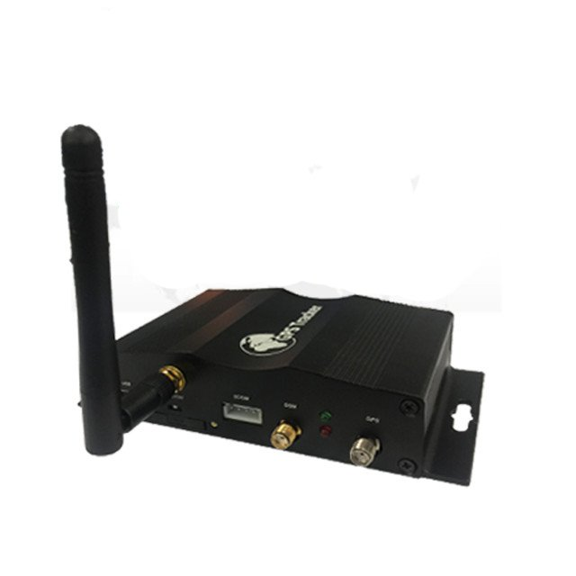

# TopShine - VT1000

El TopShine VT1000 es un rastreador GPS profesional para vehículos, diseñado para la gestión de flotas, la conectividad de pasajeros y la seguridad vehicular. Integra posicionamiento GNSS de alta precisión con comunicaciones celulares multibanda y un punto de acceso WiFi incorporado para ofrecer seguimiento de ubicación, telemetría y acceso a internet para pasajeros en un solo equipo. El VT1000 también admite conexión de cámaras y almacenamiento a bordo para preservar videos y fotografías como evidencia junto con los datos de ubicación.

Al ser un dispositivo compatible con Plaspy desde su configuración de fábrica, el VT1000 puede entregar sus actualizaciones de ubicación, alarmas y lecturas de sensores directamente a la plataforma Plaspy. Esto facilita añadir el VT1000 a una implementación existente de Plaspy para obtener visibilidad en tiempo real, alertas e informes históricos sin necesidad de integraciones personalizadas.

## Aspectos destacados

- Rastreador vehicular compatible con Plaspy que combina posicionamiento GNSS con conectividad celular multibanda y un punto de acceso WiFi integrado.  
- Soporta múltiples cámaras WiFi y almacenamiento SD a bordo para archivado de video y fotografías.  
- Telemetría vehicular completa, incluyendo detección de motor encendido/apagado, estado de puertas y entradas analógicas para monitoreo de combustible y temperatura.  
- Función de inmovilizador remoto mediante relé de corte de motor y botón SOS para respuesta ante emergencias.  
- Diseñado para registro continuo y resiliencia, con almacenamiento a bordo que preserva waypoints y medios durante interrupciones de la red.  
- Ideal para flotas de uso mixto que requieren conectividad para pasajeros, captura de evidencia y supervisión operativa en un solo dispositivo.

## Cómo funciona con Plaspy

Cuando está conectado, el VT1000 envía datos de posición, alarmas y lecturas de sensores a Plaspy, permitiendo que los gestores de flota supervisen los vehículos en tiempo real y generen informes históricos. Plaspy agrega ubicación, telemetría y eventos en mapas, flujos de alertas e informes exportables para apoyar despacho, seguridad y cumplimiento.

- Actualizaciones de ubicación en tiempo real y flujos frecuentes de telemetría visibles en el mapa y el panel de Plaspy.  
- Reporte de alarmas y eventos por apertura/cierre de puertas, estado de ignición y eventos SOS para activar alertas y notificaciones.  
- Lecturas de sensores analógicos para combustible y temperatura integradas en los informes de Plaspy y en la monitorización de excepciones.  
- Control de inmovilizador remoto disponible a través de flujos de trabajo en Plaspy cuando la configuración del dispositivo lo soporte.  
- Correlación de evidencia de video y fotografía para que los medios capturados por cámaras puedan consultarse junto con la ubicación y los datos de conducción almacenados en Plaspy.  
- Registro a bordo y almacenamiento SD garantizan la continuidad de los datos cuando la conectividad de red se reduce temporalmente.

## Casos de uso típicos

- Monitoreo de rutas y supervisión del comportamiento del conductor en autobuses, ómnibus y vehículos comerciales.  
- Operaciones de transporte de pasajeros que requieren WiFi a bordo y la integración de cámaras de seguridad para revisión de incidentes.  
- Flujos de trabajo contra robo e inmovilización de emergencia mediante alertas SOS y corte remoto del motor.  
- Entregas sensibles a temperatura o con control de combustible, donde las entradas analógicas alimentan alertas operativas e informes.  
- Documentación multicámara para grandes flotas que necesitan evidencia sincronizada de ubicación y video para investigaciones.

## Por qué elegir este rastreador con Plaspy

El VT1000 es una opción versátil para organizaciones que desean un solo dispositivo capaz de gestionar rastreo, conectividad para pasajeros y captura de evidencia en video, todo integrado con una plataforma de flotas. Su combinación de telemetría, soporte de cámaras y almacenamiento a bordo lo hace práctico para operadores que requieren visibilidad en tiempo real y registros conservados para revisiones posteriores. Al ser compatible con Plaspy desde fábrica, reduce la complejidad de configuración y permite centralizar datos de vehículos, alertas e informes históricos en el entorno de Plaspy.

Si usted desea obtener más información sobre cómo el VT1000 puede funcionar con Plaspy para monitoreo de flotas, generación de informes y seguridad, visite https://www.plaspy.com para detalles de la plataforma. Las especificaciones del producto y su disponibilidad pueden cambiar con el tiempo, por lo que le recomendamos verificar los detalles técnicos actuales y las opciones con el fabricante en https://www.gztopshine.com/.
