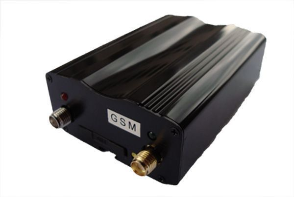

# TopShine - VT111

El TopShine VT111 es un rastreador GPS miniatura y económico, diseñado para ofrecer seguimiento efectivo y seguridad vehicular. Integra funciones de rastreo con capacidades de alarma para automóvil, soportando activación/desactivación por SMS o llamada, alertas por movimiento y apertura de puertas, y además puede armarse automáticamente mediante RFID opcional. Su tamaño reducido facilita la instalación oculta, por lo que es apropiado para distintos tipos de vehículos que requieren monitoreo discreto.

Como dispositivo listado como compatible con Plaspy, el VT111 puede integrarse en los flujos de trabajo de monitoreo de flotas y activos de Plaspy para proporcionar visibilidad de ubicación, notificaciones y opciones de control desde una plataforma central. Plaspy puede recibir actualizaciones de posición y alertas del VT111 y mostrarlas junto con otros dispositivos para supervisión consolidada, generación de reportes y control operativo.

## Aspectos destacados

- Factor de forma miniatura para instalación discreta en vehículos
- Funciones combinadas de rastreo GPS y alarma para seguridad y monitoreo
- Armado y desarmado remoto vía SMS o llamada, con arming automático opcional por RFID
- Soporta seguimiento periódico automático por SMS o GPRS para actualizaciones regulares de posición
- Alertas por movimiento, salida de geocerca, exceso de velocidad y pérdida de alimentación externa
- Capacidad de inmovilizar el vehículo cortando la alimentación o el suministro de combustible mediante comandos desde la plataforma
- Batería de respaldo recargable integrada para reportar fallos de alimentación externa

## Cómo funciona con Plaspy

El VT111 puede enviar su ubicación y eventos de alarma a Plaspy para que operadores y gerentes supervisen vehículos desde una única plataforma. Plaspy recopila las actualizaciones de posición y las notificaciones de alarma de dispositivos compatibles, permitiendo a los equipos responder, generar informes y configurar reglas operativas.

- Consolide las posiciones del VT111 con otros dispositivos en los mapas y paneles de Plaspy
- Reciba alertas de movimiento, geocerca, velocidad excesiva y pérdida de alimentación externa como notificaciones en Plaspy
- Use los reportes de Plaspy para analizar historial de rutas, comportamiento de paradas y tendencias de alertas en vehículos equipados con VT111
- Envíe comandos de inmovilización o control desde Plaspy cuando el VT111 esté configurado para aceptar control desde la plataforma
- Agrupe y supervise múltiples unidades VT111 para obtener visibilidad a nivel de flota y control operativo

## Casos de uso típicos

- Gestión de flotas de vehículos ligeros donde se prefiere un rastreador de pequeño tamaño
- Prevención y recuperación de robos con funciones de alarma e inmovilización remota
- Monitoreo de autos de renta para seguir ubicación, movimientos y eventos de manipulación
- Vehículos de reparto y servicio que requieren instalación discreta y actualizaciones de posición constantes
- Pequeñas empresas o flotas corporativas que necesitan una solución de rastreo y alarma de bajo costo

## Por qué elegir este rastreador con Plaspy

El VT111 es una opción práctica para organizaciones que buscan un rastreador pequeño y económico que combine capacidades básicas de alarma con rastreo estándar. Su combinación de reporte de ubicación, alertas por movimiento y manipulación, y la posibilidad de inmovilización remota, puede apoyar tanto tareas de seguridad como de monitoreo operativo dentro de Plaspy. Las opciones de RFID y la flexibilidad para operar de forma independiente o gestionada por un centro lo hacen adaptable a distintos flujos de trabajo e instalaciones.

Cuando se utiliza con Plaspy, el VT111 ofrece un camino directo hacia la supervisión centralizada sin requerir una gestión compleja de dispositivos. Para equipos que priorizan instalación discreta, manejo sencillo de alarmas y control y reportes basados en plataforma, el VT111 representa una alternativa sensata que complementa las funciones de visibilidad y alertamiento de Plaspy.

Para saber más sobre cómo el VT111 puede integrarse con Plaspy y explorar las funciones de la plataforma, visite https://www.plaspy.com. Las especificaciones del producto, disponibilidad y datos del fabricante pueden cambiar con el tiempo, por lo que verifique la información técnica actual en el sitio del fabricante https://www.gztopshine.com/.
