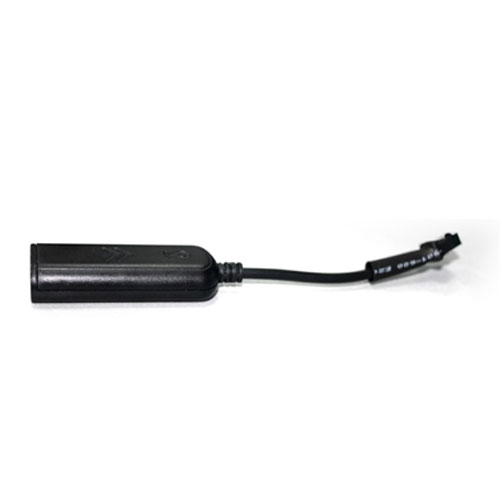

# TopTen - LT02

El TopTen LT02 es un mini rastreador GPS pensado para el seguimiento de vehículos y telemática básica. Combina el reporte de posición con funciones de alarma y monitoreo, lo que permite a propietarios y administradores conocer la dirección física del vehículo (incluyendo ciudad y calle), recibir alertas por movimiento y exceso de velocidad, y supervisar el estado de encendido del motor. El LT02 también incorpora un registrador de datos capaz de almacenar miles de puntos y ofrece lectura del odómetro y detección del voltaje del vehículo para una supervisión operativa sencilla.

Como dispositivo compatible con Plaspy, el LT02 puede enviar sus datos de ubicación y eventos a la plataforma Plaspy para proporcionar visibilidad centralizada e información a nivel de flota. La compatibilidad significa que las funciones principales del LT02 —como actualizaciones de posición, alertas de movimiento y motor, y el historial de rutas almacenado— pueden mostrarse en Plaspy para monitoreo, generación de reportes y uso operativo rutinario, sin sacrificar características a nivel de dispositivo como el control por SMS o app.

## Características destacadas

- Factor de forma mini ideal para instalaciones discretas en vehículos y uso general
- Reporte de ubicación mediante control por SMS, web y app para acceso flexible
- Funciones de alarma: detección de movimiento, alarma por exceso de velocidad y alarma por encendido del motor
- Registrador de datos con capacidad para miles de puntos para reconstrucción de rutas
- Detección de voltaje del vehículo y registro de odómetro para información básica de uso y estado
- Watchdog de hardware y modos de ahorro de energía para mayor fiabilidad y operación prolongada

## Cómo funciona con Plaspy

Al integrarse con Plaspy, el LT02 aporta actualizaciones de ubicación y notificaciones de eventos que la plataforma utiliza para mostrar el estado en tiempo real y las rutas históricas. Plaspy consolida esos datos para que los operadores puedan monitorear múltiples dispositivos LT02 simultáneamente y responder a alertas desde un tablero central.

- Visibilidad en mapa de la posición actual y del historial de ruta reciente registrado por el LT02
- Alertas centralizadas de movimiento, exceso de velocidad y eventos de motor integradas en las notificaciones de Plaspy
- Uso de los puntos almacenados para generar reportes de viaje y reconstruir rutas pasadas
- Lecturas de odómetro y voltaje disponibles en Plaspy para reportes operativos y diagnósticos básicos
- Vistas consolidadas para flotas mixtas que permiten gestionar dispositivos LT02 junto con otros rastreadores compatibles

## Casos de uso típicos

- Monitoreo de pequeñas flotas comerciales que requieren alertas básicas de ubicación y eventos
- Seguridad vehicular y recuperación ante robo mediante reportes de movimiento y ubicación
- Seguimiento de vehículos de alquiler o compartidos donde el odómetro y la identificación de dirección son útiles
- Monitoreo de motocicletas y automóviles gracias a un rango de voltaje compatible con ambos tipos de vehículos
- Revisión histórica de rutas y registro de viajes usando el registrador de datos a bordo

## Por qué elegir este rastreador con Plaspy

El LT02 es una opción práctica cuando necesita un rastreador compacto y multifuncional que equilibre el reporte de ubicación con alarmas sencillas y registro de datos. Para organizaciones que desean combinar controles a nivel de dispositivo con una plataforma de monitoreo centralizada, el LT02 proporciona las entradas clave que Plaspy requiere para presentar ubicaciones, eventos e historial de rutas en una vista unificada.

Emparejado con Plaspy, el LT02 ayuda a reducir la carga operativa de rastrear múltiples vehículos al centralizar datos de posición y alertas en una sola plataforma para monitoreo y reportes. Su combinación de reporte de direcciones, alertas de movimiento y motor, y puntos almacenados lo convierte en una opción sensata para propietarios y administradores de flota que buscan visibilidad clara sin complejidad innecesaria.

Para conocer más sobre cómo Plaspy puede trabajar con el TopTen LT02 visite https://www.plaspy.com. Las especificaciones y la disponibilidad del producto pueden cambiar con el tiempo, por lo que le recomendamos verificar los detalles actuales en la página del fabricante http://www.t10.cn.
