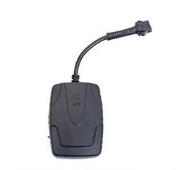

# TopTen - MT35

El rastreador GPS TopTen MT35 es un dispositivo compatible con redes 3G WCDMA y redes 2G, lo que le permite funcionar en una amplia gama de ubicaciones. Con soporte para frecuencias 3G como Band1: 2100Mhz, band2: 1900Mhz, band5: 850Mhz, band8: 900Mhz, y frecuencias 2G como 850Mhz / 900Mhz / 1800Mhz / 1900Mhz, este rastreador GPS ofrece una conectividad confiable en diferentes áreas geográficas.

El MT35 3G ofrece una variedad de características y funciones que lo convierten en una opción ideal para el seguimiento de vehículos. Puede realizar un seguimiento del vehículo a través de SMS, web o aplicación, lo que brinda flexibilidad en la forma en que se accede a la información de seguimiento. Además, cuenta con funciones de alarma de coche, como armar / desarmar por SMS / web / llamada telefónica, y la capacidad de verificar la dirección física real del automóvil, incluyendo el nombre de la ciudad y la calle.

Otras características destacadas del MT35 3G incluyen la detección inteligente del estado de ENCENDIDO / APAGADO del motor, la capacidad de detener el coche de forma segura cuando la velocidad es menor o igual a 30 km / h, un registrador de datos para almacenar 5520 waypoints, un diseño impermeable con tamaño pequeño y una función de odómetro. También ofrece alarmas de exceso de velocidad, movimiento, motor, vibración y falla de energía, lo que brinda una mayor seguridad y protección para el vehículo.

El rastreador GPS TopTen MT35 3G tiene un rango de voltaje de 10V-60VDC, lo que lo hace adecuado para motocicletas, automóviles o la mayoría de los camiones grandes. Además, cuenta con un diseño confiable de marco con vigilancia de hardware y modos de trabajo flexibles con un diseño de ahorro de energía extremo. También ofrece optimización de seguimiento cuando los vehículos giran en una esquina, detección de voltaje del vehículo y volumen de la batería de respaldo, y función A-GPS para una adquisición rápida de señal GPS.

En resumen, el rastreador GPS TopTen MT35 3G es una opción confiable y versátil para el seguimiento de vehículos, con una amplia gama de características y funciones que brindan seguridad y protección adicionales. Su compatibilidad con redes 3G y 2G, junto con su diseño resistente y tamaño compacto, lo convierten en una opción ideal para una variedad de aplicaciones de seguimiento de vehículos.

