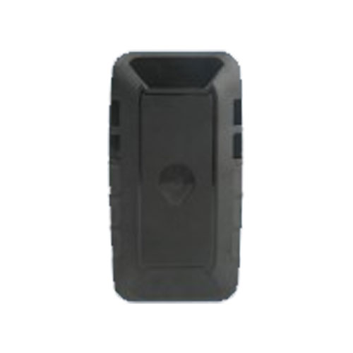

# TopTen - PG99

El TopTen PG99 es un rastreador GPS compacto pensado para el seguimiento de activos y la protección antirrobo. Soporta varios modos de funcionamiento, incluido un modo de sueño profundo extremo para consumo muy bajo, y ofrece un rendimiento de espera persistente adecuado para despliegues de larga duración. El equipo entrega información de ubicación por distintos métodos y genera alarmas por eventos como vibración, batería baja y exceso de velocidad, ayudando a proteger equipos valiosos.

Como dispositivo compatible con Plaspy, el PG99 puede integrarse en flujos de trabajo de gestión de flotas y activos para brindar visibilidad de ubicación y alertas operativas. Plaspy puede capturar las posiciones y eventos reportados por el PG99 para que los equipos monitoreen activos en mapas, reciban notificaciones y generen informes. La combinación de larga autonomía y opciones de seguimiento configurables hace del PG99 una opción práctica cuando se requieren actualizaciones periódicas y funciones antirrobo confiables.

## Aspectos principales

- Diseñado para seguimiento de activos con función antirrobo integrada y sensor de choque para detectar movimiento
- Cuatro modos de funcionamiento, incluido un modo de sueño profundo para ahorro extremo de energía y potencial de varios años en espera
- Varios desencadenantes de reporte como bajo demanda, intervalos temporales y reportes programados
- Informes de dirección física en tiempo real con detalle a nivel ciudad y calle, más opción de enlace directo a Google Maps
- Funciones de alarma que incluyen alerta por vibración, aviso de batería baja y notificación por exceso de velocidad
- Diseño robusto con fuerte imán de sujeción y carcasa impermeable para colocación flexible

## Cómo funciona con Plaspy

Al conectarlo con Plaspy, el PG99 suministra datos de ubicación y eventos que la plataforma utiliza para ofrecer visibilidad operativa y alertas. Plaspy captura los reportes del rastreador y los muestra en vistas de mapa, líneas de tiempo y notificaciones para que su equipo pueda actuar ante incidentes de seguridad y seguimiento.

- Visualización de ubicación en vivo y reciente en el mapa de Plaspy para conciencia situacional rápida
- Alertas configurables en Plaspy para eventos de vibración, batería baja, exceso de velocidad y otras alarmas reportadas por el dispositivo
- Reportes programados y reproducción del historial para revisar movimientos y tendencias de odómetro en el tiempo
- Armado y desarmado remotos a través de la plataforma Plaspy cuando los métodos de control del dispositivo lo permitan
- Opciones de reporte y exportación para auditorías de activos y análisis operativo

## Casos de uso típicos

- Monitoreo a largo plazo de activos estacionales o de uso intermitente donde la vida de batería es crítica
- Protección antirrobo para vehículos, remolques o equipos portátiles estacionados
- Visibilidad remota de equipos de campo que no se acceden con frecuencia
- Componentes de flota o activos auxiliares que requieren verificaciones periódicas de posición y notificaciones de eventos
- Seguimiento de equipos de renta o leasing donde la información de dirección y los registros de eventos son útiles

## Por qué elegir este rastreador con Plaspy

El TopTen PG99 combina capacidad de espera extendida con opciones de reporte flexibles, lo que lo hace adecuado para organizaciones que necesitan seguimiento de larga duración y funciones antirrobo sencillas. Su capacidad para ofrecer información a nivel de dirección y múltiples tipos de alarma complementa las funcionalidades de Plaspy para flujos de monitoreo y notificación.

Dado que el PG99 soporta varios modos de funcionamiento y control desde la plataforma, brinda flexibilidad operativa cuando se integra con el monitoreo y los reportes de Plaspy. Las organizaciones deberían evaluar la frecuencia de reporte y los requisitos de alarma para confirmar que este rastreador se ajusta a su perfil de despliegue, y confiar en Plaspy para consolidar los datos de los dispositivos en visibilidad y alertas útiles.

Para saber más sobre cómo Plaspy puede gestionar dispositivos como el TopTen PG99 visite https://www.plaspy.com. Las especificaciones y la disponibilidad pueden cambiar con el tiempo así que verifique los detalles técnicos actuales en el sitio del fabricante http://www.t10.cn.
