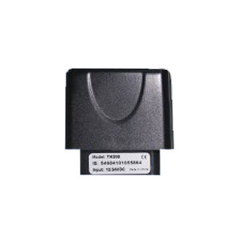

# TopTen - TK208

El TopTen TK208 es un rastreador GPS 3G en formato OBD2 diseñado para el seguimiento y la seguridad vehicular. Combina el envío de posición con la identificación opcional de conductor por RFID y un conjunto de funciones de alarma orientadas a mejorar la supervisión de vehículos y la responsabilidad del personal. La descripción del equipo destaca el registro de eventos a bordo, la detección de alarmas por movimiento y estado del motor, y varios métodos opcionales de identificación que lo hacen adecuado para flotas mixtas.

Como dispositivo compatible con Plaspy, el TK208 se integra en una plataforma centralizada para ofrecer visibilidad de ubicación, reenvío de alertas y reproducción histórica de rutas. Los usuarios de Plaspy pueden aprovechar los modos de reporte y las opciones de identificación del TK208 para asociar vehículos con conductores, monitorear eventos de seguridad e incluir los puntos de ruta registrados en informes y supervisión operativa.

## Características principales

- Factor de forma OBD2 para conexión directa al vehículo y alimentación continua
- Rastreo GPS con modos de reporte flexibles: comandos, intervalos temporales o actualizaciones basadas en distancia
- Identificación de conductor mediante RFID activa opcional o lectura de tarjeta Mifare1 IC para control de acceso y registro de conductor
- Alarmas y detección de eventos integradas, incluyendo encendido/apagado del motor, exceso de velocidad, geocercas, alarma por movimiento y alarma por motor encendido
- Sensor de choque, alarma por corte de energía y batería de respaldo recargable integrada para mantener operación durante interrupciones de alimentación
- Registrador de datos offline con capacidad para múltiples waypoints que se pueden subir y analizar posteriormente
- Amplio rango de voltaje de trabajo para soportar una gran variedad de tipos de vehículos

## Cómo funciona con Plaspy

Cuando se usa con Plaspy, el TK208 envía posición y eventos a la plataforma para visualización, alertas e informes. Plaspy puede mostrar ubicaciones en tiempo real y trayectos históricos del dispositivo, además de mapear eventos de seguridad a notificaciones de la plataforma para la respuesta operativa.

- Actualizaciones en tiempo real de ubicación y estado visibles en los mapas y listas de vehículos de Plaspy
- Reenvío de alarmas y eventos a Plaspy para que excesos de velocidad, geocercas, movimiento y pérdida de alimentación generen notificaciones en la plataforma
- Los datos de identificación de conductor por RFID pueden asociarse a viajes y registros de conductor en Plaspy para control y reportes
- Los datos del registrador offline pueden cargarse en Plaspy para reproducción de rutas y análisis retroactivo tras la reconexión
- El estado de encendido/apagado del motor y los eventos relacionados forman parte del historial de estado del vehículo para la supervisión operativa

## Casos de uso típicos

- Gestión de flotas de vehículos ligeros que requieren seguimiento y control de conductores
- Seguridad vehicular y monitoreo antirrobo para flotas corporativas y vehículos de servicio
- Control de responsabilidad del conductor y registro de cambios de turno mediante identificación RFID
- Flotas de renta o leasing donde se requiere asignación de conductor y registros de eventos
- Operaciones de entrega y servicio en campo que necesitan seguimiento confiable y alertas basadas en eventos

## Por qué elegir este rastreador con Plaspy

El TK208 combina hardware orientado a vehículos con funciones que encajan bien en los flujos de trabajo de Plaspy: conexión continua vía OBD2, identificación de conductor opcional, múltiples tipos de alarma y registro offline. Para organizaciones que necesitan visibilidad de ubicación y una forma de vincular conductores a vehículos, el TK208 ofrece capacidades prácticas que Plaspy puede mostrar en paneles, alertas e informes.

Aunque la descripción del modelo presenta un conjunto claro de funciones, algunas características son opcionales o dependen de accesorios seleccionados. La flexibilidad de la plataforma Plaspy facilita capturar la ubicación, alarmas e información de identificación del TK208 en una vista consolidada de flota, lo que permite evaluar beneficios operativos entre vehículos y conductores.

Para obtener más información sobre el uso de Plaspy con dispositivos compatibles, visite https://www.plaspy.com. Las especificaciones del producto, la disponibilidad y los detalles del fabricante pueden cambiar con el tiempo, por lo que se recomienda verificar la información técnica actual en el sitio del fabricante http://www.t10.cn.
