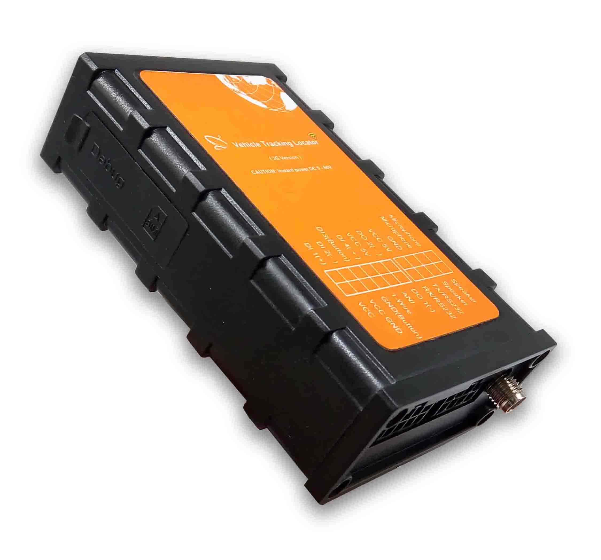

# Totemtech - AT07-3G

El rastreador GPS Totemtech AT07-3G es una solución confiable y versátil para el seguimiento y monitoreo de vehículos. Con la capacidad de enviar datos a dos servidores simultáneamente, este rastreador garantiza una comunicación estable y confiable. Además, cuenta con un acelerómetro digital de 3 ejes para supervisar el estado de movimiento del vehículo, lo que permite detectar cualquier actividad sospechosa o accidentes. 

Una de las características destacadas de este rastreador es su capacidad de almacenamiento de datos en una tarjeta Micro SD, lo que permite almacenar grandes cantidades de información y realizar actualizaciones de firmware de forma remota a través de OTA. Además, es compatible con una amplia gama de voltajes de alimentación, desde 9V hasta 50V, lo que garantiza su compatibilidad con diferentes tipos de vehículos.

El rastreador GPS Totemtech AT07-3G también ofrece la posibilidad de enviar comandos a través de GPRS, SMS o puerto USB, lo que facilita su configuración y control. Además, cuenta con una memoria flash de 16MB, que puede almacenar aproximadamente 4000 datos, y una función de detección de nivel de aceite de combustible con alta precisión.

Este rastreador también ofrece funciones avanzadas de localización por GPS, como la capacidad de enviar datos GPRS a través de IP o nombre de dominio, y la posibilidad de enlazar el mapa de Google a través de SMS. Además, cuenta con un módulo GPS u-blox de alta precisión, que garantiza una precisión de posicionamiento GPS confiable.

En cuanto a la administración de energía, el rastreador GPS Totemtech AT07-3G ofrece diferentes modos de energía inteligente, como el modo normal, el modo de sueño y el modo de sueño profundo, que permiten ahorrar energía y prolongar la vida útil de la batería. También cuenta con una batería de respaldo de 800mAh, que garantiza un funcionamiento continuo incluso en caso de corte de energía.

En resumen, el rastreador GPS Totemtech AT07-3G es una opción confiable y versátil para el seguimiento y monitoreo de vehículos. Con su amplia gama de características y su capacidad de almacenamiento de datos, este rastreador ofrece una solución completa y eficiente para garantizar la seguridad y el control de flotas de vehículos.

### Características destacadas:

- Envío de datos a dos servidores simultáneamente
- Acelerómetro digital de 3 ejes para supervisión del estado de movimiento
- Soporte para tarjetas Micro SD para almacenamiento de datos
- Compatibilidad con voltajes de alimentación de 9V a 50V
- Envío de comandos a través de GPRS, SMS o puerto USB
- Envío de datos GPRS a través de IP o nombre de dominio
- Módulo GPS u-blox de alta precisión
- Funciones avanzadas de administración de energía
- Batería de respaldo de 800mAh

