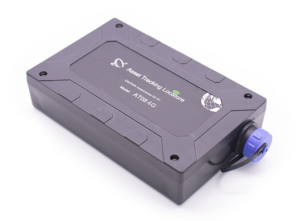

# Totemtech - AT08

El rastreador GPS magnético AT08 es un dispositivo de seguimiento robusto, compatible con Plaspy, diseñado para la monitorización de activos de larga duración. Construido alrededor de un MCU STM32 de bajo consumo y un motor GNSS uBlox M8, el AT08 ofrece posicionamiento GPS/GLONASS/BeiDou, conectividad celular multi-banda 3G/4G \(EG91 de Quectel en la variante 4G LTE Cat 1\) y una batería Li‑polímero de 4000 mAh para operación prolongada. Sus fuertes imanes de neodimio y su formato compacto lo hacen ideal para una fijación discreta en activos metálicos, mientras suministra rastreo en tiempo real y telemetría a Plaspy para la gestión de flotas y flujos de trabajo logísticos.

Diseñado para entornos exigentes, el AT08 combina una larga vida de batería, gestión inteligente de energía y actualizaciones de firmware OTA para que flotas y propietarios de activos desplieguen y mantengan rastreadores a gran escala. Ya sea que necesite un rastreador GPS para contenedores, remolques, equipos o activos estacionales, el AT08 ofrece datos de posición fiables y telemetría del dispositivo que se integran a la perfección con la plataforma de Plaspy para alertas, informes y flujos de trabajo automáticos de anti‑robo.

## Principales características

- Compatible con Plaspy: transmite coordenadas GNSS y telemetría del dispositivo a plataformas del sector para seguimiento e informes en tiempo real.
- Gran autonomía de la batería: batería Li‑polímer de 4000 mAh con operación típica de hasta 30 días con un intervalo de reporte de 60 minutos.
- Montaje magnético robusto: dos imanes de neodimio fuertes para una adhesión segura a superficies metálicas en despliegues en campo.
- GNSS multiconstelación: el módulo uBlox M8 admite GPS, GLONASS y BeiDou con CEP de aproximadamente 2.5 m.
- Amplia cobertura celular: soporte 3G y 4G LTE \(EG91 para 4G LTE Cat 1\) con conjuntos de bandas para Europa y Norteamérica.
- Operación de bajo consumo: gestión inteligente de energía con modos de inactividad \(~70 mA\), reposo \(~39 mA\) y suspensión profunda \(~1 mA\).
- Mantenimiento remoto: actualizaciones de firmware OTA facilitan el despliegue a gran escala de flotas y la personalización de firmware a solicitud.

## Cómo funciona con Plaspy

El AT08 proporciona posición GNSS continua y telemetría del dispositivo a través de redes celulares hacia Plaspy para rastreo en tiempo real, geocercas, alertas e informes históricos. Plaspy ingiere los paquetes de ubicación del dispositivo, estado de la batería y de la señal, y eventos de movimiento para ofrecer mapas en vivo y flujos de trabajo automatizados para la gestión de flotas, monitoreo anti‑robo y análisis operativos.

- Actualizaciones de ubicación y telemetría en tiempo real: coordenadas GNSS, calidad de fijación y estado de la batería del dispositivo se envían vía GPRS/3G/4G a Plaspy.
- Alertas basadas en movimiento: el sensor 3D de vibración a bordo informa movimientos y eventos de manipulación/movimiento para notificaciones anti‑robo.
- Telemetría de energía y carga: el nivel de batería y el estado de carga \(carga por micro USB\) alimentan los paneles de la plataforma para la planificación de mantenimiento.
- Gestión de firmware OTA: las actualizaciones de firmware pueden entregarse de forma remota para que los dispositivos en campo permanezcan compatibles con las integraciones de Plaspy.
- Configuración flexible: configure el AT08 por SMS, vía OTA a través de una conexión de datos o mediante micro USB para una puesta en marcha rápida.

## Resumen técnico

| Conectividad | 3G y 4G LTE \(Quectel EG91 en AT08 4G, LTE Cat 1\). Configuración de datos GPRS/3G y SMS soportada. |
| --- | --- |
| Bandas | LTE-FDD europeo: B1/B3/B7/B8/B20/B28A; WCDMA: B1/B8; GSM: 900/1800 MHz. LTE-FDD norteamericano: B2/B4/B5/B12/B13; bandas WCDMA correspondientes. |
| Alimentación y batería | 4000 mAh Li‑polymer battery; recarga típica ~3–4 horas con un cargador de 5V. Vida de batería reportada de hasta 30 días con un intervalo de reporte de 60‑min. Gestión inteligente de energía con modo inactivo \(~70 mA\), reposo \(~39 mA\) y suspensión profunda \(~1 mA\). |
| Interfaces | Micro USB para carga y datos/configuración, ranura de SIM estándar, configuración vía SMS/GPRS/3G o conexión de PC. |
| GNSS | Módulo uBlox M8 \(GPS / GLONASS / BeiDou\). Sensibilidad de adquisición hasta -148 dBm, seguimiento -162 dBm, reacquisición -160 dBm, CEP ≈ 2.5 m. |
| Sensores | Sensor 3D de vibración para detección de movimiento y alertas de manipulación/movimiento. |
| Gestión remota | Actualizaciones de firmware OTA soportadas; personalización de firmware y hardware disponible a solicitud. |
| Ambiental | Rango de temperatura operativo -20°C a 60°C; temperatura de carga de la batería 0°C a 45°C \(descarga -20°C a 60°C\); humedad relativa 5%–95% \(no condensible\). |
| Factor de forma | Dimensiones 114 × 72,5 × 26,2 mm; peso ~0,25 kg; dos imanes de neodimio \(BHmax 287–310 KJ/m³\) para montaje en metal. |
| Accesorios | Incluye un cable micro USB de carga/datos. Especificaciones de empaque y cartón disponibles para pedidos al por mayor. |

## Casos de uso

- Gestión de flotas: se puede colocar en remolques, contenedores o vehículos de apoyo para proporcionar datos de posición de larga duración para planificación de rutas e informes de uso.
- Antirrobo y recuperación de activos: la detección de movimiento y la telemetría continua permiten alertas de anti‑robo y localización rápida a través de los paneles de Plaspy.
- Seguimiento logístico y de contenedores: el montaje magnético en superficies metálicas hace del AT08 una opción ideal para mercancías, contenedores intermodales y equipos portátiles.
- Equipo móvil y activos estacionales: larga autonomía de la batería y diseño tolerante a la intemperie para activos almacenados o desplegados de forma intermitente.
- Mochilas, equipaje y activos no motorizados: montaje discreto en marcos o estuches metálicos para monitoreo a largo plazo durante el tránsito.

## Por qué elegir este rastreador con Plaspy

El AT08 ofrece un equilibrio práctico entre durabilidad, autonomía y conectividad para usuarios de Plaspy que requieren datos de rastreo GPS fiables en entornos desafiantes. Su GNSS multiconstelación y el receptor de alta sensibilidad proporcionan fijaciones de ubicación precisas para el rastreo en tiempo real y telemetría, mientras que la plataforma STM32 de bajo consumo y los modos de suspensión configurables extienden los intervalos de despliegue en campo. El montaje magnético robusto facilita la instalación en activos metálicos, reduciendo el trabajo y el tiempo de inactividad para equipos de flota y logística.

Emparejado con Plaspy, el AT08 se integra en una solución escalable para gestión de flotas, respuesta ante robos y operaciones impulsadas por telemetría. Plaspy utiliza los datos de ubicación, batería y movimiento del dispositivo para soportar geocercas, alertas e informes históricos; también puede integrarse con monitoreo de combustible, flujos de trabajo de ignición/inmovilizador o sensores Bluetooth externos a nivel de la plataforma para ofrecer telemática más rica cuando se acompaña de hardware complementario. Con firmware OTA, opciones de personalización y soporte multibanda cellular, el AT08 es un rastreador GPS robusto para empresas que requieren rastreo en tiempo real confiable y visibilidad de activos a largo plazo.

