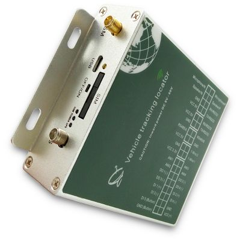

# Totemtech - AT09

El Totemtech AT09 es un rastreador GPS vehicular versátil diseñado para el seguimiento en tiempo real y la monitorización mediante múltiples sensores. Combina la localización con entradas especializadas para presión de neumáticos, hasta varios sensores de combustible y sondas de temperatura, además de conectividad para periféricos como pantallas, cámaras y lectores RFID. La detección de movimiento integrada y el almacenamiento local amplían su utilidad para supervisión continua y revisión histórica de recorridos.

Como modelo compatible con Plaspy, el AT09 puede enviar su telemetría y eventos a la plataforma de gestión de flotas de Plaspy. Esta compatibilidad hace que el AT09 sea adecuado para organizaciones que desean consolidar ubicación de vehículos, lecturas de sensores y eventos de periféricos en una sola vista operativa para monitoreo, alertas e informes dentro de Plaspy.

## Características clave

- Seguimiento de ubicación en tiempo real con trazas históricas para revisar rutas y reproducción  
- Monitoreo de presión de neumáticos para mantener la seguridad en operación  
- Soporte para hasta cuatro sensores de combustible y dos sensores de temperatura para telemetría multipunto  
- Transmisión a servidores redundantes para entrega de datos más fiable  
- Tres puertos seriales para conectar periféricos como pantallas, cámaras y lectores RFID  
- Acelerómetro integrado de 3 ejes para reportar estado de movimiento y eventos  
- Actualizaciones de firmware OTA que simplifican el mantenimiento y la puesta al día del dispositivo

## Cómo funciona con Plaspy

Al integrarse con Plaspy, el AT09 envía datos de ubicación y de sensores a la plataforma, donde se pueden visualizar, registrar y gestionar. Plaspy recibe la información entrante del dispositivo y la convierte en posición vehicular, valores de sensores y registros de eventos que son útiles en los flujos de trabajo de la flota.

- Consolide ubicación en vivo y trazas históricas en los mapas y líneas de tiempo de Plaspy  
- Muestre lecturas de presión de neumáticos, nivel de combustible y temperatura en paneles e informes  
- Configure alertas en Plaspy para umbrales como bajo nivel de combustible o presión anormal de neumáticos  
- Use las herramientas de reportes de Plaspy para analizar tendencias de sensores y la utilización de vehículos a lo largo del tiempo  
- Aproveche la transmisión a servidores duales para reducir huecos de datos en los informes de Plaspy

## Casos de uso típicos

- Monitoreo de flotas donde la supervisión de presión de neumáticos y combustible mejora la seguridad y reduce costos  
- Operaciones de transporte de larga distancia y logística que requieren seguimiento redundante y revisión histórica de rutas  
- Control de carga sensible a la temperatura mediante sensores integrados en el rastreador  
- Vehículos de servicio y utilitarios que incorporan cámaras o lectores RFID para capturar eventos operativos  
- Vigilancia de activos y equipos donde la detección de movimiento y el almacenamiento local son útiles

## Por qué elegir este rastreador con Plaspy

El AT09 es una opción práctica para flotas que necesitan más que la ubicación GPS básica. Su soporte para múltiples sensores de combustible y temperatura, monitorización de presión de neumáticos y conexiones a periféricos permite a los operadores recopilar un amplio conjunto de datos operativos por vehículo. Esas capacidades encajan bien con Plaspy, donde los flujos de sensores y eventos se pueden convertir en alertas, informes e información procesable.

Plaspy facilita integrar los datos del AT09 en una única capa operativa, lo que hace más sencillo vigilar la salud del vehículo, activar notificaciones y generar reportes de desempeño. Si sus operaciones dependen de combinar ubicación con telemetría de sensores y dispositivos conectados, el AT09 junto con Plaspy ofrece una alternativa equilibrada para mejorar la visibilidad y supervisión.

Para obtener más información sobre cómo Plaspy trabaja con rastreadores compatibles como el Totemtech AT09, visite https://www.plaspy.com. Las especificaciones del producto, la disponibilidad y los detalles del fabricante pueden cambiar con el tiempo, así que verifique la información técnica actual en el sitio oficial de Totemtech http://www.totemtek.com/ antes de tomar decisiones de compra.
