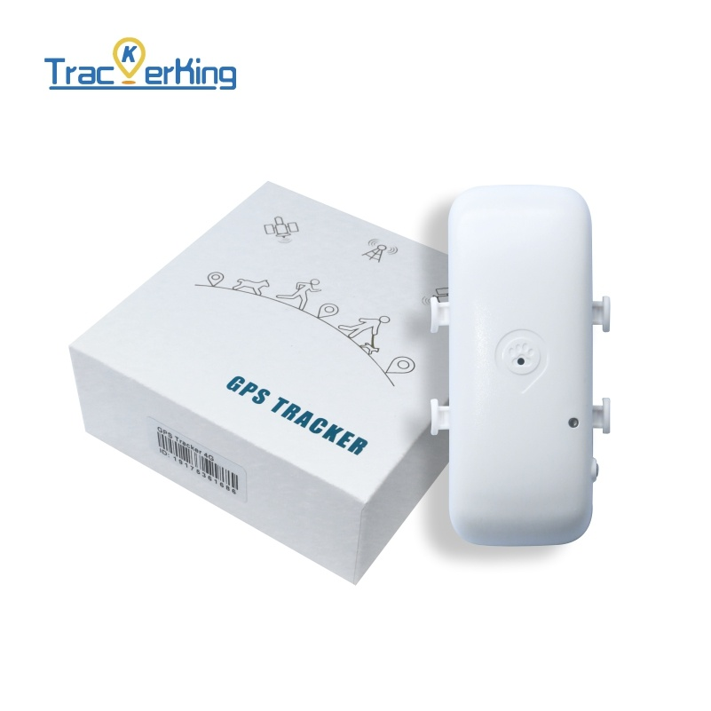

# TrackerKing - DK05

El DK05 es un rastreador GPS compacto para mascotas inteligente, diseñado para seguimiento fiable en tiempo real por collar y ahora completamente compatible con Plaspy. Diseñado para perros y gatos, el DK05 combina amplia cobertura celular \(4G + 2G Cat‑1, quad‑band GSM\) con una carcasa IP67 a prueba de agua y una batería recargable de 1000 mAh, de modo que los dueños obtienen actualizaciones de ubicación continuas, alertas de movimiento y monitoreo de voz remoto a través de la plataforma Plaspy.

Fácil de montar en un collar o arnés, el DK05 ofrece telemetría práctica para la seguridad de la mascota sin añadir volumen. Cuando se integra con Plaspy, obtienes seguimiento centralizado en tiempo real, alarmas de geocerca configurables, avisos de batería baja y datos de ubicación históricos, todo gestionado desde el panel de Plaspy y las apps móviles.

## Puntos clave

- Rastreador GPS compatible con Plaspy: se integra con Plaspy para seguimiento en tiempo real, alertas y historial.
- Diseño compacto y ligero \(≈7,5 × 2,9 × 1,7 cm; ≈39,5 g\) diseñado específicamente para collares y arneses.
- Amplia cobertura celular con 4G + 2G Cat‑1 y GSM de cuádruple banda para una amplia disponibilidad de red.
- Clasificación IP67 a prueba de agua para soportar condiciones húmedas al aire libre y mascotas activas.
- Batería recargable de 1000 mAh con modo de ahorro de energía ajustable desde la app para un funcionamiento extendido.
- Alertas de seguridad integrales: violaciones de geocerca, alarmas de movimiento y vibración, y avisos de batería baja.
- Monitoreo de voz remoto para comprobaciones de audio en tiempo real a través de la app de Plaspy.
- Nota: DK05 está optimizado para telemetría de mascotas y no incluye funciones de telemetría vehicular, como detección de ignición, control de inmovilizador o monitoreo de combustible.

## Resumen técnico

| Modelo | DK05 |
| --- | --- |
| Conectividad | 4G + 2G Cat‑1, GSM de cuádruple banda |
| Bandas | GSM de cuádruple banda \(amplia compatibilidad GSM\) |
| Alimentación y batería | Batería recargable de 1000 mAh; modo de ahorro de energía ajustable desde la app |
| Interfaces | No hay pantalla integrada; diseñado para montaje en collar/arnés; micrófono integrado para monitoreo de voz. No hay entrada de ignición externa ni interfaz de inmovilizador. |
| GNSS | Posicionamiento en tiempo real basado en GPS \(funcionalidad de rastreador GPS\) |
| Bluetooth | No especificado / no se anuncian sensores BLE integrados |
| Gestión remota | Control mediante la app companion para ajustes de ahorro de energía y notificaciones; configurado para integrarse con Plaspy |
| Protección y forma | IP67 a prueba de agua; dimensiones ≈7,5 × 2,9 × 1,7 cm; peso ≈39,5 g; montaje en collar/arnés |
| Garantía | Garantía de 18 meses |

## Casos de uso

- Seguimiento diario de perros o gatos para propietarios que buscan ubicación en tiempo real fiable y alertas de actividad mediante Plaspy.
- Monitoreo al aire libre y resistente al agua para mascotas que nadan, caminan bajo la lluvia o deambulan por terrenos mojados \(clasificación IP67\).
- Protección de geocerca: recibe alertas inmediatas de Plaspy cuando la mascota sale de una zona segura definida.
- Recuperación de mascotas perdidas mediante reproducción de rutas históricas y seguimiento en vivo en Plaspy para localizar la última posición conocida.
- Comprobaciones de comportamiento y seguridad con alarmas de movimiento/vibración y monitoreo de voz remoto para evaluar la situación de la mascota desde la distancia.

## Por qué elegir este rastreador con Plaspy

El DK05 ofrece seguimiento GPS centrado en mascotas que se alinea con las fortalezas de Plaspy en monitoreo centralizado y gestión de alertas. Su combinación de conectividad 4G + 2G Cat‑1 y soporte GSM de cuádruple banda garantiza una amplia cobertura para el seguimiento en tiempo real, mientras que la protección IP67 y un diseño compacto y ligero lo hacen cómodo para el uso diario en el collar. La compatibilidad con Plaspy añade valor al convertir la telemetría del DK05 en alertas accionables, historial de ubicación y notificaciones móviles, proporcionando una visión unificada para monitorizar a varias mascotas.

Para propietarios de mascotas que buscan una conciencia fiable anti‑robo y telemetría continua sin la complejidad de sistemas de grado vehicular, el DK05 ofrece una solución eficiente: funciones enfocadas \(geocerca, alarmas de movimiento y vibración, avisos de batería baja, monitoreo de voz\) e integración simple con Plaspy para obtener información en tiempo real de forma segura. Nota: DK05 está diseñado específicamente para animales y no incluye características de telemetría vehicular como detección de ignición, control de inmovilizador, monitoreo de combustible o gestión de sensores BLE comúnmente utilizadas en configuraciones de gestión de flotas.

