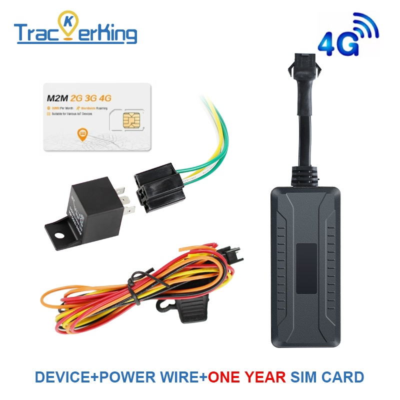

# TrackerKing - DK12

El DK12 es un rastreador robusto y multifunción diseñado para instalaciones en vehículos y activos que requieren seguimiento confiable en tiempo real y medidas antirrobo efectivas. Basado en el módulo SIMCOM7670SA, el DK12 ofrece conectividad 4G Cat1 con conmutación automática a 2G y variantes opcionales Cat M y NB IoT, además de una carcasa impermeable y un amplio rango de entrada de 9–90V para uso flexible en automóviles, camiones y equipos móviles.

Como dispositivo compatible con Plaspy, el DK12 puede transmitir datos de ubicación, alarmas y telemetría a la plataforma Plaspy, permitiendo monitoreo en vivo, reproducción histórica de rutas y acciones antirrobo coordinadas. Sus funciones orientadas a vehículos, como detección de encendido ACC, soporte de encendido virtual y corte remoto de motor o combustible, lo convierten en una opción práctica para gerentes de flota y operadores de renta que desean combinar hardware resistente con la visibilidad y reglas de alerta del sistema Plaspy.

## Características principales

- Rastreador compatible con Plaspy que ofrece conectividad 4G Cat1 con conmutación automática a 2G y variantes opcionales Cat M o NB IoT para entornos con cobertura mixta.
- Controles antirrobo orientados a vehículo, incluyendo corte remoto de motor y de suministro de combustible, y soporte de encendido virtual para facilitar una respuesta rápida ante incidentes.
- Construcción impermeable y amplio rango de entrada de 9–90V para operación confiable en automóviles, camiones y equipos móviles.
- Informes completos de alarmas, que incluyen alarma por vibración, geocerca y exceso de velocidad, para respaldar el monitoreo y las alertas en Plaspy.
- Reproducción de rutas históricas y estadísticas de kilometraje para supervisión de flota y reportes operativos.
- Compatibilidad con protocolos comunes de rastreadores como GT06, JT808 y Tianqin para simplificar la integración con los servidores de Plaspy y los flujos de trabajo estándar de la plataforma.
- Detección de voltaje de batería externa y reporte de telemetría para monitoreo remoto del estado eléctrico del vehículo.

## Cómo funciona con Plaspy

Al integrarse con Plaspy, el DK12 envía posiciones, eventos de alarma y mensajes de telemetría a la plataforma Plaspy, donde la ubicación, las alertas y el historial se presentan junto con los datos del resto de la flota. Plaspy procesa mensajes estándar de rastreadores, por lo que los dispositivos DK12 pueden incorporarse con mínimo trabajo de protocolo y mapearse en paneles y reglas de alerta existentes.

- Actualizaciones de ubicación y telemetría en tiempo real para monitoreo activo de la flota y coordinación de despachos.
- Reporte del estado de encendido, incluida la detección ACC y el encendido virtual, para alimentar registros de sesiones de conductor y reglas operativas.
- Acciones remotas de inmovilizador, como corte de motor o combustible, coordinadas desde Plaspy para mitigar robos.
- Eventos de alarma, incluyendo vibración, geocerca y exceso de velocidad, enviados a Plaspy para notificaciones inmediatas y respuestas automatizadas.
- Reporte de kilometraje y odómetro, además de telemetría de voltaje de batería externa para planificación de mantenimiento y acciones preventivas.

## Casos de uso típicos

- Gestión de flotas con seguimiento en vivo, reproducción de rutas y reportes de kilometraje para optimizar operaciones y rutas.
- Soluciones antirrobo para vehículos que combinan inmovilización, alarmas y notificaciones de plataforma para una respuesta rápida.
- Monitoreo de autos de renta y logística para mantener visibilidad en áreas de cobertura variable y apoyar auditorías de retorno.
- Seguridad de activos como remolques y equipos móviles, aprovechando el diseño impermeable y la amplia tolerancia de voltaje.
- Flujos de trabajo de cumplimiento y mantenimiento que utilizan estadísticas de odómetro y telemetría de voltaje para programar el mantenimiento.

## Por qué elegir este rastreador con Plaspy

El DK12 es una opción práctica para organizaciones que necesitan telemetría orientada a vehículos junto con funciones antirrobo robustas y desean usar Plaspy como la plataforma central de monitoreo. Sus opciones de conectividad y compatibilidad de protocolos reducen el esfuerzo de integración, y el hardware del dispositivo está diseñado para afrontar las limitaciones comunes en instalaciones vehiculares gracias al amplio rango de voltaje de entrada y la carcasa impermeable.

Combine el DK12 con Plaspy para obtener mapeo, alertas y reportes consolidados sin conectores personalizados complejos. Para saber más sobre Plaspy y cómo puede gestionar dispositivos como el DK12 visite https://www.plaspy.com. Las especificaciones del producto, disponibilidad y detalles del fabricante pueden cambiar con el tiempo; verifique las especificaciones actuales y las opciones de variantes en el sitio de TrackerKing https://trackerking.cn/.
