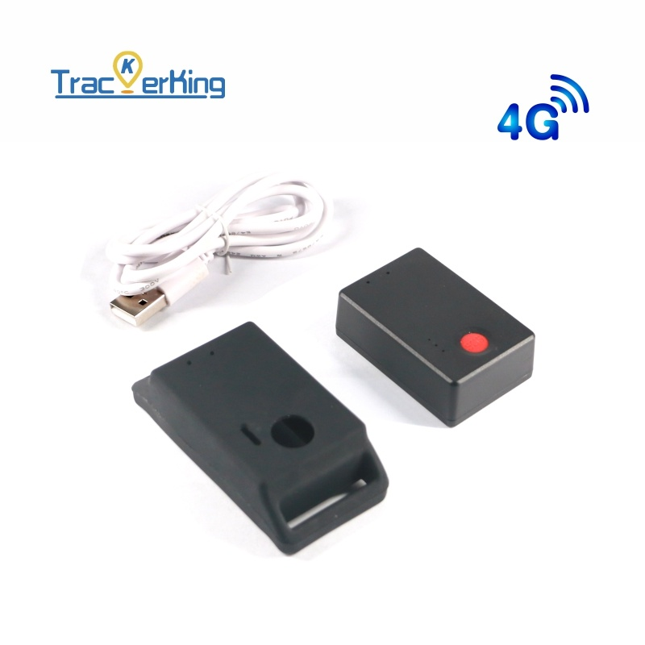

# TrackerKing - DK27

El DK27 es un rastreador GPS compacto y portátil pensado para protección anti pérdida y monitoreo de activos personales. Integra conectividad celular, batería recargable y un diseño de pequeño tamaño que facilita su despliegue sin cableado y su colocación discreta. Entre las funciones principales que destaca el fabricante están el botón SOS con una sola pulsación, monitoreo de voz para escucha remota, alarmas por movimiento y vibración, y soporte de geocercas; todas orientadas a proteger vehículos, motocicletas, mascotas y personas.

Al ser totalmente compatible con Plaspy, las actualizaciones de ubicación y las señales de evento del DK27 pueden integrarse en los paneles y flujos de trabajo de Plaspy. Esta compatibilidad unifica la telemetría del DK27, los eventos SOS y las alertas de geocerca en una sola vista de gestión de flotas, de modo que operadores y cuidadores puedan monitorear dispositivos en tiempo real, configurar notificaciones y revisar rutas y eventos históricos desde Plaspy.

## Características principales

- Compatible con Plaspy para una integración sencilla en paneles y flujos de seguimiento
- Conectividad 4G y 2G Cat 1 con quad band GSM para amplia cobertura
- Batería recargable integrada de 1200 mAh que permite uso portátil sin necesidad de cableado
- Botón SOS y monitoreo de voz para apoyar la respuesta ante emergencias y la escucha remota
- Alarmas por movimiento y vibración más eventos de geocerca para protección contra robo y pérdidas
- Formato compacto adecuado para vehículos, motocicletas, mascotas, niños, adultos mayores y activos portátiles

## Cómo funciona con Plaspy

Al conectarse a Plaspy, el DK27 transmite datos de ubicación y eventos a la plataforma, donde esa telemetría se muestra en mapas, en informes y como alertas configurables. Plaspy procesa los eventos del dispositivo para que los equipos mantengan conciencia situacional, respondan a incidentes y analicen movimientos pasados para obtener información operativa.

- Actualizaciones de ubicación en tiempo real y reproducción de rutas disponibles en Plaspy para monitoreo en vivo
- Los eventos del botón SOS se reenvían a Plaspy para activar notificaciones y reglas de escalamiento
- Las alarmas por movimiento y vibración se registran como eventos en Plaspy para iniciar alertas o acciones automatizadas
- Las alertas de geocerca aparecen en Plaspy para ayudar a hacer cumplir zonas y supervisar cumplimiento
- Estado de batería baja y modos de ahorro de energía visibles en Plaspy para asistir en el mantenimiento y la programación de recargas
- Los eventos de monitoreo de voz pueden registrarse en Plaspy donde los flujos de trabajo de la plataforma lo soporten, complementando el registro de incidentes

## Casos de uso típicos

- Seguridad personal y monitoreo por parte de cuidadores para niños o adultos mayores usando funciones SOS y de voz
- Protección antirrobo para motocicletas y vehículos ligeros con alarmas de movimiento y geocercas
- Rastreo de mascotas con collares o accesorios portátiles para controlar desplazamientos
- Protección de activos portátiles como equipaje, herramientas o equipos cuando el cableado no es práctico
- Rastreo comercial ligero para vehículos o equipos que requieren despliegue rápido y ocasional

## Por qué elegir este rastreador con Plaspy

El DK27 es una opción práctica para organizaciones y particulares que necesitan un rastreador con baja fricción y alimentación por batería, orientado a alertas de seguridad y portabilidad más que a una integración profunda con vehículos. Su diseño compacto y la batería recargable facilitan el despliegue en múltiples activos pequeños o pertenencias personales, y Plaspy integra esas fuentes distribuidas en una vista operativa unificada para monitoreo y respuesta.

Para administradores de flota, cuidadores y responsables de activos que buscan un rastreador GPS sencillo que se combine con una plataforma de gestión robusta, el DK27 con Plaspy ofrece una solución equilibrada para ubicación en tiempo real, alertas de eventos y revisión histórica. Conozca más sobre Plaspy en el sitio principal https://www.plaspy.com y verifique especificaciones y disponibilidad actual en el sitio del fabricante https://trackerking.cn/ ya que los detalles y las características pueden cambiar con el tiempo.
