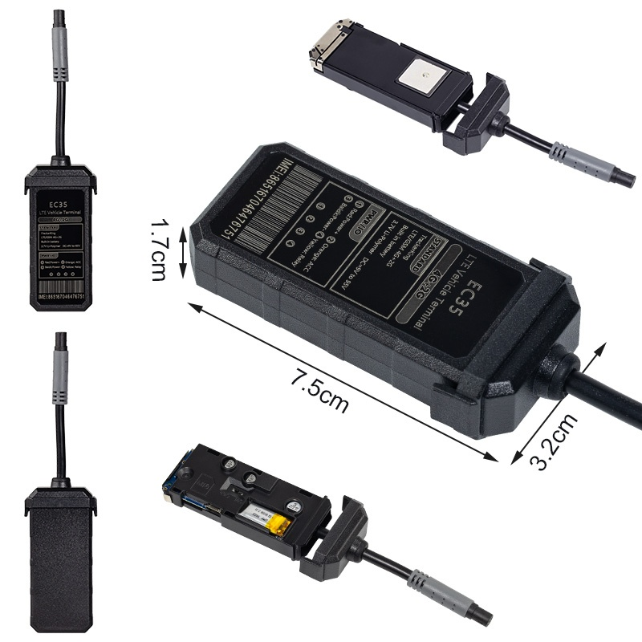

# TrackerKing - EC35

El TrackerKing EC35 es un rastreador GPS robusto y compatible con Plaspy, diseñado para entornos vehiculares exigentes. Construido alrededor de un módulo Quectel 4G Cat1 con conmutación automática a 2G, el EC35 ofrece seguimiento en tiempo real, telemetría fiable y reproducción del historial de rutas para automóviles, camiones y motocicletas. Su impermeabilización IP68, su amplio rango de entrada de 9–90 V y su batería interna de respaldo hacen del EC35 una opción práctica donde la disponibilidad y la durabilidad importan.

El EC35 integra interfaces de sensores para monitoreo de combustible, detección de temperatura e identificación del conductor \(IButton\), además de módulos de relé Bluetooth opcionales para ampliar la telemetría y la conectividad en sitio. Diseñado para reportar mediante protocolos estándar de rastreo como GT06, JT808 y Tianqin, el EC35 se instala fácilmente y se empareja con Plaspy para la gestión de flotas, protección antirrobo, control remoto del inmovilizador y generación de informes detallados del vehículo.

## Aspectos clave

- Compatible con Plaspy: admite los protocolos GT06, JT808 y Tianqin para una integración sencilla con el seguimiento en tiempo real e informes de Plaspy.
- Seguimiento en tiempo real fiable sobre 4G Cat1 con conmutación automática a 2G para mantener la conectividad en áreas de cobertura diversas.
- Impermeabilización IP68 y diseño robusto para automóviles, camiones, equipos pesados y motocicletas en condiciones adversas.
- Amplio rango de entrada 9–90V y batería interna de respaldo para garantizar telemetría continua y alertas por fallo de alimentación.
- Detección de encendido integrada \(ACC\) y soporte de encendido virtual para un registro preciso de kilometraje, eventos de encendido y telemetría de la flota.
- Soporte para sensores externos de nivel de combustible y temperatura para habilitar el monitoreo de combustible y la visibilidad de la cadena de frío cuando sea necesario.
- Corte remoto del motor y del combustible para funciones antirrobo y control estilo inmovilizador desde Plaspy.
- Identificación del conductor con IButton y relé Bluetooth opcional integrados en Plaspy para atribución del conductor y emparejamiento de sensores locales.

## Cómo funciona con Plaspy

Cuando se empareja con Plaspy, el EC35 se convierte en un punto final telemático completo: envía ubicación, telemetría de sensores y eventos de estado al servidor de Plaspy utilizando protocolos de rastreo GPS estándar de la industria. Plaspy ingiere los informes TCP/UDP del dispositivo para proporcionar mapas en tiempo real, alertas, reproducción histórica y paneles de flota. Las características del EC35—como la detección ACC de encendido, las entradas de sensores externos y el corte remoto—se exponen en Plaspy para reglas automatizadas, notificaciones y flujos de trabajo de control remoto.

- Ubicación y telemetría en tiempo real transmitidas a Plaspy vía 4G Cat1 \(con conmutación a 2G\) para un seguimiento continuo.
- Eventos de encendido y encendido virtual reportados a Plaspy para kilometraje, horas de motor y analítica basada en uso.
- Monitoreo de combustible y datos de sensores de temperatura externa transmitidos a Plaspy para gestión de combustible y visibilidad de la cadena de frío.
- Corte remoto del motor y del combustible \(control estilo inmovilizador\) accionable desde los paneles y alertas de Plaspy.
- Relé Bluetooth opcional e ID de conductor con IButton integrados en Plaspy para atribución del conductor y emparejamiento de sensores locales.

## Resumen técnico

| Conectividad | Módulo Quectel 4G Cat1 con conmutación automática a 2G |
| --- | --- |
| Bandas | 4G Cat1 \(módulo Quectel\) con conmutación a 2G; las variantes de bandas de red específicas dependen del modelo/región |
| Alimentación y batería | Rango de voltaje de entrada amplio: 9–90V; batería interna de respaldo para alertas por fallo de alimentación |
| Interfaces | Detección de encendido ACC y soporte de encendido virtual; entradas para sensores de nivel de combustible y temperatura; IButton de identificación del conductor; salida para corte remoto de motor/combustible |
| GNSS | Posicionamiento GPS con reproducción de ruta histórica y retransmisión desde áreas sin señal GPS |
| Bluetooth | Módulos de relé Bluetooth opcionales y accesorios para emparejamiento de sensores locales y expansiones |
| Gestión remota | Soporta protocolos estándar de rastreo GPS GT06, JT808, Tianqin; informes TCP/UDP para integración con servidor |
| Formato | Rastreador compacto para vehículos, carcasa impermeable IP68 adecuada para automóviles, camiones, equipos pesados y motocicletas |

## Casos de uso

- Gestión de flotas: seguimiento en tiempo real, eventos de encendido y estadísticas de kilometraje para optimizar rutas e informes.
- Antirrobo y recuperación de vehículos: corte remoto de motor/combustible combinado con geocercas y alarmas de vibración para una respuesta rápida.
- Monitoreo de combustible: integración de sensores externos de nivel de combustible para detectar robos, ineficiencia y tendencias de consumo.
- Cadena de frío y carga sensible a la temperatura: sensores externos de temperatura retransmiten telemetría a Plaspy para cumplimiento y alertas.
- Protección de motocicletas y seguimiento de equipos pesados: impermeabilización IP68 y amplio rango de voltaje para despliegues en exteriores en condiciones adversas.

## Por qué elegir este rastreador con Plaspy

El TrackerKing EC35 está diseñado para llevar un seguimiento GPS confiable y telemetría de vehículos a Plaspy con un mínimo esfuerzo de integración. Su soporte para los protocolos GT06, JT808 y Tianqin y el informe TCP/UDP garantiza conectividad compatible con Plaspy lista para usar. Con un amplio rango de voltaje, impermeabilización IP68 y una batería interna de respaldo, el EC35 reduce el tiempo de inactividad y mejora la continuidad de datos para la gestión de flotas y flujos de trabajo de anti‑robo. La detección de encendido integrada, el soporte de sensores de combustible y temperatura y el corte remoto de motor/combustible permiten a los operadores disponer del control e información necesarios para operaciones eficientes, mayor seguridad y telemetría más rica. Para flotas y operadores de activos que buscan un rastreador GPS duradero, compatible con Plaspy, con opciones de sensores flexibles y capacidad de inmovilizador remoto, el EC35 ofrece valor práctico sin configuraciones complejas.

