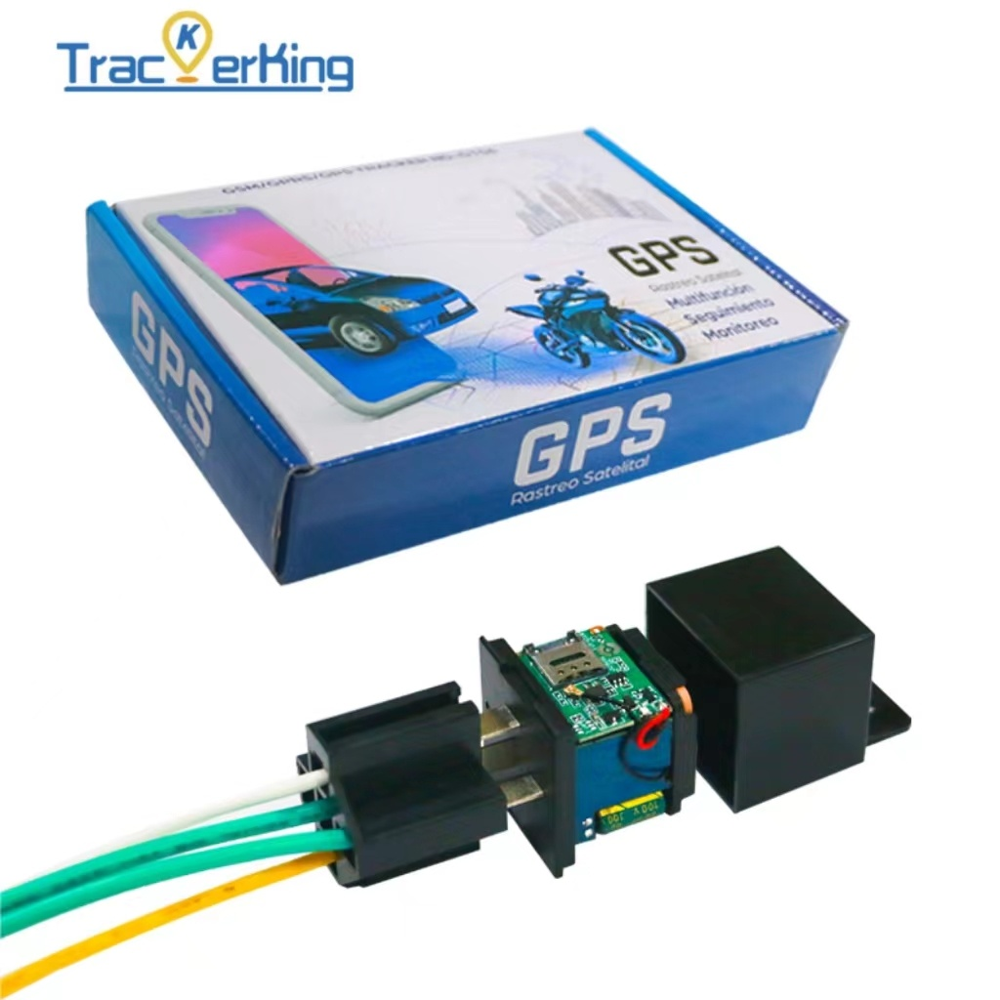

# TrackerKing - G509

El TrackerKing G509 es un rastreador GPS de tipo relé diseñado para proporcionar seguridad discreta en vehículos y soporte operativo en flotas. Su carcasa imita la apariencia de un relé convencional, ofreciendo seguimiento en tiempo real y reproducción fiable de rutas históricas, todo en un formato compacto que facilita la instalación oculta en vehículos comerciales, autos particulares y equipos móviles. Sus funciones están orientadas a flujos de trabajo antirrobo y a telemetría básica de flota para apoyar la respuesta operativa y la recuperación.

Como opción compatible con Plaspy, el G509 puede integrarse con los paneles y aplicaciones móviles de Plaspy para ofrecer visibilidad instantánea de ubicaciones, alertas configurables y telemetría centralizada de la flota. Al configurarse para reportar a Plaspy, las señales de rastreo y las alarmas del dispositivo aparecen junto con otros datos de la flota, de modo que los operadores puedan monitorear posiciones en vivo, revisar historiales y, cuando esté autorizado, ejecutar acciones de inmovilización desde la plataforma.

## Características principales

- Factor de forma tipo relé discreto, ideal para instalación oculta en vehículos y equipos móviles
- Rastreo GPS en tiempo real y reproducción de rutas históricas para auditoría y revisión
- Alarmas antirrobo y de seguridad: detección de movimiento, alarma por vibración, exceso de velocidad y notificaciones por geocercas
- Salida de relé para corte remoto de motor o alimentación cuando se utiliza como inmovilizador y está autorizado
- Alarma por pérdida de alimentación con batería interna de respaldo para detección de manipulación y fallas eléctricas
- Compatible con Plaspy para paneles centralizados, alertas y reportes básicos de kilometraje y viajes

## Cómo funciona con Plaspy

Cuando el G509 está configurado para enviar datos a Plaspy, su información de ubicación y eventos se integra en la plataforma para que gestores de flota y propietarios de vehículos puedan ver posiciones en tiempo real, recibir notificaciones y revisar recorridos históricos. Las herramientas de mapas e informes de Plaspy interpretan los eventos del dispositivo para generar telemetría accionable y registros de eventos útiles para seguridad, cumplimiento y análisis operativo.

- Actualizaciones de ubicación en tiempo real entregadas a Plaspy para monitoreo y despacho inmediato
- Eventos de alarma como movimiento, vibración, exceso de velocidad y rupturas de geocerca enviados como notificaciones y registrados para auditoría
- Reproducción de rutas históricas y registros de viajes disponibles en Plaspy para verificación de rutas y revisión por parte del conductor
- Estadísticas de kilometraje e informes básicos de viajes visibles en los reportes de Plaspy para análisis operativo
- Comandos remotos de inmovilizador que pueden emitirse desde Plaspy al relé del dispositivo, cuando está configurado y autorizado
- Estado de pérdida de energía y batería de respaldo reportados para que los operadores detecten intentos de manipulación o fallas eléctricas

## Casos de uso habituales

- Protección antirrobo en flotas mediante instalación discreta y alertas por vibración o movimiento
- Inmovilización remota para recuperación de vehículos o para impedir el uso no autorizado, siempre que la política lo permita
- Auditoría de rutas y monitoreo del comportamiento del conductor usando reproducción histórica y alertas por exceso de velocidad
- Monitoreo de manipulación y alimentación para detectar intentos de desactivar el rastreo o problemas eléctricos
- Seguimiento de activos móviles y remolques que operan dentro de rangos de voltaje vehículos estándar

## Por qué elegir este rastreador con Plaspy

El G509 combina un formato compacto y discreto con un conjunto de funciones centradas en la seguridad y la operación que lo hacen práctico para flotas y propietarios que requieren rastreo oculto y capacidades de inmovilización. Su posibilidad de control por relé ofrece una opción real para mitigar robos, mientras que los eventos de rastreo y alarma se integran directamente en Plaspy para visibilidad centralizada.

Para organizaciones que usan Plaspy, el G509 es adecuado cuando necesita reportes de ubicación confiables, registros básicos de kilometraje y viajes, y manejo integrado de alarmas en un dispositivo que puede ocultarse. Dado que la unidad está pensada para instalación cableada y actúa sobre circuitos del vehículo para funciones de inmovilización, se recomienda instalación profesional para garantizar una configuración segura y correcta.

Para obtener más información sobre Plaspy y cómo se integran los dispositivos compatibles con su plataforma visite https://www.plaspy.com. Las especificaciones del producto, la disponibilidad y los detalles del fabricante pueden cambiar con el tiempo; verifique las especificaciones técnicas actuales y la guía de instalación en el sitio oficial de TrackerKing https://trackerking.cn/.
