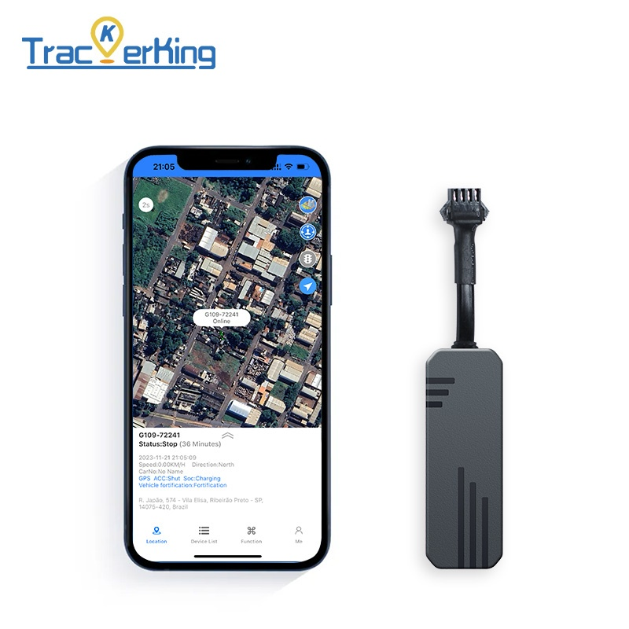

# TrackerKing - J14

El TrackerKing J14 es un rastreador GPS vehicular cableado y compacto diseñado para instalación permanente en el vehículo. Emplea posicionamiento GNSS dual con GPS y BDS para ofrecer localizaciones fiables y de baja latencia, y viene en una carcasa resistente con clasificación IP65. Con un amplio rango de tensión de funcionamiento y un tamaño reducido, el J14 está pensado para montaje discreto en autos, camiones ligeros y vehículos pesados cuando se requiere monitoreo persistente.

Como dispositivo compatible con Plaspy, el J14 suministra telemetría continua de posición y eventos que Plaspy integra para mostrar mapas en vivo, generar alertas y reproducir historiales. Su conjunto de alarmas y el reporte basado en eventos lo hacen idóneo para flotas y flujos de trabajo de seguridad en Plaspy, proporcionando a los operadores datos útiles para recuperación, respuesta ante incidentes y supervisión operativa.

## Aspectos destacados

- Compatible con Plaspy para envío continuo de posición y eventos, soportando seguimiento en vivo e informes.
- Posicionamiento GPS más BDS para mejorar la fiabilidad y rapidez de los fixes en distintos entornos.
- Más de diez mecanismos de alarma, incluyendo geocercas, exceso de velocidad, detección de movimiento y corte de alimentación.
- Rango de entrada 9–90 V DC para uso en autos, vehículos comerciales y maquinaria pesada sin necesidad de convertidores adicionales.
- Carcasa IP65 que ofrece resistencia al polvo y al agua en ubicaciones expuestas del vehículo.
- Diseño compacto y de bajo perfil, 74 × 26 × 15 mm, y peso liviano para una instalación cableada discreta.
- Telemetría basada en eventos y reproducción histórica de rutas para apoyar investigaciones y análisis operativos.

## Cómo funciona con Plaspy

Al implementarlo con Plaspy, el J14 entrega fixes GNSS constantes y mensajes de eventos que alimentan los paneles y flujos de trabajo de Plaspy. Plaspy consume la señal del rastreador para mostrar ubicaciones en tiempo real, activar alertas y conservar historiales con marcas de tiempo para informes y revisiones.

- Actualizaciones de ubicación en tiempo real a Plaspy para visibilidad de la flota y monitoreo de rutas.
- Reenvío de alarmas y eventos como violación de geocerca, exceso de velocidad, movimiento y corte de alimentación para disparar alertas y flujos en Plaspy.
- Reproducción histórica de rutas y registros de eventos con marcas de tiempo en Plaspy para investigaciones y cumplimiento.
- Correlación de la telemetría del J14 con señales del vehículo expuestas a Plaspy para enriquecer los informes telemáticos cuando esos datos estén disponibles.
- Despliegue escalable de dispositivos y supervisión centralizada en Plaspy para gestionar el seguimiento en una flota mixta.

## Casos de uso típicos

- Gestión de flotas para logística, repartos y servicios de campo donde se requiere seguimiento continuo y historial de rutas.
- Recuperación de vehículos financiados, donde la instalación discreta y las alertas por eventos ayudan a los equipos de recuperación a localizar activos.
- Monitoreo antirrobo y de seguridad para autos, camiones y equipos rastreados con notificaciones por movimiento y corte de alimentación.
- Protección de activos para vehículos comerciales y remolques mediante geocercas y alertas por manipulación que facilitan una respuesta rápida.
- Monitoreo persistente para vehículos especializados que requieren un rastreador cableado pequeño y resistente.

## Por qué elegir este rastreador con Plaspy

El J14 es una opción práctica para organizaciones que desean incorporar reportes fiables de ubicación y eventos en una implementación de Plaspy. Su posicionamiento GNSS dual y su conjunto amplio de alarmas proporcionan las señales fundamentales que Plaspy utiliza para ofrecer visibilidad en vivo, alertas y reproducción histórica. Además, el amplio rango de voltaje y la carcasa IP65 reducen las limitaciones en distintos tipos de vehículos. El factor de forma compacto ayuda a mantener el dispositivo discreto y resistente a manipulaciones para flujos de trabajo de recuperación y antirrobo.

Para saber más sobre Plaspy y cómo los rastreadores compatibles pueden integrarse en su programa de flota visite https://www.plaspy.com. Las especificaciones del producto y la disponibilidad pueden cambiar con el tiempo, por lo que le recomendamos verificar los detalles técnicos y las pautas de instalación actuales en el sitio del fabricante https://trackerking.cn/.
