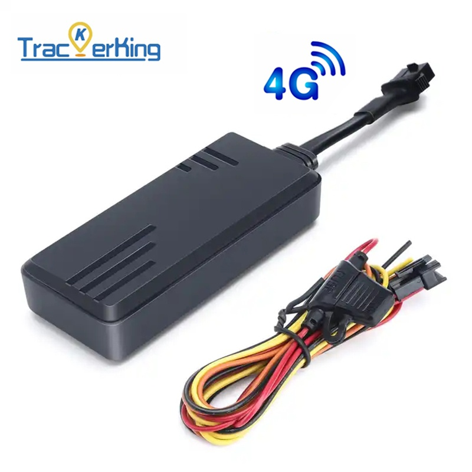

# TrackerKing - J16

El J16 es un rastreador GPS para vehículos con cable diseñado para un seguimiento en tiempo real fiable, compatible con Plaspy, y una protección profesional anti-robos. Construido alrededor de un módulo celular Quectel y compatible con 4G+2G Cat-1 con conmutación automática a 2G, el J16 ofrece a los operadores de flotas y a los propietarios de vehículos una cobertura de red sólida, telemetría en tiempo real y una integración sencilla con plataformas telemáticas de terceros.

La unidad está diseñada específicamente para la gestión de flotas, monitoreo de coches de alquiler y recuperación ante robos: ofrece seguimiento en tiempo real, reproducción de rutas históricas, estadísticas de kilometraje y odómetro, retransmisión en áreas sin cobertura de datos GPS almacenados y inmovilización remota mediante corte del motor o del combustible. Como localizador cableado plug-and-play diseñado para instalación dentro del arnés de cableado del vehículo, el J16 se conecta a los circuitos de ignición y de relé y reporta intervalos telemáticos estándar a Plaspy o a cualquier servidor compatible usando los protocolos GT06, JT808 y Tianqin.

## Aspectos clave

- Compatible con Plaspy listo para usar — admite GT06, JT808 y Tianqin para una fácil integración con el servidor y la telemetría.
- Conectividad celular fiable con 4G Cat-1 y conmutación automática a 2G para un seguimiento en tiempo real continuo en áreas con cobertura mixta.
- Funciones profesionales anti-robo que incluyen corte remoto del motor y del combustible \(inmovilizador\), alarma de vibración, alarma de geocerca y alertas de exceso de velocidad.
- Amplio rango de voltaje de entrada \(9–90 V\) y batería interna de respaldo con alarma de fallo de energía para un funcionamiento ininterrumpido en todo tipo de vehículos.
- Retransmisión en áreas sin cobertura: los datos GPS y de odómetro en caché se cargan cuando la cobertura se restablece para conservar el historial.
- Diseñado para la gestión de flotas — estadísticas de odómetro y kilometraje, reproducción de historial y intervalos de reporte estándar optimizan las operaciones.
- Formato cableado plug-and-play pensado para una instalación segura dentro del arnés del vehículo para reducir manipulaciones y admitir control de relés.

## Cómo funciona con Plaspy

La integración del J16 con Plaspy es sencilla ya que el dispositivo implementa protocolos telemáticos ampliamente utilizados y un módulo celular Quectel. Al configurarlo para reportar a los servidores de Plaspy, el rastreador transmite la ubicación y actualizaciones de estado a intervalos configurables para que puedas monitorizar los vehículos en tiempo real, reproducir rutas y recibir alertas por robo o uso indebido.

- Actualizaciones de ubicación y telemetría en tiempo real enviadas a Plaspy para monitoreo en vivo y paneles de control de flotas.
- Detección de ignición ACC y reporte de ignición virtual para un estado preciso de motor encendido/apagado y métricas de utilización.
- Soporte de inmovilizador remoto — órdenes de corte de motor y de combustible emitidas desde Plaspy para detener un vehículo robado de forma segura.
- Retransmisión en áreas sin cobertura: los datos GPS y de odómetro en caché se cargan automáticamente en Plaspy cuando se restablece la cobertura para conservar el historial.
- Eventos de alarma \(vibración, geocerca, exceso de velocidad, fallo de energía\) enviados a Plaspy como alertas para una respuesta rápida a incidentes y registro de auditoría.

## Resumen técnico

| Conectividad | 4G Cat-1 con conmutación automática a 2G \(módulo celular Quectel\) |
| --- | --- |
| Bandas | 4G + 2G Cat-1 \(conmutación automática\). Las bandas de frecuencia específicas dependen de la versión regional/provisión del operador. |
| Alimentación y batería | Rango amplio de voltaje de entrada: 9–90 V; batería interna de respaldo con alarma de fallo de energía |
| Interfaces | Instalación con cableado con entrada de ignición \(ACC\), soporte de ignición virtual, control de relé para corte de motor y combustible |
| GNSS | Ubicación GPS con datos GPS en caché y retransmisión en áreas sin cobertura. \(Conjuntos GNSS compatibles no detallados.\) |
| Bluetooth | No especificado en la descripción del producto |
| Gestión remota | Soporta comandos y configuración remotos; reporta a servidores propietarios o de terceros usando protocolos telemáticos estándar |
| Formato | Rastreador de vehículos cableado plug-and-play para instalación dentro del arnés de cableado del vehículo |

## Casos de uso

- Gestión de flotas: monitorizar ubicaciones de vehículos, kilometraje, rutas y comportamiento del conductor para una asignación y planificación de mantenimiento optimizadas.
- Anti-robo y recuperación: alarmas por vibración, geocerca y exceso de velocidad, más el inmovilizador remoto \(corte del motor/ combustible\) para ayudar a recuperar vehículos robados y evitar usos no autorizados.
- Monitoreo de coches de alquiler: rastrear uso por alquiler, verificar rutas y kilometraje, e inmovilizar de forma remota un vehículo en caso de incumplimientos de contrato.
- Logística y seguimiento de activos: asegurar entregas puntuales, conservar el historial de rutas con retransmisión en áreas sin cobertura y recibir alertas de fallo de energía para detección de manipulación.

## Por qué elegir este rastreador con Plaspy

El J16 ofrece una solución fiable y de grado profesional para operadores que requieren telemetría compatible con Plaspy y controles anti-robo robustos. Su conectividad celular basada en Quectel con 4G Cat-1 y conmutación a 2G garantiza una cobertura persistente para el seguimiento en tiempo real, mientras que el soporte de los protocolos GT06, JT808 y Tianqin facilita la integración con Plaspy y otras plataformas. Su amplio rango de voltaje, la batería de respaldo interna y la instalación cableada reducen el tiempo de inactividad y el riesgo de manipulación, y la capacidad de inmovilización remota ofrece a los equipos de operaciones un control decisivo durante incidentes de robo o uso indebido.

Para las organizaciones que utilizan Plaspy para la gestión de flotas y telemetría, el J16 ofrece una opción compacta cableada que se centra en la seguridad del vehículo, informes precisos de kilometraje y odómetro, y una reproducción de historial fiable. Aunque Plaspy también admite integraciones de telemetría ampliadas como monitorización de combustible y sensores Bluetooth para casos de uso ampliados, el J16 destaca como rastreador GPS central y controlador de inmovilización para flotas, alquileres y flotas logísticas que buscan seguimiento en tiempo real robusto y funcionalidad anti-robo.

