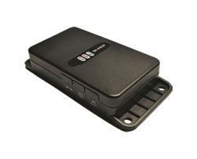

# Tramigo - T23

El Tramigo T23 es un dispositivo de rastreo para vehículos pensado tanto para uso particular como para la gestión de flotas. Posicionado como un producto de seguridad vehicular muy vendido, el T23 ofrece visibilidad continua de la ubicación y funcionalidades orientadas al seguimiento, la recuperación de vehículos y la supervisión diaria de la flota. Su diseño admite instalación oculta y conexión a la alimentación del vehículo; además, cuenta con batería de respaldo y memoria interna para mantener la continuidad del rastreo si se pierde la energía principal.

Como dispositivo compatible con Plaspy, el Tramigo T23 puede enviar datos de ubicación y eventos a la plataforma Plaspy para facilitar la supervisión en tiempo real, las alertas y los informes. Los usuarios de Plaspy pueden aprovechar las funciones habituales del T23 —como reportes por intervalo de tiempo o distancia, entradas de pánico e ignición, y capacidad de voz— dentro del entorno Plaspy para mejorar la visibilidad operativa y responder con mayor rapidez ante incidentes.

## Aspectos destacados

- Historial comprobado como un dispositivo popular de seguridad y rastreo vehicular, apto para uso personal y flotas comerciales
- Reporte de ubicación en tiempo real mediante conectividad GSM y GPRS para actualizaciones continuas
- Batería de respaldo y memoria interna que preservan los datos de rastreo si se interrumpe la alimentación principal
- Múltiples opciones de posicionamiento: intervalo de tiempo, distancia recorrida y cambio de ángulo para reportes adaptables
- Capacidad de voz integrada y más de cuatro entradas digitales con entradas predefinidas para ignición y pánico, útiles para eventos y alertas
- Opciones de conectividad ampliables como antenas externas, micrófono y parlante, y conexiones para sensores adicionales

## Cómo funciona con Plaspy

Al integrarse con Plaspy, el Tramigo T23 transmite información de ubicación y eventos a la plataforma, donde se incorpora a la visibilidad centralizada y a las herramientas de gestión de la flota. Plaspy traduce los datos entrantes del dispositivo en posiciones sobre el mapa, cronologías históricas y alertas configurables para que los equipos puedan monitorear vehículos y responder ante excepciones.

- Mostrar ubicaciones en vivo y el historial en los mapas de Plaspy para seguir rutas y verificar paradas
- Configurar alertas para pánico, eventos de ignición o patrones de movimiento y recibir notificaciones a través de Plaspy
- Usar reportes de viajes y actividad en Plaspy para analizar utilización, tiempo ocioso y desempeño de rutas
- Combinar las entradas del T23 con la monitorización de Plaspy para detectar uso no autorizado y apoyar los procesos de recuperación de vehículos
- Agregar datos de múltiples unidades T23 para supervisión a nivel de flota y planificación operativa

## Casos de uso típicos

- Seguridad vehicular y recuperación rápida para autos particulares y bienes de alto valor
- Rastreo de flotas pequeñas y medianas para operaciones de entrega, servicios y logística
- Supervisión de vehículos en alquiler y leasing para controlar ubicación y eventos de uso
- Monitoreo remoto de personal de campo y vehículos de empresa para mejorar despacho y seguridad
- Alertas de incidentes y coordinación de respuesta usando entradas de pánico e ignición

## Por qué elegir este rastreador con Plaspy

El Tramigo T23 es una opción práctica para organizaciones que requieren un dispositivo de rastreo maduro junto con una plataforma de gestión flexible. Su combinación de reporte continuo de ubicaciones, entradas de eventos y alimentación de respaldo proporciona una fuente de datos confiable para que Plaspy entregue visibilidad situacional e informes. La capacidad de voz y la conectividad ampliable hacen al T23 adaptable a diversas necesidades operativas sin requerir modificaciones especializadas.

Dado que el T23 está pensado tanto para uso personal como para flotas, los equipos que evalúan hardware para Plaspy pueden esperar un equilibrio entre funciones probadas en campo y un comportamiento de dispositivo sencillo. No obstante, la adecuación final depende de sus requerimientos operativos; considere el T23 en función de la cadencia de reportes esperada, las necesidades de alerta y el entorno de los vehículos.

Para más información sobre cómo funciona Plaspy con dispositivos Tramigo y explorar las funciones de la plataforma, conozca más sobre Plaspy en https://www.plaspy.com. Las especificaciones del producto, disponibilidad y detalles del fabricante pueden cambiar con el tiempo, por lo que le recomendamos verificar las especificaciones actuales en el sitio oficial de Tramigo http://www.tramigo.net/.
