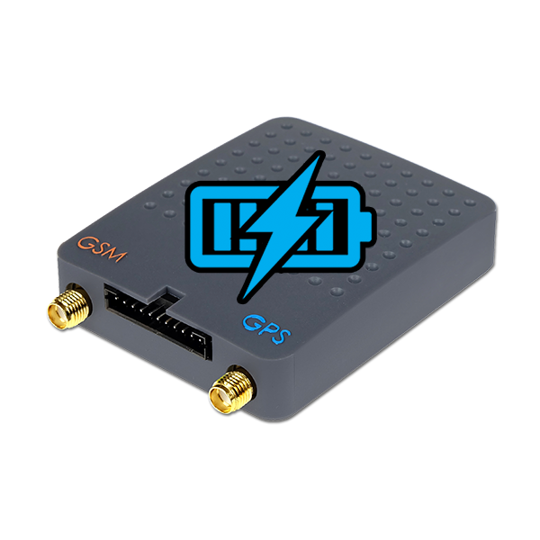

# Tytan SAT - DS520B

El DS520B es un rastreador GPS compatible con Plaspy, diseñado para el monitoreo fiable de vehículos y cargas. Como la versión B de la serie DS520, ofrece seguimiento en tiempo real vía GSM GPRS y un conjunto de interfaces de telemetría pensadas para uso vehicular. El dispositivo dispone de entradas y salidas analógicas y digitales, soporta sensores de temperatura 1-wire y cuenta con almacenamiento local para conservar eventos cuando la conectividad se interrumpe.

Este rastreador es relevante para los usuarios de Plaspy porque sus capacidades de telemetría y control se integran directamente con la plataforma para la gestión de flotas, flujos de trabajo anti robo y reportes operativos. Al combinarlo con Plaspy, los datos del DS520B se presentan en paneles, alertas e informes históricos, lo que permite a los equipos de operaciones y seguridad actuar sobre la ubicación y el estado sin perder eventos durante cortes temporales de la red.

## Aspectos principales

- Rastreador GPS compatible con Plaspy que ofrece seguimiento en tiempo real vía GSM GPRS para vehículos y carga
- Entradas y salidas analógicas y digitales para telemetría flexible y estados usados en la gestión de flotas
- Soporte para sensores de temperatura 1-wire, ideal para monitoreo de cargas refrigeradas o compartimentos
- Salidas digitales y control remoto de circuitos para acciones tipo inmovilizador y respuestas anti robo
- Memoria no volátil que almacena datos localmente durante fallas celulares para preservar eventos y posiciones
- Factor de forma compacto enfocado al uso vehicular y despliegue en carga

## Cómo funciona con Plaspy

Al integrarse con Plaspy, el DS520B envía eventos de ubicación y telemetría que la plataforma normaliza y muestra para monitoreo, alertas e informes. Plaspy le permite configurar reglas y paneles que usan las entradas y salidas del DS520B para respaldar flujos operativos y respuestas de seguridad.

- Las actualizaciones de ubicación y telemetría en tiempo real son visibles en Plaspy para un seguimiento continuo
- Eventos de E/S digitales pueden reportar encendido, puertas o alarmas a Plaspy para análisis de comportamiento y seguridad
- Las entradas analógicas proporcionan telemetría de sensores como sondas de combustible y se presentan en informes y gráficos en Plaspy
- Las salidas digitales permiten que Plaspy dispare acciones remotas en circuitos como parte de flujos anti robo o de control
- Las lecturas de temperatura 1-wire se reenvían a Plaspy para monitoreo térmico y alertas por umbrales
- El buffer local del dispositivo garantiza que Plaspy reciba historiales completos de eventos cuando se restaura la conectividad

## Casos de uso típicos

- Flujos anti robo e inmovilización de flotas combinando salidas remotas del DS520B con reglas en Plaspy
- Monitorización de combustible y telemetría para análisis de consumo y detección de anomalías
- Seguimiento de temperatura en cargas refrigeradas usando sensores 1-wire y alertas de Plaspy
- Monitoreo de eventos de encendido y apertura de puertas para reportes de comportamiento del conductor y seguridad
- Rastreo general de vehículos y activos donde es importante mantener continuidad de datos durante cortes de red

## Por qué elegir este rastreador con Plaspy

El DS520B es una opción práctica para organizaciones que necesitan telemetría y control remoto confiables, junto con las funciones operativas de Plaspy. Su combinación de E/S analógicas y digitales, soporte para sensores de temperatura, salidas remotas y buffer local cubre requisitos comunes de monitoreo de flotas, protección de carga e intervenciones remotas básicas sin añadir complejidad innecesaria.

Si desea conocer más sobre cómo Plaspy puede aprovechar la telemetría y el control del DS520B en sus operaciones de flota, visite Plaspy en el sitio principal https://www.plaspy.com. Las especificaciones y la disponibilidad de producto pueden cambiar con el tiempo, por lo que le recomendamos verificar los detalles actuales con el fabricante en http://tytansat.com/ antes de tomar decisiones de compra o despliegue.
