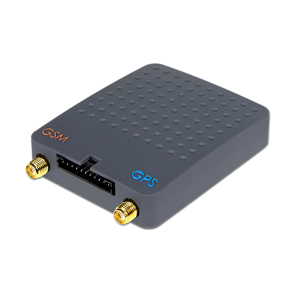

# Tytan SAT - DS540B

El DS540B es la versión B de la serie DS540 de Tytan SAT, diseñado como un rastreador GPS compatible con Plaspy para el seguimiento en tiempo real de vehículos y mercancías. Está pensado para aplicaciones vehiculares exigentes y ofrece telemetría profunda a bordo mediante la lectura completa de buses CAN FMS, J1939 y J1708, junto con integración de sensores analógicos y digitales. Esta combinación proporciona ubicación precisa y datos vehiculares detallados útiles para operaciones de flota y procesos de seguridad.

Como dispositivo compatible con Plaspy, el DS540B envía ubicación y telemetría del vehículo a Plaspy para ofrecer visibilidad consolidada y supervisión operativa. Al integrarse con Plaspy, el rastreador convierte señales crudas del vehículo en alertas, reportes históricos y paneles en vivo que facilitan el seguimiento de uso, procesos antirrobo, control de combustible y planificación de mantenimiento en flotas mixtas.

## Principales ventajas

- Rastreador GPS compatible con Plaspy optimizado para seguimiento en tiempo real de vehículos y carga, y entrega de telemetría
- Lectura completa de buses CAN FMS J1939 J1708 para acceder a nivel de combustible, RPM, carga del motor y señales OEM de alarma
- Entradas analógicas y digitales para captar eventos discretos como puertas, maletero o encendido
- Soporte para sensor de temperatura 1 wire, ideal para monitorizar cargas sensibles a la temperatura y cadenas de frío
- Salidas digitales que permiten control remoto de actuadores, cierres de puertas o integraciones con inmovilizadores cuando están soportadas
- Apto para flotas diversas, incluyendo autos de pasajeros, camiones, autobuses, maquinaria de construcción y equipos agrícolas

## Cómo funciona con Plaspy

El DS540B recolecta ubicación GNSS junto con la telemetría del vehículo desde CAN FMS J1939 J1708 y entradas de sensores locales, y luego remite esos datos a Plaspy para seguimiento en tiempo real, alertas e informes. Plaspy procesa estos parámetros, normaliza eventos y los muestra mediante paneles, geocercas e informes programados para que los equipos operativos puedan tomar decisiones basadas en información puntual.

- Actualizaciones de ubicación y telemetría en tiempo real aparecen en los paneles de Plaspy para supervisión y despacho en vivo
- Parámetros del bus CAN como nivel de combustible, RPM y carga del motor se analizan y presentan como métricas de telemetría y monitoreo de combustible
- Entradas analógicas y digitales registran eventos de puertas, maletero e ignición para alertas inmediatas y registro de eventos
- Sensores de temperatura 1 wire informan la temperatura de la carga a Plaspy para monitorización de refrigeración y cumplimiento normativo
- Salidas digitales permiten acciones de control remoto para soportar inmovilizadores o cortes remotos cuando el vehículo y el integrador lo permiten

## Casos de uso típicos

- Antirrobo y bloqueo de flota mediante salidas digitales y alertas de Plaspy para gestionar respuestas de seguridad
- Monitoreo de combustible y análisis de comportamiento del conductor combinando datos CAN de combustible y RPM con reportes de Plaspy
- Control de cargas sensibles a la temperatura para transportes refrigerados usando sensores 1 wire y registros históricos
- Monitoreo de eventos de puertas y alarmas para detectar accesos no autorizados y generar notificaciones instantáneas
- Telemática para maquinaria pesada y equipos agrícolas para seguimiento de utilización y planificación de mantenimiento

## Por qué elegir este rastreador con Plaspy

El DS540B es una opción práctica para organizaciones que requieren más que solo ubicación. Su capacidad para leer datos completos del bus del vehículo y combinarlos con entradas analógicas y digitales lo hace flexible para flotas que necesitan información sobre combustible, monitoreo de alarmas y acciones remotas. Integrado con Plaspy, estas señales se transforman en telemetría estructurada, alertas accionables e informes históricos que ayudan a reducir tiempos de inactividad y mejorar la eficiencia operativa.

Si necesita un rastreador que integre la telemetría del bus del vehículo en una plataforma de gestión de flotas unificada, el DS540B junto con Plaspy ofrece un camino claro desde señales crudas hasta información útil. Más información sobre Plaspy en el sitio principal https://www.plaspy.com. Las especificaciones del producto, la disponibilidad y los datos del fabricante pueden cambiar con el tiempo, por lo que le recomendamos verificar las especificaciones actuales en el sitio oficial del fabricante http://tytansat.com/.
