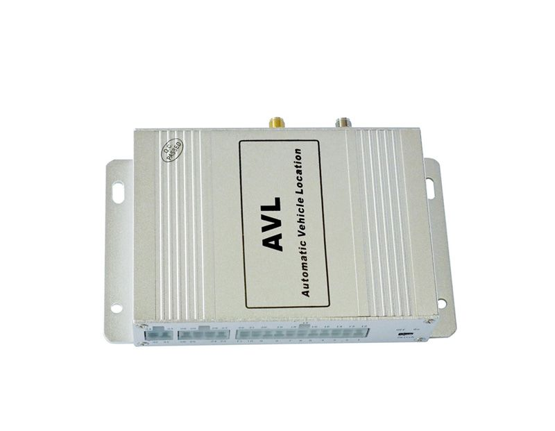

# TZone - AVL-08

El TZone AVL-08 es un rastreador GPS versátil pensado para la seguridad vehicular, el seguimiento de activos y la gestión de flotas. Soporta consultas puntuales de ubicación y seguimiento continuo, e incorpora múltiples funciones de alarma y monitoreo como exceso de velocidad, batería baja, geocerca, vibración, estacionamiento y alertas SOS. Además ofrece características para control y detección del estado del vehículo, entradas opcionales para dispositivos externos, grabación local, cálculo de kilometraje y soporte para sensores adicionales que cubren las necesidades habituales de control de flota y activos.

Al ser un dispositivo compatible con Plaspy, el AVL-08 se integra en el entorno de gestión de flotas de Plaspy para entregar visibilidad en tiempo real de ubicaciones, alertas de eventos e historiales de seguimiento. La compatibilidad facilita el uso del AVL-08 dentro de flujos operativos, permitiendo a responsables de flota consolidar rastreo, notificaciones e informes en una sola plataforma mientras conservan las funciones prácticas del equipo.

## Características principales

- Soporta modos de seguimiento puntual y continuo para mayor flexibilidad de monitoreo.
- Múltiples tipos de alarma, incluyendo exceso de velocidad, geocerca, estacionamiento, vibración, batería baja y SOS.
- Funciones de control y estado del vehículo, como control de puertas y corte gradual de motor para mayor seguridad.
- Opciones de integración con dispositivos externos: grabación en tarjeta SD y conectores para lectores RFID, cámaras y impresoras.
- Capacidades incorporadas para cálculo de kilometraje, detección de nivel de combustible y aceite, sensor de temperatura opcional y eventos basados en acelerómetro 3D.
- Comunicación de voz bidireccional y compatibilidad con mapas móviles para apoyar la comunicación operativa y la visualización.
- Memoria flash integrada para almacenamiento local de datos y posibilidad de enviar ubicación y eventos a servicios remotos.

## Cómo funciona con Plaspy

Al emparejarlo con Plaspy, el AVL-08 envía actualizaciones de ubicación y eventos de alarma a la plataforma, de modo que su equipo pueda monitorear activos en tiempo real y revisar la actividad histórica. Plaspy utiliza los datos del rastreador para generar notificaciones, visualizar rutas y soportar decisiones operativas sobre vehículos y activos móviles.

- Visualización de ubicación en tiempo real y seguimiento continuo en los paneles y mapas de Plaspy.
- Reenvío de eventos de alarma como violaciones de geocerca, exceso de velocidad, batería baja y SOS para manejo inmediato de notificaciones.
- Reproducción de rutas históricas y registros de kilometraje para respaldar informes y revisiones operativas.
- Integración de eventos y grabaciones de dispositivos externos en los flujos de trabajo de Plaspy para ofrecer contexto consolidado de incidentes.
- Uso de datos grabados en el almacenamiento a bordo para complementar registros en la nube y apoyar auditorías o investigaciones.

## Casos de uso típicos

- Gestión de flotas para empresas pequeñas y medianas que requieren rastreo, alertas y reportes de kilometraje.
- Seguridad vehicular y prevención de robos con alertas en tiempo real y funciones de control del motor.
- Monitoreo de transporte escolar y de pasajeros para mejorar la supervisión de seguridad y la visibilidad de rutas.
- Operaciones logísticas y de reparto que necesitan historial de rutas, seguimiento de ubicación y notificaciones de alarma.
- Seguimiento de activos móviles donde sensores externos o integración RFID aportan información adicional relevante.

## Por qué elegir este rastreador con Plaspy

El AVL-08 combina un conjunto amplio de funciones prácticas con la capacidad de integrarse en Plaspy, lo que lo convierte en una buena opción para organizaciones que desean centralizar el rastreo y las alertas. Su combinación de seguimiento continuo, alarmas por eventos, soporte para dispositivos externos y grabación local ofrece flexibilidad para diversos escenarios operativos sin requerir cambios de hardware muy especializados.

Dado que Plaspy se centra en la visibilidad, las alertas y los informes, emparejar el AVL-08 con la plataforma ayuda a convertir los eventos y flujos de ubicación del dispositivo en información operativa accionable. Para equipos que necesitan monitoreo consolidado en flotas mixtas o tipos de activos diversos, esta combinación ofrece un enfoque equilibrado para la supervisión y la seguridad de la flota.

Para obtener más información sobre el uso del TZone AVL-08 con Plaspy visite https://www.plaspy.com. Las especificaciones del producto, su disponibilidad y detalles del fabricante pueden cambiar con el tiempo, por lo que le recomendamos verificar las especificaciones actuales y las opciones soportadas en el sitio oficial de TZone http://www.tzonedigital.com/.
