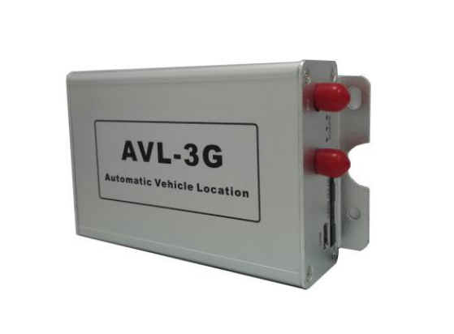

# TZone - TZ-AVL05 3G

El rastreador GPS TZ-AVL05 3G de TZone es un dispositivo de seguimiento de alta calidad que combina tecnología GPS y GSM para proporcionar una ubicación precisa y en tiempo real. Con su función de seguimiento, puede verificar la posición de su vehículo o activo en cualquier momento. Además, el rastreador envía periódicamente datos de posicionamiento para mantenerlo actualizado sobre la ubicación de su vehículo.

Este rastreador también cuenta con varias funciones de seguridad y antirrobo. Incluye una alarma SOS para situaciones de emergencia, una alarma de corte de antena GPS y una alarma de corte de suministro de energía para proteger su vehículo contra robos. También puede configurar una alarma de velocidad para recibir notificaciones cuando su vehículo exceda un límite de velocidad preestablecido. Otras funciones de seguridad incluyen la alarma de vehículo que es tirado, la alarma de geo-cerca y el monitoreo del nivel de combustible.

Además de las funciones de seguimiento y seguridad, el rastreador GPS TZ-AVL05 3G ofrece otras características útiles. Utiliza el protocolo estándar de TZone y puede almacenar datos cuando no hay señal disponible. También puede generar informes de kilometraje y tiene una alarma de baja tensión para mantenerlo informado sobre el estado de la batería. El rastreador también cuenta con un sensor G para detectar movimientos bruscos y una función de desplazamiento antiestática de GPS.

El TZ-AVL05 3G ofrece varias opciones adicionales, como un iButton para la identificación del conductor, un sensor de temperatura 18B20 y una interfaz RS232 para conectar una cámara, lector RFID, entre otros dispositivos. También tiene una ranura para tarjeta TF para almacenar datos.

Especificaciones técnicas:
- Dimensiones: 118mm x 93mm x 31mm
- Peso: 0.26kg
- Tensión externa: 9V - 36V
- Batería de respaldo: 850mAh / 3.7V
- Sensibilidad del GPS: -165dBm
- Frecuencia GSM: Cuatro bandas \(850/900/1800/1900 Mhz\)
- Chipset GPS: Super sensibilidad y alta precisión
- Tiempo de arranque en frío del chipset: 35 segundos
- Tiempo de arranque en caliente del chipset: 1 segundo
- LED: Tres indicadores LED para la energía, GSM, GPS
- Módulo 3G: 850/900/2100MHz
- Interfaces: 3 entradas digitales, 2 entradas analógicas, 3 salidas, 1 puerto RS232, 1 interfaz one\_wire

El rastreador GPS TZ-AVL05 3G de TZone es una opción confiable y versátil para el seguimiento y la seguridad de vehículos y activos. Con su combinación de funciones avanzadas y especificaciones técnicas sólidas, este rastreador proporciona una solución eficiente y efectiva para sus necesidades de seguimiento.

