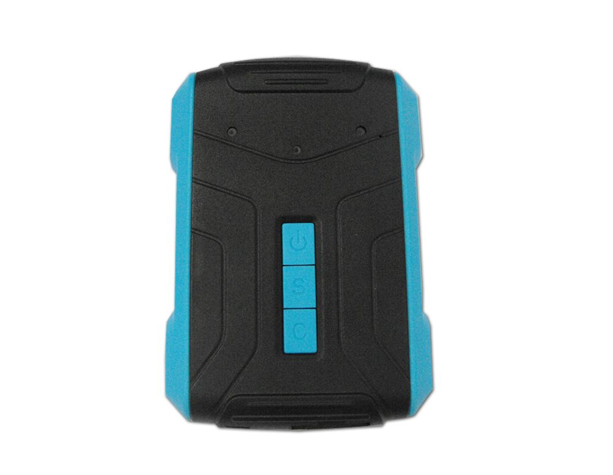

# TZone - TZ-AVL10

El TZone TZ-AVL10 es un rastreador GPS vehicular compacto pensado para el seguimiento y monitoreo flexible de activos móviles. Ofrece una autonomía extendida que supera los tres meses, soporta seguimiento vía software o teléfono celular y cuenta con un conjunto de alertas como exceso de velocidad, batería baja y geocercas. El equipo también incorpora funcionalidades para la gestión de costos de roaming, detección de estado de puertas y encendido del motor, y la capacidad de realizar un corte controlado de alimentación del motor en situaciones de emergencia. Las opciones de comunicación incluyen GPRS y SMS, y el firmware puede actualizarse por aire (OTA).

Como dispositivo compatible con Plaspy, el TZ-AVL10 puede enviar actualizaciones de ubicación y eventos de alarma a la plataforma de monitoreo de flotas de Plaspy, proporcionando a los operadores visibilidad consolidada e informes. Plaspy puede mostrar el historial de posiciones, la actividad de alertas y los eventos de estado junto con otros dispositivos de la flota, ayudando a los equipos a gestionar operaciones, seguir excepciones y responder incidentes desde una única plataforma. Esta compatibilidad convierte al TZ-AVL10 en una opción práctica para organizaciones que desean combinar la larga autonomía y las funciones de alarma del dispositivo con la supervisión operativa de Plaspy.

## Aspectos clave

- Autonomía muy prolongada de más de tres meses para reducir mantenimiento y recargas frecuentes
- Opciones de seguimiento flexibles por software o teléfono celular para acceso a la ubicación bajo demanda
- Suite de alertas integrada incluyendo exceso de velocidad, batería baja y geocercas para monitoreo por eventos
- Función de roaming para ayudar a controlar costos de comunicaciones entre regiones
- Detección remota y control para estado de puertas y encendido/apagado del motor
- Capacidad de corte gradual y seguro de la alimentación del motor destinada a inmovilizaciones de emergencia
- Comunicación por GPRS y SMS con soporte para actualización de firmware OTA

## Cómo funciona con Plaspy

Al integrarse con Plaspy, el TZ-AVL10 transmite su ubicación y eventos de alarma para que aparezcan en el panel de control de Plaspy junto al resto de activos rastreados. Plaspy procesa los reportes de posición y las alertas de dispositivos compatibles y hace esa información disponible para monitoreo en tiempo real, revisión histórica e informes operativos.

- Visibilidad de la ubicación en tiempo real e historial tipo breadcrumb para revisar rutas y auditorías
- Notificaciones de alarmas y eventos enviadas a Plaspy para la atención inmediata del operador
- Eventos de geocerca y alertas por exceso de velocidad visibles en los paneles e informes de la plataforma
- Informes históricos y registros exportables para apoyar el análisis de uso de vehículos e incidentes
- Eventos de estado y control del rastreador registrados en Plaspy para que los equipos vean actividad de puertas y encendido/apagado del motor
- Uso de canales SMS o GPRS que asegura que el dispositivo pueda reportar incluso cuando se prefiera un método sobre otro

## Casos de uso típicos

- Monitoreo de vehículos de flota para equipos de reparto, servicio y ventas que requieren seguimiento con larga autonomía
- Rastreos de activos para vehículos o remolques de uso periódico donde la duración de la batería es crítica
- Escenarios de seguridad y recuperación que aprovechan alertas de geocerca y la detección remota del estado de puertas o motor
- Seguimiento entre regiones con control de costos donde las funciones de roaming ayudan a reducir gastos de comunicación
- Flujos de respuesta a emergencias que se benefician de la opción de inmovilización controlada del motor

## Por qué elegir este rastreador con Plaspy

El TZ-AVL10 combina operación de larga duración con un conjunto enfocado de alarmas y funciones de estado remoto que responden a las necesidades comunes de monitoreo de flotas y activos. Su capacidad de comunicarse por GPRS y SMS y de recibir actualizaciones de firmware OTA reduce el mantenimiento in situ y mantiene los dispositivos actualizados. Para las organizaciones que usan Plaspy, el rastreador aporta entradas ricas en eventos que mejoran la visibilidad, las alertas y las capacidades de reporte de la plataforma.

Si necesita un rastreador que equilibre rendimiento de larga autonomía con un conjunto compacto de funciones y opciones de alarma comprobadas, el TZ-AVL10 es una alternativa razonable para considerar con Plaspy. Para conocer más sobre Plaspy y cómo puede presentar y gestionar datos de dispositivos compatibles visite https://www.plaspy.com. Las especificaciones del producto, la disponibilidad y los datos del fabricante pueden cambiar con el tiempo, por lo que le recomendamos verificar la información técnica actual en el sitio oficial del fabricante http://www.tzonedigital.com/.
