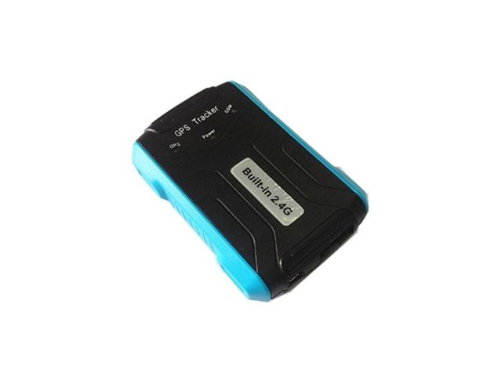

# TZone - TZ-AVL11

El TZone TZ-AVL11 es un rastreador GPS compacto y versátil pensado para el control de vehículos y activos. Integra antenas GSM y GPS, un receptor RFID de 2.4G y diversos sensores a bordo para ofrecer reportes continuos de ubicación y telemetría básica. El equipo incluye batería interna y puerto mini USB para carga y actualizaciones de firmware, y admite varios métodos de reporte como GPRS, SMS y monitoreo por software, adaptándose a distintos escenarios de implementación.

Como dispositivo compatible con Plaspy, el TZ-AVL11 puede enviar datos de ubicación y eventos a Plaspy para una supervisión de flota centralizada. Su bajo consumo, memoria interna para historial y funciones de alarma configurables lo hacen útil en despliegues de largo plazo y en operaciones rutinarias de flota. Al integrarlo con Plaspy, el rastreador ayuda a consolidar seguimiento, alertas e historial en una sola plataforma para mejorar la visibilidad operativa.

## Puntos clave

- Receptor RFID 2.4G integrado para flujos de trabajo de inventario o control de acceso
- Antenas GPS y GSM integradas con precisión de posición reportada de 10 a 15 metros
- Batería interna con capacidad reportada de 4500 mAh para respaldo y seguimiento prolongado
- Múltiples opciones de reporte incluyendo GPRS y SMS además de soporte para monitoreo por computadora o smartphone
- Amplio conjunto de alarmas: exceso de velocidad, geocerca, batería baja, corte de alimentación, detección de movimiento y SOS
- Memoria a bordo para registrar datos históricos y puerto mini USB para actualizaciones de firmware

## Cómo funciona con Plaspy

El TZ-AVL11 puede transmitir su ubicación y estado a Plaspy, donde se integra en una vista centralizada de gestión de flotas. Plaspy procesa los eventos del rastreador y los muestra en paneles, mapas e informes para que los operadores puedan tomar decisiones con información en tiempo real y registros históricos.

- Visualización de ubicación en tiempo real y reproducción del historial en los mapas de Plaspy
- Alertas y notificaciones enviadas a Plaspy por exceso de velocidad, rupturas de geocerca, batería baja y eventos SOS
- Registro del estado del dispositivo y de eventos para informes y auditoría dentro de Plaspy
- Lecturas RFID y estados de sensores externos que enriquecen el contexto de los activos en la plataforma Plaspy cuando están soportados
- La capacidad de micrófono y escucha remota del dispositivo puede mostrarse en Plaspy si se habilita y configura

## Casos de uso típicos

- Seguimiento de vehículos de flotas pequeñas y medianas en operaciones comerciales
- Monitoreo de activos donde la identificación RFID agrega valor a inventario o asociación con conductores
- Flujos de trabajo de seguridad y anti robo que aprovechan alertas de movimiento, detección de corte de energía y señales SOS
- Despliegues prolongados que se benefician del bajo consumo y del almacenamiento de datos en el equipo
- Monitoreo de carga sensible a la temperatura cuando se emplea un sensor de temperatura como telemetría adicional

## Por qué elegir este rastreador con Plaspy

El TZ-AVL11 es una opción práctica para organizaciones que requieren un rastreador de ubicación con capacidad RFID y un conjunto equilibrado de funciones. Su larga autonomía en espera, memoria interna y variedad de tipos de alarma lo hacen apto para uso mixto en vehículos y activos fijos. Al integrarlo con Plaspy, el dispositivo aporta datos de ubicación y eventos accionables a una única vista operativa, simplificando la supervisión y la generación de informes para despachadores y gestores de flota.

Además, dado que el TZ-AVL11 soporta varios métodos de reporte y cuenta con funcionalidades integradas como monitoreo de audio, lecturas RFID y detección de temperatura, puede cubrir necesidades operativas diversas sin requerir múltiples dispositivos especializados. La combinación de este hardware con Plaspy permite centralizar el seguimiento, configurar notificaciones y revisar movimientos históricos con contexto.

Para más información sobre Plaspy y cómo funciona con dispositivos TZone como el TZ-AVL11 visite https://www.plaspy.com. Las especificaciones del producto y la disponibilidad pueden cambiar con el tiempo, por lo que le recomendamos verificar los detalles técnicos y la documentación del fabricante en el sitio oficial de TZone http://www.tzonedigital.com/ antes de tomar decisiones de compra o despliegue.
