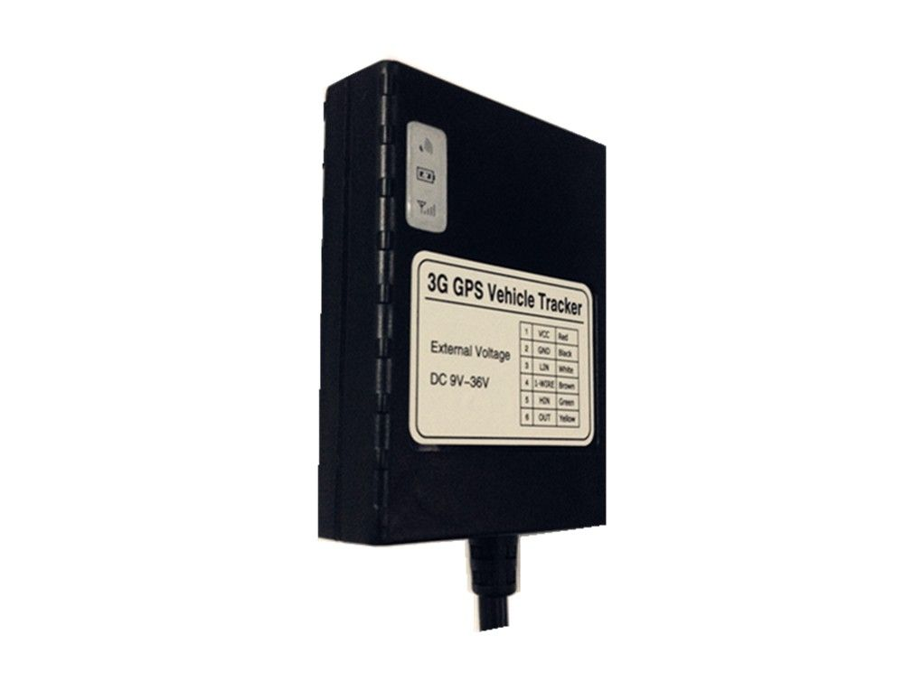

# TZone - TZ-AVL301

El rastreador GPS TZ-AVL301 de TZone es una opción de vanguardia para el seguimiento y monitoreo de vehículos. Con su capacidad 3G, este dispositivo ofrece una conectividad rápida y confiable para una transmisión de datos eficiente. Compatible con frecuencias GSM 850/900/1800/1900Mhz y WCDMA 2100/900Mhz, el TZ-AVL301 garantiza una cobertura amplia y estable en diferentes áreas geográficas.

Este rastreador GPS cuenta con una serie de características destacadas, como soporte para iButton, entradas digitales y salidas, entrada analógica y una función de inmovilización del motor. Además, es resistente al agua con una clasificación IP67, lo que lo hace adecuado para su uso en condiciones climáticas adversas.

El TZ-AVL301 también ofrece una memoria flash para el registro de datos, una antena GPS y GSM integradas, y soporte para el protocolo TCP/UDP. Con la capacidad de detectar la ignición y calcular el kilometraje, este rastreador GPS proporciona información precisa sobre la ubicación y el rendimiento del vehículo.

Con dimensiones de 87mm x 67mm x 21mm, el TZ-AVL301 es compacto y fácil de instalar en cualquier vehículo. Además, su batería recargable de 320mAh ofrece hasta 7 horas de tiempo de trabajo en modo normal.

En resumen, el rastreador GPS TZ-AVL301 de TZone es una solución confiable y eficiente para el seguimiento y monitoreo de vehículos. Con su conectividad 3G, características destacadas y resistencia al agua, este dispositivo proporciona información precisa y en tiempo real para una gestión efectiva de flotas y seguridad vehicular.

### Características destacadas:

- Conectividad 3G para una transmisión de datos rápida y confiable
- Soporte para iButton
- Entradas y salidas digitales
- Entrada analógica
- Inmovilización del motor
- Resistente al agua con clasificación IP67
- Memoria flash para el registro de datos
- Antena GPS y GSM integradas
- Soporte para protocolo TCP/UDP
- Detección de ignición y cálculo de kilometraje
- Batería recargable de 320mAh con hasta 7 horas de tiempo de trabajo en modo normal

### Especificaciones técnicas:

| Especificación | Valor |
| --- | --- |
| Tensión de carga | DC 9-36V |
| Dimensión | 87mm x 67mm x 21mm |
| Módulo 3G | GSM 850/900/1800/1900Mhz \(Personalizado\), WCDMA 900/2100Mhz |
| Memoria flash | 32MBit |
| Sensibilidad del GPS | -165dBm |
| Frecuencia GPS | L1, 1575.42 MHz |
| Canales | 66 canales todo-en-vista de seguimiento |
| Precisión de la posición | 3 metros, 2D RMS |
| Precisión de la velocidad | 0.1 m/s |
| Exactitud del tiempo | 1 que sincronizamos al tiempo del GPS |
| Dato del defecto | WGS-84 |
| Readquisición | 0.1 seg., Promedio |
| Arranque en caliente | 2 seg., Promedio |
| Inicio fresco | 33 seg., Promedio |
| Límite de la altitud | 18,000 metros \(60,000 pies\) como máximo |
| Límite de velocidad | 515 metros/segundo \(1000 knots\) máximo |
| Límite del tirón | 20 m/s |
| Temperatura de funcionamiento | -20 °C a 60 °C |
| Humedad | 5% a 95% sin condensación |
| Voltaje | Recargable 320mAh batería \(3.7V\) |
| Tiempo de trabajo | 7 horas en modo normal |

