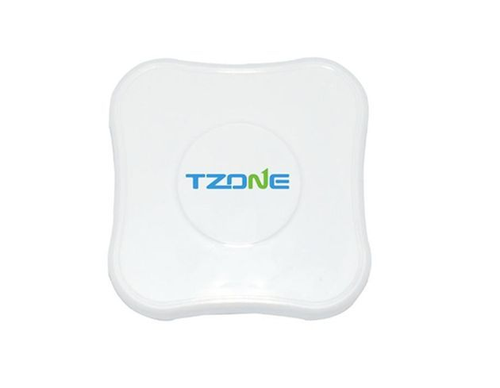

# TZone - TZ-BC05

El TZone TZ-BC05 es un dispositivo de rastreo compacto y liviano diseñado para ofrecer monitoreo confiable de ubicación y proximidad. Presenta una carcasa discreta color crema con un tamaño de 45 x 45 x 21 mm y un peso aproximado de 40 gramos. El TZ-BC05 utiliza el protocolo iBeacon de iPhone y la tecnología Bluetooth 4.0 para emitir señales, es compatible con las principales plataformas móviles y permite ajustar parámetros de transmisión, además de funcionar por largo tiempo con una batería CR 2477.

Como dispositivo compatible con Plaspy, el TZ-BC05 es útil para quienes requieren una baliza pequeña y de bajo perfil que se integre en flujos de trabajo centralizados de seguimiento y gestión. Plaspy puede mostrar la presencia, la ubicación aproximada y el estado operativo de balizas compatibles como el TZ-BC05 junto con otros dispositivos, ayudando a los equipos a monitorear activos y responder a eventos basados en ubicación desde una sola plataforma.

## Características principales

- Factor de forma compacto y discreto de 45 x 45 x 21 mm y alrededor de 40 gramos, ideal para colocar en activos
- Emite con el protocolo iBeacon de iPhone mediante Bluetooth 4.0 para broadcasts de proximidad consistentes
- Compatible con iOS 7.0 en adelante y Android 4.3 en adelante, ofreciendo amplio soporte para smartphones
- Batería CR 2477 de larga duración con tiempo de funcionamiento aproximado de 1.5 a 2.5 años según la configuración
- Intervalo de transmisión ajustable de 0.1 a 3 segundos y potencia transmitida de -30 a 4 dBm para cobertura flexible
- Conexión protegida por contraseña para limitar el acceso a dispositivos autorizados
- Alcance de transmisión de 50 a 143 metros en condiciones de campo abierto para mayor cobertura

## Cómo funciona con Plaspy

Plaspy puede presentar la información emitida por dispositivos TZ-BC05 compatibles para brindar visibilidad operativa y sencillos insights basados en proximidad. Las señales transmitidas y los intervalos configurables del TZ-BC05 permiten que Plaspy detecte presencia y reporte estado cuando está soportado, e incluya el dispositivo en flujos de monitoreo, alertas e informes.

- Mostrar la presencia del dispositivo y la actividad reciente de señal en los mapas y listas de dispositivos de Plaspy
- Incluir unidades TZ-BC05 en inventarios de activos para facilitar el seguimiento de objetos pequeños y equipos
- Activar alertas de proximidad o presencia según transmisiones detectadas y reglas definidas por el usuario
- Usar los reportes y el historial en Plaspy para revisar eventos de presencia pasados y ventanas de actividad
- Gestionar metadatos e identificadores del dispositivo dentro de Plaspy para supervisión operativa
- Mostrar indicios operativos como la última vez visto y estado básico cuando el dispositivo y la plataforma proporcionen esa información

## Casos de uso típicos

- Seguimiento de objetos personales y activos de pequeño valor que se benefician de una baliza discreta
- Localización de equipaje, mochilas o equipos en instalaciones compartidas o en tránsito
- Rastreo de mascotas para detección de presencia de corto a medio alcance y asistencia en recuperación
- Monitoreo de inventario y proximidad en almacenes o entornos minoristas
- Complementar flujos de trabajo de vehículos o flotas donde el beacon de corto alcance es útil para elementos específicos

## Por qué elegir este rastreador con Plaspy

El TZ-BC05 es una opción práctica cuando necesita una baliza pequeña y discreta que pueda integrarse con Plaspy para obtener visibilidad centralizada. Sus ajustes de transmisión configurables y su larga vida de batería lo hacen adecuado para despliegues donde se desea minimizar las intervenciones de mantenimiento y donde la detección de presencia configurable aporta valor. Al ser compatible con los sistemas operativos de smartphone más comunes, encaja en entornos de dispositivos mixtos sin requerimientos especiales.

Plaspy ayuda a las organizaciones a incorporar unidades TZ-BC05 en flujos de seguimiento y monitoreo más amplios, permitiendo que los equipos traten estos dispositivos como parte de un conjunto unificado de rastreo. Si necesita una baliza de proximidad compacta que se integre en una plataforma para monitoreo, alertas e informes, el TZ-BC05 es una opción a considerar junto con Plaspy.

Para obtener más información sobre Plaspy y cómo se utilizan los dispositivos compatibles en la plataforma visite https://www.plaspy.com. Las especificaciones del producto, la disponibilidad y los datos del fabricante pueden cambiar con el tiempo, por lo que le recomendamos verificar las especificaciones y la documentación actuales con el fabricante en http://www.tzonedigital.com/ antes de tomar decisiones de compra.
