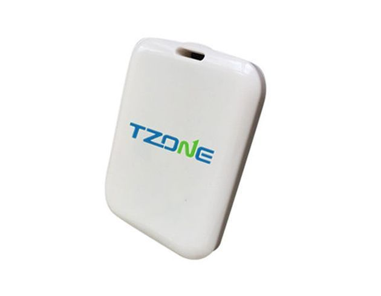

# TZone - TZ-BC08

El TZone TZ-BC08 es un rastreador compacto y ligero diseñado para ofrecer seguimiento fiable a corta distancia y detección de proximidad. Su tamaño reducido y peso contenido, junto con un acabado blanco crema, facilitan su colocación discreta en objetos personales o su fijación a activos pequeños. El dispositivo soporta el protocolo iBeacon de iPhone sobre Bluetooth 4.0 y ofrece un intervalo de transmisión configurable y potencia de emisión ajustable, aptos para distintos escenarios de proximidad.

Como dispositivo compatible con Plaspy, el TZ-BC08 puede aportar información de presencia y proximidad a los flujos de trabajo de Plaspy. Cuando las señales beacon del TZ-BC08 son captadas por receptores o integraciones compatibles y reenviadas a Plaspy, el equipo gana contexto de ubicación, visibilidad de activos y eventos disparados por proximidad que facilitan el monitoreo de objetos y personas en entornos de corto alcance.

## Aspectos destacados

- Huella muy compacta de aproximadamente 65 x 50 x 10 mm y peso cercano a 15 gramos para colocación discreta
- Implementa el protocolo iBeacon de iPhone sobre Bluetooth 4.0 para amplia compatibilidad con plataformas móviles modernas
- Compatible con iOS 7.0 en adelante y Android 4.3 en adelante para integración flexible con dispositivos móviles
- Tiempo de funcionamiento nominal largo: alrededor de 1 a 1.5 años con la batería incluida CR2450 3V
- Intervalo de difusión y potencia de transmisión configurables para equilibrar capacidad de respuesta y duración de la batería
- Alcance de transmisión en campo abierto en el orden de 50 a 90 metros en línea de vista, adecuado para detección de proximidad
- Conexiones protegidas por contraseña para ayudar a restringir el acceso al emparejamiento y la configuración

## Cómo funciona con Plaspy

El TZ-BC08 incorpora datos de proximidad de corto alcance en la plataforma Plaspy cuando sus transmisiones beacon son captadas y entregadas por puntos de recolección o integraciones compatibles. En Plaspy, estos datos complementan el rastreo por GPS aportando información de presencia y un contexto de ubicación más granular en escenarios interiores o de corto alcance.

- Monitoreo de presencia y proximidad de objetos etiquetados cuando un beacon es detectado por un punto de entrada o un colector móvil
- Visibilidad de activos en los paneles de Plaspy mostrando la última vez visto y el contexto de ubicación proporcionado por el dispositivo receptor
- Alertas y notificaciones por proximidad cuando un objeto etiquetado entra o sale de un área monitorizada o es detectado por receptores específicos
- Informes y registros históricos para auditorías y revisiones operativas basados en eventos de detección de beacon
- Supervisión operativa para flujos de trabajo de corto alcance como registros de entrada y salida y barridos localizados de inventario

## Casos de uso típicos

- Etiquetado de pertenencias personales y objetos de valor para detectar proximidad y registrar última vez visto
- Rastreo de activos a corta distancia en bodegas, almacenes y depósitos donde los beacons indican presencia
- Gestión de inventario y barridos periódicos usando dispositivos móviles o colectores fijos que reenvían eventos de beacon a Plaspy
- Etiquetado de mascotas o artículos personales donde se requiere hardware discreto y ligero
- Monitorización localizada de accesorios de vehículos o remolques en áreas controladas donde la detección a corto alcance es adecuada

## Por qué elegir este rastreador con Plaspy

El TZ-BC08 es una opción práctica cuando necesita un beacon pequeño y fácil de desplegar para detección de proximidad y presencia, en lugar de un rastreo GPS continuo. Su diseño compacto y larga vida útil de batería lo hacen idóneo para etiquetar una amplia variedad de activos pequeños o pertenencias personales, y el uso del estándar iBeacon facilita la integración con el ecosistema de móviles y receptores que pueden reenviar eventos a Plaspy.

Dado que este dispositivo ofrece detección a corta distancia, las organizaciones que usan Plaspy normalmente combinarán beacons TZ-BC08 con puntos de recolección apropiados o dispositivos móviles que puedan reportar las detecciones a la plataforma. Esa combinación permite alertas basadas en eventos, reportes de presencia y mejor visibilidad de activos en entornos interiores y de proximidad sin modificar los flujos de trabajo centrales de Plaspy.

Para conocer más sobre cómo Plaspy puede utilizar dispositivos beacon como el TZ-BC08 en su configuración de rastreo visite https://www.plaspy.com. Las especificaciones del producto y su disponibilidad pueden cambiar con el tiempo, por favor verifique los detalles actuales en el sitio del fabricante http://www.tzonedigital.com/ antes de tomar decisiones de compra o despliegue.
