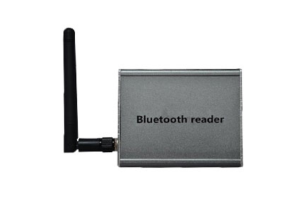

# TZone - TZ-BR04

El TZone TZ-BR04 es un rastreador GPS de grado industrial pensado para detección de ubicación y monitoreo robusto en grandes espacios exteriores y entornos adversos. Opera en la banda de microondas ISM, ofreciendo recepción confiable de señal hasta 50 metros. Cuenta con una carcasa de calidad industrial, antena externa para mejorar la recepción y un amplio rango de temperatura operativa de -40℃ a +60℃, lo que lo hace idóneo para condiciones exigentes. Sus dimensiones compactas (L78mm x W67mm x H27mm) y su ángulo de identificación omnidireccional permiten colocaciones flexibles en distintos activos.

Como dispositivo compatible con Plaspy, el TZ-BR04 se integra en flujos de trabajo de gestión de flotas y activos para ofrecer visibilidad continua de la ubicación y supervisión operativa. Su soporte de Bluetooth 4.0 y las salidas RS232/RS485 brindan opciones de conectividad versátiles para instaladores e integradores de sistemas, mientras que la sensibilidad del receptor del modelo asegura recepción estable en entornos complicados. Los usuarios de Plaspy pueden agregar unidades TZ-BR04 a grupos de monitoreo y aprovechar las funciones de mapas, alertas e informes de la plataforma para las operaciones diarias de la flota.

## Puntos clave

- Diseño de grado industrial pensado para condiciones ambientales adversas
- Operación en banda ISM con recepción confiable hasta 50 metros
- Antena externa para una recepción más estable y mejor alcance
- Soporte Bluetooth 4.0 y salidas RS232 / RS485 para flexibilidad de conectividad
- Alta sensibilidad de recepción para captura de datos fiable
- Amplio rango de temperatura operativa de -40℃ a +60℃
- Tamaño compacto y detección omnidireccional para ubicaciones discretas

## Cómo funciona con Plaspy

Cuando está conectado a Plaspy, el TZ-BR04 envía información de ubicación y estado del dispositivo que Plaspy muestra en mapas y paneles operativos. Plaspy procesa los datos del rastreador para ofrecer visibilidad continua y registros históricos a los responsables de flota y activos.

- Visibilidad en tiempo real en los mapas de Plaspy para monitorear activos en movimiento
- Agrupamiento y monitoreo de flotas para gestionar múltiples unidades TZ-BR04 en distintos sitios
- Alertas y notificaciones por eventos como entrada o salida de áreas definidas
- Informes históricos y reproducción de trayectos para analizar movimientos y tendencias operativas
- Supervisión operativa mediante listas de dispositivos y vistas resumidas para verificaciones de estado

## Casos de uso típicos

- Monitoreo de vehículos o remolques en grandes instalaciones exteriores y patios
- Seguimiento de equipos portátiles y herramientas en sitios industriales
- Gestión de activos en entornos de temperaturas extremas o ubicaciones expuestas
- Monitoreo temporal de obras o instalaciones donde se requiere rastreo robusto
- Identificación de perímetros o zonas del sitio donde la detección omnidireccional es útil

## Por qué elegir este rastreador con Plaspy

El TZ-BR04 es una opción práctica para organizaciones que requieren un rastreador resistente y compacto con capacidad de recepción a larga distancia. Su antena externa y construcción industrial lo hacen apropiado para despliegues donde la estabilidad de la señal y la resiliencia ambiental son prioritarias. Combinado con Plaspy, el dispositivo facilita flujos de trabajo diarios de rastreo, generación de informes y alertas que ayudan a los equipos a mantener el control operativo sobre flotas y activos distribuidos.

Si desea conocer más sobre Plaspy y cómo funciona con dispositivos compatibles como el TZone TZ-BR04, visite https://www.plaspy.com. Las especificaciones del producto, la disponibilidad y los datos del fabricante pueden cambiar; verifique la documentación técnica y las especificaciones actuales en el sitio oficial del fabricante en http://www.tzonedigital.com/ para obtener la información más precisa.
