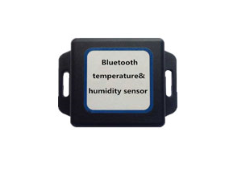

# TZone - TZ-BT04

El TZone TZ-BT04 es un registrador compacto de temperatura y humedad que utiliza Bluetooth Low Energy, basado en el chipset Nordic N51822 y tecnología Bluetooth 4.0. Captura lecturas de temperatura ambiente y humedad relativa, almacena hasta 15,000 puntos de datos y puede transferir datos almacenados o en tiempo real a dispositivos móviles. El equipo está diseñado para monitoreo portátil y permite ajustar intervalos de envío y parámetros de transmisión según distintos escenarios de supervisión.

Como dispositivo compatible con Plaspy, el TZ-BT04 puede funcionar como fuente de telemetría ambiental dentro de los flujos de trabajo de Plaspy. Los datos recopilados por el registrador pueden canalizarse hacia las herramientas de monitoreo e informes de Plaspy a través de los métodos de carga soportados, ofreciendo visibilidad centralizada del historial de temperatura y humedad, alertas por umbrales y reportes operativos. Esto convierte al TZ-BT04 en una opción práctica para organizaciones que requieren supervisión ambiental junto con la gestión de activos y flotas.

## Características principales

- Registrador de temperatura y humedad Bluetooth Low Energy con chipset Nordic N51822
- Almacena hasta 15,000 registros de temperatura y humedad para análisis histórico
- Amplios rangos de medición: temperatura desde -40℃ hasta +125℃ y humedad de 0% a 100%RH
- Precisión reportada de ±0.5℃ en temperatura y ±4%RH en humedad
- Tamaño pequeño, liviano y fácil de transportar para monitoreo móvil o por puntos
- Fuente de alimentación integrada de 600mAh/3V con vida útil estimada alrededor de un año según uso
- Intervalos de envío y ajustes de transmisión configurables, con opción de subir datos a un servidor vía GPRS

## Cómo funciona con Plaspy

Al integrarse con Plaspy, el TZ-BT04 aporta mediciones ambientales que Plaspy puede almacenar, visualizar y sobre las cuales puede generar alertas junto con otros datos de activos. Plaspy ingiere los registros del dispositivo mediante los métodos de carga compatibles y presenta la información en un entorno de monitoreo centralizado para apoyar decisiones operativas y reportes de cumplimiento.

- Registre y reenvíe mediciones de temperatura y humedad a Plaspy para obtener visibilidad centralizada
- Visualice tendencias históricas y series de tiempo de los datos ambientales recolectados por el registrador
- Configure alertas por umbral en Plaspy para notificar al equipo cuando las lecturas excedan rangos aceptables
- Genere reportes y exportes desde Plaspy para auditorías, control de calidad y revisiones de desempeño
- Correlacione datos ambientales con otros activos rastreados en Plaspy para contextualizar eventos de transporte y almacenamiento

## Casos de uso típicos

- Monitoreo de la cadena de frío durante el envío y almacenamiento de bienes sensibles a la temperatura
- Vigilancia continua dentro de refrigeradores, congeladores y cámaras frigoríficas
- Supervisión ambiental para muestras de laboratorio y almacenamiento de investigación
- Monitoreo climático en archivos y museos para proteger colecciones sensibles
- Controles puntuales portátiles durante transporte e inspecciones de instalaciones

## Por qué elegir este rastreador con Plaspy

El TZ-BT04 es adecuado para organizaciones que requieren registradores ambientales confiables sin equipos voluminosos. Su combinación de precisión, capacidad de almacenamiento y portabilidad lo hace útil en muchos escenarios donde es importante conservar registros de temperatura y humedad. Al incorporar los datos del TZ-BT04 en Plaspy, los equipos cuentan con un único lugar para revisar el historial ambiental, configurar alertas e integrar la información de condiciones en flujos de trabajo operativos más amplios.

La compatibilidad con Plaspy aporta valor mediante paneles centralizados, generación de reportes y la posibilidad de cruzar condiciones ambientales con otros datos de activos. Si sus operaciones demandan supervisión ambiental consistente junto con el rastreo y la gestión de activos, el TZ-BT04 combinado con Plaspy ofrece una solución compacta y práctica. Learn more about Plaspy on the main website https://www.plaspy.com. Please note that product specifications, availability, and manufacturer details can change over time; verify current specifications on the manufacturer's official website http://www.tzonedigital.com/.
