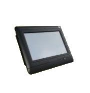

# TZone - TZ-DP070

El TZone TZ-DP070 es un monitor de temperatura diseñado para desarrollo secundario sobre el sistema operativo Windows CE 6.0. Ofrece una interfaz visual que recibe datos de temperatura por RS485 y está pensado para integrarse con lectores RFID y un sistema de etiquetas de temperatura. El equipo transmite las mediciones recogidas mediante tecnología inalámbrica 2.4G RF e incorpora una pantalla de 7 pulgadas, soporte para tarjetas SD y MMC, conectividad Ethernet y USB, y una pantalla táctil resistiva para operación local.

Como dispositivo compatible con Plaspy, el TZ-DP070 permite incorporar lecturas de temperatura e identificación por etiqueta en un flujo de trabajo centralizado de monitoreo de flota o activos. Plaspy puede mostrar y archivar los datos del monitor, ofrecer supervisión operativa e incluir el TZ-DP070 en alertas e informes junto a otros dispositivos. Aunque el TZ-DP070 está orientado principalmente al monitoreo ambiental más que al rastreo GPS, su compatibilidad con Plaspy lo hace útil cuando la supervisión de condiciones y la identificación por etiqueta forman parte de una estrategia integral de gestión de flota o activos.

## Características principales

- Diseñado para desarrollo secundario sobre Windows CE 6.0, facilitando la personalización e integración.
- Pantalla visual de 7 pulgadas con resolución 800x480 y táctil resistiva para interacción local.
- Funciona con lectores RFID y etiquetas de temperatura, transmitiendo datos por 2.4G RF inalámbrico.
- Entrada RS485 para recibir datos de sensores de temperatura y mostrar lecturas localmente.
- Soporta almacenamiento en SD y MMC, además de contar con USB y Ethernet 100M para conectividad y registro.
- Panel frontal con clasificación IP65 para resistencia al polvo y al agua en muchos entornos operativos.

## Cómo funciona con Plaspy

El TZ-DP070 puede alimentar a Plaspy con datos de temperatura e identificación de etiquetas para que su equipo pueda monitorear condiciones y activos desde la plataforma. Plaspy agrega los datos recibidos y los pone a disposición para visualización, alertas e informes a lo largo de la flota o inventario de activos.

- Visibilidad centralizada de lecturas de temperatura y asociaciones con etiquetas dentro de Plaspy.
- Alertas y notificaciones configurables en Plaspy para incumplimientos de umbrales y cambios de estado.
- Registro histórico y generación de informes usando datos recibidos del dispositivo y del almacenamiento local en tarjeta.
- Estado del dispositivo y actividad reciente mostrados junto con otros equipos gestionados por Plaspy para supervisión operativa.
- Use los paneles de Plaspy para correlacionar datos de temperatura con registros de activos e identidades de etiquetas RFID.

## Casos de uso habituales

- Monitoreo de mercancías refrigeradas o compartimentos donde se requiere registro de temperatura.
- Puntos de la cadena de frío como depósitos, cámaras de almacenamiento y estaciones de transferencia.
- Identificación de activos combinada con monitoreo ambiental mediante etiquetas RFID con sensor de temperatura.
- Entornos industriales o comerciales que requieren una pantalla frontal robusta y recolección remota de datos.

## Por qué elegir este dispositivo con Plaspy

El TZ-DP070 es adecuado para organizaciones que necesitan un monitor de temperatura robusto con enfoque en pantalla y posibilidad de adaptación mediante desarrollo secundario. Su combinación de visualización local, integración con etiquetas y transmisión inalámbrica lo hace práctico para proyectos que requieren monitoreo in situ con visibilidad remota. Al integrarlo con Plaspy, las lecturas del TZ-DP070 pueden incorporarse a vistas operativas más amplias, ayudando a que su equipo supervise las condiciones ambientales junto con otros datos de flota y activos.

Si desea explorar cómo aparecen los datos del TZ-DP070 en Plaspy o evaluar su adecuación para su despliegue, consulte Plaspy en nuestro sitio principal https://www.plaspy.com. Las especificaciones y la disponibilidad del producto pueden cambiar con el tiempo, así que verifique los detalles actuales y la documentación del fabricante en http://www.tzonedigital.com/.
