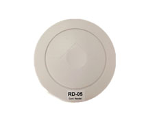

# TZone - TZ-RD05

El TZone TZ-RD05 es un lector RFID de 2.4G diseñado para gestionar múltiples modelos de etiquetas 2.4G, incluyendo TZ-Tag01, TZ-Tag02, TZ-Tag03, TZ-Tag04 y TZ-Tag201. Ofrece detección omnidireccional de etiquetas con un alcance de lectura de hasta 50 m, y dispone de opciones de comunicación RS485 y LAN para integrarse con sistemas de gestión superiores. Construido para entornos exigentes, el TZ-RD05 cuenta con protección IP55 y un amplio rango de temperatura de operación; su forma cilíndrica y compacta está pensada para montaje en techo.

Como dispositivo compatible con Plaspy, el TZ-RD05 puede enviar eventos de lectura de etiquetas y contexto de ubicación a la plataforma de gestión de flotas y activos Plaspy para aumentar la visibilidad operativa. Las organizaciones que usan Plaspy pueden combinar las lecturas de unidades TZ-RD05 con otras telemetrías y fuentes de datos para apoyar el control de inventarios, la localización de activos, la supervisión de accesos y la generación de informes dentro del entorno Plaspy.

## Características principales

- Diseñado para gestión de etiquetas a 2.4 GHz compatible con varios modelos TZ
- Identificación omnidireccional para lecturas consistentes desde cualquier dirección
- Largo alcance de lectura de hasta 50 m para cubrir áreas más amplias
- Interfaces de comunicación RS485 y LAN para integración flexible con sistemas
- Protección IP55 y amplio rango de temperatura para entornos exigentes
- Soporte de actualización de firmware vía conexión serial para prolongar la vida útil del dispositivo
- Diseño cilíndrico y compacto ideal para instalaciones en techo

## Cómo funciona con Plaspy

El TZ-RD05 entrega eventos de lectura de etiquetas y estado del dispositivo que Plaspy puede procesar para mejorar la visibilidad en tiempo real y el rastreo histórico de activos etiquetados. Una vez conectado, el lector se convierte en una fuente de datos de presencia y ubicación que Plaspy puede mostrar, filtrar y reportar junto con otra información de la flota o del sitio.

- Envíe eventos de detección de etiquetas a Plaspy para mostrar la presencia actual de activos y su última ubicación conocida
- Use las alertas de Plaspy para notificar a los equipos cuando los artículos etiquetados entren o salgan de zonas designadas
- Consolide las lecturas de etiquetas para conciliación de inventarios y auditorías operativas en los informes de Plaspy
- Visualice la cobertura del lector y las interacciones con etiquetas en los tableros y mapas de Plaspy
- Combine los datos del TZ-RD05 con otros dispositivos monitorizados por Plaspy para una supervisión unificada

## Casos de uso habituales

- Rastreo de activos en bodegas y plantas de producción que requieren un amplio alcance de lectura
- Gestión de inventarios y monitoreo automático de stock mediante lectores instalados en techo
- Control de accesos y detección de presencia de personal o equipos en áreas controladas
- Identificación a larga distancia de contenedores, pallets o artículos de alto valor
- Monitoreo a nivel de sitio donde se requiere durabilidad ambiental y tolerancia a rangos de temperatura amplios

## Por qué elegir este equipo con Plaspy

El TZ-RD05 es una opción práctica para organizaciones que necesitan detección confiable de etiquetas a larga distancia junto con resistencia a condiciones ambientales severas. Su compatibilidad con múltiples modelos de etiquetas TZ y sus comunicaciones flexibles lo hacen adecuado para integrarse en redes y sistemas de gestión existentes; al integrarlo con Plaspy, puede aportar visibilidad continua de etiquetas a los flujos de trabajo de flota y activos.

Al ser compatible con Plaspy, los equipos pueden aprovechar la plataforma para convertir las lecturas de etiquetas en información accionable, como el estado de inventarios, patrones de movimiento y alertas por excepciones. Para despliegues donde el montaje en techo, las lecturas omnidireccionales y un amplio rango de temperatura sean relevantes, el TZ-RD05 ofrece una solución focalizada que se integra con las operaciones gestionadas por Plaspy.

To learn more about Plaspy and how compatible devices like the TZ-RD05 can enhance your tracking and management workflows visit https://www.plaspy.com. Product specifications and availability can change over time, so please verify current technical details and installation guidance with the manufacturer at http://www.tzonedigital.com/.
