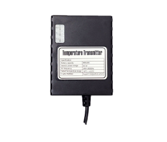

# TZone - TZ-TT01

El rastreador GPS TZ-TT01 de la marca TZone es un dispositivo especializado en la transmisión de datos de temperatura. Este rastreador puede conectar hasta tres termómetros digitales a través de una interfaz de un solo cable. Los termómetros digitales no requieren alimentación externa, ya que son alimentados directamente por el rastreador GPS \(que a su vez se alimenta con una fuente de alimentación externa de 5V DC\). El rastreador GPS TZ-TT01 puede medir de manera rápida y precisa la temperatura requerida y transmitir los datos al dispositivo receptor correspondiente utilizando la tecnología de transmisión inalámbrica 2.4G RF.

El rastreador GPS TZ-TT01 tiene unas dimensiones de 87mm x 67mm x 21mm y un peso de 0.1 kg. Funciona con una fuente de alimentación externa de 5V DC y tiene una batería de litio interna de 3.7V DC. Tiene un tiempo de espera de hasta 2 meses y opera en una frecuencia de RF de 2.400-2.4835GHz. La potencia de transmisión es de 18dBm y puede alcanzar tasas de datos de hasta 1M bps a -85 dBm. La precisión de la temperatura es de 0.5 ℃ y puede detectar temperaturas en un rango de -55 ℃ a +125 ℃. Además, puede soportar una presión de aire de 860Kpa a 1060Kpa y una humedad de hasta el 75% sin condensación. El rango de temperatura de funcionamiento es de -20 ℃ a 60 ℃. El rastreador GPS TZ-TT01 también cuenta con tres indicadores LED y una interfaz de un solo cable que puede conectar hasta tres termómetros digitales.

