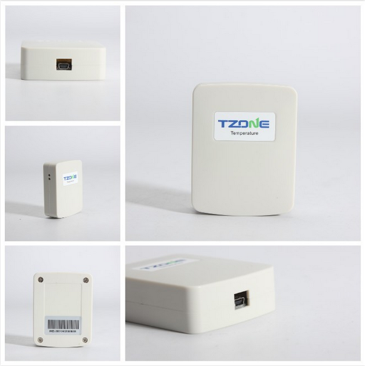

# TZone - TZ-TT18

El TZone TZ-TT18 es un transmisor de un solo uso para temperatura y humedad, diseñado para recopilar datos ambientales de alta precisión y enviarlos a un servidor mediante datos móviles. Integra un sensor de temperatura y humedad con un módulo GSM y requiere la inserción de una tarjeta SIM para funcionar. El dispositivo está pensado para reportes intermitentes: permanece en un estado de bajo consumo hasta las transmisiones programadas o la activación por el usuario, lo que ayuda a prolongar su vida útil durante el monitoreo de envíos y almacenamiento.

Como dispositivo compatible con Plaspy, el TZ-TT18 puede reenviar sus mediciones de temperatura y humedad a la plataforma Plaspy para su monitoreo e informes. Su formato compacto y su comportamiento de activación programada lo hacen apto para colocarse discretamente dentro de embalajes de envío, contenedores de cadena de frío y entornos de almacenamiento donde se requieren tomas ambientales periódicas y confiables. Al integrarlo con Plaspy, los datos del TZ-TT18 pueden visualizarse junto con la información de la flota y otros activos para apoyar la supervisión operativa.

## Aspectos destacados

- Transmisor de temperatura y humedad de un solo uso con comunicaciones GSM integradas
- Diseñado para operación de bajo consumo con modo de reposo y activación programada para mayor duración
- Medición de temperatura de alta precisión con ±0.3℃ y amplio rango de medición
- Precisión de humedad de ±3% en un amplio rango de humedad
- Capacidad para almacenar un gran número de entradas de datos GPRS para transmisión posterior
- Dimensiones compactas 80mm x 64mm x 25mm para una colocación discreta
- Indicadores LED para estado de temperatura y GSM que facilitan revisiones básicas en el dispositivo

## Cómo funciona con Plaspy

Cuando se usa con Plaspy, el TZ-TT18 transmite sus lecturas registradas de temperatura y humedad a la plataforma Plaspy, donde los datos se consolidan, visualizan y ponen a disposición para su uso operativo. Plaspy puede ingerir las cargas periódicas GPRS del dispositivo y presentarlas junto con otros activos monitoreados para ofrecer a los equipos una vista unificada de las condiciones ambientales y el estado de los envíos.

- Visualización centralizada de las lecturas de temperatura y humedad recibidas desde el TZ-TT18
- Puntos de datos programados o basados en eventos que aparecen en los informes de Plaspy para análisis histórico
- Alertas y notificaciones en Plaspy según umbrales o faltas en las transmisiones esperadas
- Asignación de unidades individuales TZ-TT18 a envíos, ubicaciones de almacenamiento o registros de activos
- Exportación de datos y registros para cumplimiento y trazabilidad en auditorías

## Casos de uso típicos

- Monitoreo de la cadena de frío para envíos sensibles a la temperatura
- Verificación de almacenamiento de medicinas y vacunas durante el transporte y en almacenamiento temporal
- Revisiones puntuales de refrigeración en distribución y puntos de venta
- Monitoreo ambiental de un solo uso para envíos de ida o almacenamiento a corto plazo
- Ubicaciones de almacenamiento remotas o temporales donde son suficientes verificaciones periódicas

## Por qué elegir este rastreador con Plaspy

El TZ-TT18 es una opción práctica para organizaciones que necesitan un transmisor compacto y de un solo uso para capturar lecturas precisas de temperatura y humedad y entregarlas a una plataforma central. Su comunicación integrada y su diseño de reposo/activación reducen la carga operativa; al combinarlo con Plaspy, el dispositivo forma parte de un flujo de trabajo más amplio de monitoreo e informes que respalda la integridad de la cadena de frío y la supervisión de activos.

Dado que el TZ-TT18 fue diseñado para reportes intermitentes y colocación discreta, es especialmente adecuado en escenarios donde no se requiere seguimiento continuo en tiempo real, pero sí es importante contar con registros ambientales documentados. Plaspy aporta la visibilidad, las alertas y los informes necesarios para que esos registros puedan ser atendidos y archivados junto con otros datos de la flota y de activos.

Para obtener más información sobre cómo Plaspy puede trabajar con el TZone TZ-TT18 visite https://www.plaspy.com. Las especificaciones del producto y su disponibilidad pueden cambiar con el tiempo, por lo que le recomendamos verificar los detalles actuales del dispositivo y la documentación técnica en el sitio del fabricante http://www.tzonedigital.com/ antes de comprar o desplegar.
