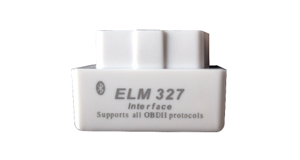

# Ulbotech - S101

El adaptador S101 OBD-II BLE es un compacto accesorio de telemetría para vehículos, listo para conectar y usar, diseñado para ampliar el seguimiento GPS compatible con Plaspy con datos de diagnóstico a bordo enriquecidos. Aunque el S101 no es un rastreador GPS independiente, se empareja con smartphones, tabletas o PCs con BLE que ejecutan apps compatibles con Plaspy para alimentar diagnósticos del motor, monitoreo de combustible y telemetría de sensores en vivo en la plataforma Plaspy. Su procesador basado en ELM327 y su enlace estable Bluetooth 4.0 BLE proporcionan actualizaciones más rápidas y gráficos de parámetros en vivo más densos que muchos adaptadores genéricos, lo que lo convierte en un complemento confiable para el seguimiento en tiempo real de Plaspy para flotas y vehículos individuales.

Diseñado para un consumo mínimo de energía y conexión continua, el S101 permanece conectado al puerto OBD-II del vehículo sin un drenaje de batería apreciable y proporciona datos consistentes de OBD-II, incluyendo RPM del motor, temperatura de refrigerante, ajustes de combustible y velocidad del vehículo. Los responsables de flotas, mecánicos y conductores aficionados pueden usar S101 con Plaspy para enriquecer el seguimiento GPS con telemetría, analítica de combustible y lecturas de diagnóstico a demanda que apoyan la gestión de flotas, flujos de trabajo antirrobo y el mantenimiento predictivo.

## Aspectos clave

- Telemetría compatible con Plaspy — reenvía datos del motor y sensores de OBD-II a Plaspy a través de dispositivos con BLE para mejorar el seguimiento en tiempo real y los informes.
- Conexión Bluetooth 4.0 BLE rápida y estable — diseño basado en ELM327 optimizado para actualizaciones de pantalla más rápidas y gráficos de parámetros en vivo más densos.
- Amplio soporte de protocolos OBD-II — funciona con J1850 PWM/VPW, ISO 9141-2, ISO 14230 KWP2000 y ISO 15765-4 CAN.
- Bajo consumo de energía — ~15 mA típico; seguro para permanecer enchufado sin drenaje significativo de la batería.
- Telemetría integral — expone RPM, temperatura del refrigerante, estado del sistema de combustible, ajustes y otros parámetros para monitoreo y diagnóstico.
- Formato ultracompacto — huella de conector OBD-II pequeña que reduce la intrusión en el espacio del conductor, manteniéndose duradero para uso diario de la flota.
- Compatibilidad multiplataforma — se conecta a Windows \(soporte legado\), Android y dispositivos Symbian con apps compatibles.

## Cómo funciona con Plaspy

El S101 actúa como fuente de telemetría OBD-II que complementa el seguimiento GPS de Plaspy. Cuando el S101 se conecta al puerto OBD-II de un vehículo, transmite PIDs OBD estándar a través de un enlace Bluetooth 4.0 BLE a una app móvil o de escritorio compatible con Plaspy. Plaspy combina esa telemetría en vivo con datos de posición GPS \(del teléfono inteligente o de un rastreador GPS de Plaspy\) para ofrecer un estado unificado del vehículo, diagnósticos e inteligencia basada en la ubicación en tiempo real. Este enfoque mantiene la coordinación entre el seguimiento GPS y la telemetría OBD sin requerir hardware celular en el propio adaptador.

- Actualizaciones de ubicación y telemetría en tiempo real — la ubicación GPS de Plaspy más la telemetría OBD del S101 para vistas de seguimiento más ricas.
- Códigos de diagnóstico a demanda — leer y borrar códigos MIL/Check Engine dentro de interfaces conectadas a Plaspy cuando la app lo permita.
- Monitoreo de combustible y parámetros del motor — ajustes de combustible, MAF, presión de combustible y PIDs relacionados alimentan los informes de Plaspy para el análisis de eficiencia.
- Alertas basadas en eventos — Plaspy puede usar datos OBD \(p. ej., temperatura de refrigerante alta, códigos de fallo\) para activar alertas junto con geovallas y eventos de seguimiento.
- Integración de sensores Bluetooth — el enlace BLE del S101 permite que funcione junto a otros sensores Bluetooth o balizas gestionadas a través del mismo dispositivo que ejecuta Plaspy.

## Resumen técnico

| Modelo | S101 \(adaptador OBD-II BLE basado en ELM327\) |
| --- | --- |
| Conectividad | Bluetooth 4.0 BLE \(hacia smartphones/tabletas/PC\), interfaz OBD-II hacia el vehículo |
| Bandas | No aplicable — BLE solamente \(sin bandas celulares\) |
| Protocolos OBD-II | J1850 PWM, J1850 VPW, ISO 9141-2, ISO 14230 KWP2000, ISO 15765-4 CAN |
| Poder & Batería | Tensión de operación 12V ± 4V; consumo de energía típico ~15 mA; diseñado para uso continuo con conexión enchufada |
| Interfaces | Conector OBD-II estándar \(J1962\); expone PIDs OBD-II estándar. No hay I/O externo ni inmovilizador incorporado reportado. |
| GNSS | Ninguno — se empareja con GPS del dispositivo o rastreadores GPS de Plaspy para datos de ubicación |
| Bluetooth | Bluetooth 4.0 BLE; alcance aproximado de 5–45 m; tasa de baudios serial 38400 para el intercambio de datos |
| Gestión remota | Configurables a través de apps compatibles para Windows y Android; no se especifica FOTA |
| Dimensiones & Peso | Aprox. 31 × 48 × 25 mm; peso ~20 g; perfil de enchufe ultra compacto \(\<2 cm de longitud de enchufe\) |
| Ambiental | Temperatura de operación -30°C a +80°C; almacenamiento -40°C a +85°C; humedad 10%–85% sin condensación |
| Compatibilidad | Vehículos compatibles con OBD-II; Windows XP/Vista/7/8, dispositivos Android y Symbian soportados por apps compatibles |

## Casos de uso

- Diagnóstico de mantenimiento de flotas — enriquecer el seguimiento GPS con diagnósticos del motor para priorizar el servicio y reducir el tiempo de inactividad.
- Lectura y borrado de códigos por usuario — leer códigos MIL/Check Engine en el punto y borrar fallos durante la resolución de problemas.
- Monitoreo de combustible y coaching del conductor — usar ajustes de combustible, MAF y datos del acelerador con los informes de Plaspy para mejorar la economía de combustible y el comportamiento del conductor.
- Ajuste y gráficos de datos en vivo — proporcionar gráficos de parámetros en tiempo real más densos para mecánicos y entusiastas del tuning al monitorear el comportamiento del motor en tiempo real.
- Soporte antirrobo y alertas de eventos — proporcionar disparadores de diagnóstico \(p. ej., actividad no esperada del motor\) que Plaspy puede correlacionar con la ubicación GPS para respaldar flujos de trabajo antirrobo.

## Por qué elegir este tracker con Plaspy

Aunque el S101 no es un rastreador GPS independiente, es un compañero rentable para sistemas de seguimiento potenciados por Plaspy que requieren telemetría robusta del vehículo. Al entregar datos OBD-II confiables a través de Bluetooth 4.0 BLE, el S101 enriquece el seguimiento en tiempo real de Plaspy con parámetros accionables del motor, monitoreo de combustible y códigos de diagnóstico — todo ello sin añadir hardware celular al vehículo. Para los responsables de flotas y operadores de servicios centrados en el mantenimiento impulsado por telemetría, el S101 ofrece una integración sencilla: conéctalo, accede mediante una app compatible con Plaspy y empieza a combinar la ubicación GPS con los datos de salud del vehículo para una gestión de flotas más inteligente, respuesta ante fallas más rápida y mayor eficiencia de combustible.

Elige el S101 cuando necesites telemetría BLE estable, consumo de energía bajo y amplia cobertura de protocolos OBD-II. Es especialmente adecuado para flotas y equipos de servicio que desean vincular diagnósticos OBD a los flujos de trabajo de seguimiento, informes y alertas de Plaspy, lo que facilita medidas prácticas antirrobo, monitoreo sensible al encendido y análisis centrado en el combustible sin modificar el cableado del vehículo ni añadir hardware voluminoso.

