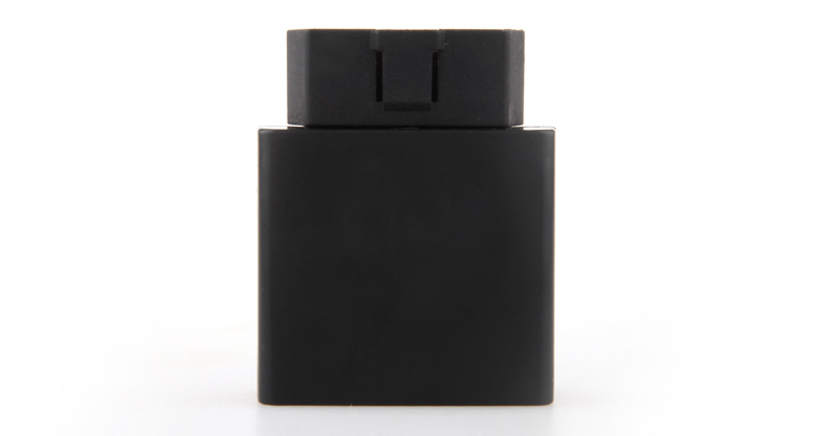

# Ulbotech - T360

El Ulbotech T360 es un rastreador OBD plug and play pensado para despliegues rápidos en autos y vehículos comerciales ligeros. Construido alrededor del motor GNSS u blox 6M y un módem GPRS/GSM cuatribanda, el equipo ofrece posicionamiento en tiempo real, notificación de eventos y análisis del comportamiento de conducción. Sus antenas internas, detección automática de APN y zona horaria, y funciones de actualización de firmware facilitan la implementación y el mantenimiento tanto para flotas como para propietarios particulares.

Como dispositivo compatible con Plaspy, el T360 se integra con plataformas backend para enviar cargas periódicas e inmediatas de posición, alarmas, eventos de geocerca y reportes de comportamiento del conductor. Su salida interna para inmovilizador, la capacidad de monitor de voz y el acelerómetro de 3 ejes hacen que la unidad sea útil en flujos antirrobo, alimentación de telemetría y monitoreo operativo que Plaspy puede procesar, mostrar y accionar desde sus paneles y reglas de alerta.

## Características principales

- Diseño OBD II plug and play para instalaciones rápidas y no invasivas en flotas de vehículos.
- Motor GNSS u blox 6M para fijaciones de posición confiables y rendimiento de seguimiento consistente.
- Conectividad GPRS/GSM cuatribanda para cobertura celular amplia en regiones compatibles.
- Acelerómetro onboard de 3 ejes que detecta virajes bruscos, frenadas fuertes y excesos de velocidad.
- Salida interna para inmovilizador y soporte de monitor de voz para flujos de seguridad y recuperación.
- Detección automática de APN y zona horaria, además de actualizaciones remotas de firmware para reducir la configuración manual.
- Factor de forma compacto y antenas internas para una instalación ordenada y escalabilidad en flotas.

## Cómo funciona con Plaspy

Al integrarse con Plaspy, el T360 envía datos de ubicación y eventos al backend de Plaspy, donde se procesan en paneles, alertas e informes útiles para la operación. Plaspy consume el flujo de posiciones y los mensajes de evento para ofrecer visibilidad en vivo, reproducción histórica y notificaciones configurables que apoyan la supervisión de flotas y los flujos de seguridad.

- Actualizaciones de ubicación en tiempo real y envíos periódicos de posición visibles en los paneles de Plaspy.
- Eventos de comportamiento de conducción reportados a Plaspy para puntuación de seguridad y análisis de tendencias.
- Disparos de geocerca y mensajes de alarma dirigidos a Plaspy para alertas inmediatas.
- Alertas de inmovilizador y de estado disponibles en Plaspy para acciones antirrobo y flujos remotos.
- Informes de telemetría y estado del vehículo presentados en Plaspy para planificación de mantenimiento y diagnóstico.

## Casos de uso típicos

- Gestión de flotas con seguimiento en vivo, reproducción de rutas y monitoreo del comportamiento del conductor.
- Prevención y recuperación ante robos mediante la salida de inmovilizador y alertas por geocerca.
- Telemática para rentadoras y aseguradoras donde se prefiere una instalación OBD no invasiva.
- Monitoreo del estado del vehículo y asistencia en carretera utilizando estado y telemetría a bordo.
- Supervisión de vehículos familiares o de empresa para fomentar una conducción más segura y una respuesta más rápida ante incidentes.

## Por qué elegir este rastreador con Plaspy

El T360 es una opción práctica para organizaciones que buscan un rastreador compacto montado en OBD que reduzca el tiempo de instalación y aporte telemetría relevante para operaciones de flota y seguridad. Su combinación de posicionamiento GNSS, conectividad celular y sensores integrados entrega la información esencial que Plaspy necesita para ofrecer visibilidad de ubicación, alertas de eventos e informes sin cableado complejo ni configuraciones manuales frecuentes.

Para clientes que usan Plaspy, el T360 facilita integrar la posición del vehículo, los datos de eventos del conductor y el estado básico del vehículo en una sola plataforma para la supervisión operativa. Si necesita más detalles sobre cómo encaja el T360 en su despliegue o consideraciones de compatibilidad con Plaspy, conozca más sobre Plaspy en el sitio principal https://www.plaspy.com. Las especificaciones del producto, la disponibilidad y los detalles del fabricante pueden cambiar con el tiempo, por lo que se recomienda verificar las especificaciones actuales con la documentación oficial del fabricante en http://www.ulbotech.com/.
