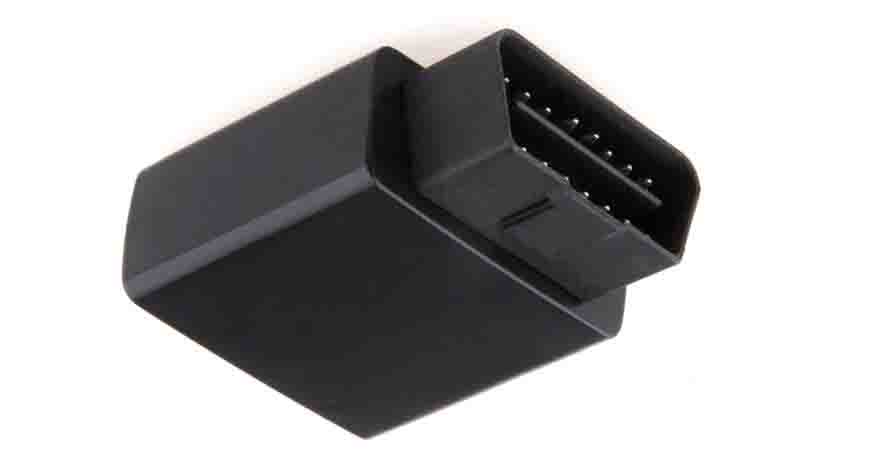

# Ulbotech - T363A

El T363A es un rastreador GPS OBD plug and play diseñado para la gestión de flotas, la protección antirrobo y el monitoreo de comportamiento del conductor. Al conectarse directamente al puerto OBD del vehículo, el dispositivo transmite en tiempo real la ubicación y la telemetría del vehículo a los sistemas de backend. Su factor de forma compacto y los componentes GNSS y celulares integrados facilitan despliegues rápidos en flotas mixtas y a operadores que necesitan visibilidad inmediata sin instalaciones complejas.

Como dispositivo compatible con Plaspy, el T363A se integra con la plataforma para aportar ubicación, diagnósticos derivados del OBD y alertas configurables para flotas, arrendadoras y propietarios de vehículos. Al emparejarlo con Plaspy, el rastreador envía datos de ubicación y eventos que pueden usarse para monitoreo en vivo, generación de informes y flujos de trabajo automatizados, ayudando a transformar señales del vehículo en información operativa útil.

## Aspectos destacados

- Instalación OBD plug and play para despliegues rápidos en flotas de vehículos.
- Compatible con Plaspy para seguimiento en tiempo real, alertas e informes telemáticos.
- Receptor GNSS de alta sensibilidad con posicionamiento asistido para fijaciones más rápidas y posiciones precisas.
- Conectividad celular quad-band para amplio alcance regional en la entrega de datos.
- Bluetooth a bordo para emparejar accesorios opcionales o sensores externos.
- Salida de inmovilizador interna y detección de eventos basada en acelerómetro para soportar flujos de trabajo de antirrobo y monitoreo del conductor.

## Cómo funciona con Plaspy

El T363A transmite posiciones GNSS, telemetría derivada del OBD y datos de eventos a través de la red celular hacia la plataforma Plaspy. Plaspy consume estos flujos de datos para mostrar ubicaciones de vehículos en tiempo real, generar alertas y compilar reportes históricos que apoyan la toma de decisiones operativas. Desde Plaspy se pueden gestionar las configuraciones del dispositivo y su comportamiento para alinear las señales entrantes con las reglas de negocio y las necesidades de reporte.

- Actualizaciones de ubicación y telemetría en tiempo real para vistas de mapas en vivo y reproducción de rutas.
- Señales de ignición y diagnósticos basados en OBD que Plaspy utiliza para disparar mantenimientos y flujos operativos.
- Parámetros de uso del vehículo y de consumo de combustible, cuando están disponibles, se muestran en los informes de Plaspy para analizar costos y consumo.
- Flujos remotos de inmovilizador, habilitados por la salida digital del dispositivo, que pueden integrarse en los procesos de alerta y respuesta de Plaspy.
- Accesorios conectados por Bluetooth que aportan contexto adicional a Plaspy para una mejor correlación de eventos.
- Alertas de geocercas y de eventos que alimentan las notificaciones y los registros históricos en Plaspy para cumplimiento y revisión operativa.

## Casos de uso típicos

- Gestión de flotas con seguimiento en vivo, análisis de rutas y telemetría de conducta del conductor.
- Monitoreo antirrobo con alertas por manipulación, respaldo de energía y control remoto de inmovilizador.
- Operaciones de flotas de alquiler y seguimiento basado en uso, incluyendo geocercas y registros de eventos.
- Soporte en carretera y diagnóstico vehicular mediante estados y fallas derivadas del OBD.
- Entrenamiento y perfilado de conductores utilizando detección de eventos por acelerómetro para frenadas bruscas o aceleraciones rápidas.

## Por qué elegir este rastreador con Plaspy

El T363A es una opción práctica para organizaciones que buscan un dispositivo telemático plug and play que se integre con una plataforma de seguimiento completa. Su combinación de posicionamiento GNSS, diagnósticos derivados del OBD y detección de eventos permite a las flotas obtener visibilidad operativa inmediata sin instalaciones complejas. Para operaciones que ya usan Plaspy, el T363A suministra las señales fundamentales que la plataforma espera para mapeo, alertas y flujos de trabajo de reporte.

Si desea más información sobre cómo Plaspy puede trabajar con dispositivos como el T363A visite https://www.plaspy.com para detalles de la plataforma y recursos de ventas. Las especificaciones del producto y su disponibilidad pueden cambiar con el tiempo; para obtener los detalles técnicos y la documentación del fabricante más actualizados, consulte el sitio oficial de Ulbotech en http://www.ulbotech.com/.
