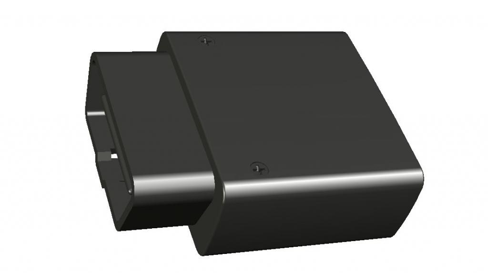

# Ulbotech - T373A

El T373A es un localizador GPS OBD II plug and play diseñado para el rastreo de vehículos y la gestión de flotas. Se conecta a cualquier puerto OBD II estándar y ofrece ubicación en tiempo real y telemetría a bordo sin necesidad de cableado complejo. El equipo lee una amplia gama de datos OBD II y combina posicionamiento GNSS con conectividad celular para proporcionar la visibilidad que requieren flotas, empresas de alquiler, aseguradoras y servicios de asistencia en carretera para supervisión operativa y disuasión de robos.

Como dispositivo totalmente compatible con Plaspy, el T373A puede transmitir posición, parámetros OBD II y datos de eventos directamente a la plataforma Plaspy para su visualización, alertas e informes. Su diseño plug and play y las funciones de telemetría integradas lo hacen especialmente adecuado en despliegues donde la instalación rápida, la gestión centralizada y las actualizaciones remotas escalables son prioridades para los usuarios de Plaspy.

## Características clave

- Conexión OBD II plug and play para despliegue rápido y tiempos mínimos de instalación.
- Rastreo en tiempo real y telemetría detallada del vehículo, incluyendo RPM, velocidad, temperatura del refrigerante, nivel de combustible y consumo.
- Salida digital integrada para corte de motor (inmovilizador) que facilita flujos de trabajo anti robo cuando se integra con los controles de Plaspy.
- Receptor GNSS integrado para fijaciones de posición confiables junto con conectividad celular multibanda para la subida de datos.
- Soporte Bluetooth 2.0 para emparejar periféricos y ampliar la telemetría según se requiera.
- Acelerómetro de 3 ejes incorporado para detectar eventos de comportamiento del conductor, como frenadas bruscas o aceleraciones repentinas.
- Actualizaciones de firmware FOTA y funciones de configuración automática para simplificar el mantenimiento en flotas a gran escala.

## Cómo funciona con Plaspy

Al conectarse con Plaspy, el T373A envía ubicación en vivo y telemetría del vehículo a la plataforma, donde los datos se normalizan, visualizan y accionan para las operaciones de flota. Plaspy procesa parámetros OBD II, eventos de diagnóstico, señales del acelerómetro y posiciones GPS para ofrecer mapas en tiempo real, alertas configurables e informes operativos adecuados para mantenimiento, seguridad y prevención de robo.

- Actualizaciones de ubicación y telemetría en tiempo real para monitoreo en vivo y reproducción de rutas.
- Datos OBD II en vivo y códigos de diagnóstico (DTC) para planificación de mantenimiento y detección de fallas.
- Monitoreo de combustible e informes de consumo para apoyar el análisis de eficiencia.
- Control remoto de inmovilizador (corte de motor) a través de la salida digital cuando está habilitado por las políticas de Plaspy.
- Soporte de periféricos Bluetooth para ampliar los datos de sensores e integrar accesorios.
- Eventos de comportamiento del conductor y alertas por violación de geocercas para flujos de trabajo de seguridad y cumplimiento.

## Casos de uso típicos

- Gestión de flotas con rastreo en vivo, historial de rutas y supervisión del consumo de combustible.
- Flujos de trabajo anti robo y recuperación mediante control de inmovilizador y alertas rápidas.
- Telemetría para seguros y rentas: puntuación de conductores, reportes de uso e insights basados en DTC.
- Asistencia en carretera y respuesta a emergencias con intercambio de ubicación y diagnóstico del vehículo.
- Programas de seguridad del conductor con geocercas y análisis de eventos de conducción agresiva.

## Por qué elegir este rastreador con Plaspy

El T373A combina telemetría práctica desde el puerto OBD II con posicionamiento GNSS y transmisión de datos celulares para ofrecer los insumos clave que Plaspy necesita para visibilidad de flota y análisis operativo. Su diseño plug and play reduce el tiempo y el costo de instalación, mientras que la gestión remota de firmware y las funciones de configuración automática ayudan a los administradores a controlar dispositivos en grandes flotas desde una plataforma central.

Si desea obtener más información sobre cómo funciona el T373A con Plaspy y revisar detalles de compatibilidad, visite el sitio web de Plaspy en https://www.plaspy.com. Las especificaciones y la disponibilidad del producto pueden cambiar con el tiempo, por lo que le recomendamos verificar los detalles actuales con el fabricante en http://www.ulbotech.com/.
