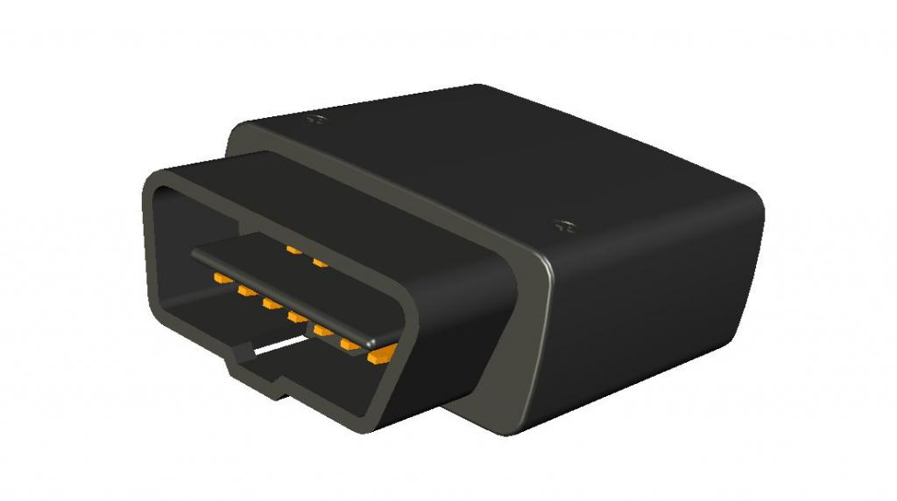

# Ulbotech - T381

El T381 es un rastreador GPS OBDII compacto plug and play de Ulbotech. Construido alrededor de un módem 4G LTE y un módulo GNSS interno u‑blox, el dispositivo ofrece reportes de ubicación en tiempo real, telemetría del vehículo y una salida para inmovilizador para control antirrobo. Su compatibilidad con OBDII y SAE J1939 permite acceder a parámetros del motor y códigos de diagnóstico (DTC) para la supervisión de flotas y el mantenimiento preventivo, mientras que su hotspot Wi‑Fi integrado y el puenteo Wi‑Fi ayudan a reducir el uso de datos celulares en dispositivos dentro de la cabina.

Como dispositivo compatible con Plaspy, el T381 puede transmitir ubicación, parámetros OBD y datos de eventos del conductor directamente a Plaspy para monitoreo en vivo, alertas e informes históricos. Esa compatibilidad lo hace adecuado para implementaciones rápidas en flotas mixtas donde se requiere visibilidad inmediata de la posición, el estado del motor y controles básicos de seguridad. Los usuarios de Plaspy pueden agregar los datos del T381 junto con otros dispositivos para apoyar enrutamiento, planificación de mantenimiento y supervisión operativa.

## Características principales

- Factor de forma OBDII plug and play para incorporación rápida de vehículos y acceso inmediato a la telemetría.
- Seguimiento GNSS en tiempo real con conectividad celular para reportar posición y movimiento a Plaspy.
- Telemetría completa OBDII y SAE J1939, incluyendo RPM, velocidad, temperatura del refrigerante, nivel de combustible, consumo y códigos DTC para diagnóstico e informes.
- Hotspot Wi‑Fi y puenteo integrados para reducir el uso de datos celulares en terminales y dispositivos dentro de la cabina.
- Salida de inmovilizador integrada que permite el corte remoto del motor desde la plataforma de la flota.
- Batería interna de respaldo y diseño compacto para mantener el reporte durante breves interrupciones de energía.

## Cómo funciona con Plaspy

Cuando se utiliza con Plaspy, el T381 actúa como un endpoint telemático que envía ubicación y diagnósticos del vehículo al panel de Plaspy para visibilidad en tiempo real y análisis histórico. Los datos de la interfaz OBD y del receptor GNSS alimentan las funciones de Plaspy para monitoreo, alertas e informes, de modo que usted pueda gestionar los vehículos desde una sola plataforma.

- Actualizaciones de ubicación en vivo y historial de movimiento visibles en Plaspy para enrutamiento y seguimiento.
- Entrega automática de diagnósticos del motor y alertas de DTC para soportar flujos de trabajo de mantenimiento.
- Reportes de nivel de combustible y consumo disponibles para análisis de eficiencia y control de costos.
- Control remoto de la salida de inmovilizador a través de Plaspy para procedimientos de seguridad y recuperación.
- Informes de comportamiento del conductor y eventos de seguridad entregados como eventos para coaching y cumplimiento.
- Reducción del uso de datos celulares para dispositivos dentro de la cabina mediante el hotspot y el puenteo Wi‑Fi del T381, manteniendo la conectividad con Plaspy.

## Casos de uso típicos

- Gestión de flotas y seguimiento de la utilización para flotas de vehículos pequeñas y medianas.
- Flujos de trabajo antirrobo que combinan reporte de ubicación con inmovilización remota.
- Monitoreo de combustible y análisis de consumo para identificar ineficiencias y reducir costos.
- Flotas de alquiler y aseguradoras que requieren diagnóstico en tiempo real e información sobre el comportamiento de conducción.
- Diagnóstico en ruta y despacho de servicio más rápido usando DTC y reportes de estado del vehículo.

## Por qué elegir este rastreador con Plaspy

El T381 combina telemetría útil a nivel vehicular con un modelo de despliegue sencillo, lo que lo convierte en una opción práctica para operadores que desean datos del motor y reportes de posición sin instalaciones complejas. Su combinación de visibilidad OBDII, precisión GNSS y puenteo Wi‑Fi cubre diversas necesidades operativas, desde enrutamiento hasta mantenimiento preventivo, permitiendo que Plaspy consolide los datos y los presente en paneles accionables.

Para saber más sobre Plaspy y cómo se usan los dispositivos compatibles en el rastreo de flotas visite https://www.plaspy.com. Las especificaciones del producto y su disponibilidad pueden cambiar con el tiempo, por lo que le recomendamos verificar los detalles técnicos actuales y la información de soporte en el sitio del fabricante http://www.ulbotech.com/ antes de tomar decisiones de compra o despliegue.
