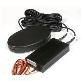

# V-SUN - TLT-1B

El rastreador GPS V-SUN TLT-1B es una excelente opción para aquellos que buscan un dispositivo confiable y eficiente para rastrear vehículos de logística, empresas, instituciones y vehículos de agentes policiales. Este rastreador GPS permite obtener información precisa sobre la posición del vehículo a través de mensajes de texto SMS o mediante la visualización del recorrido en Internet.

Con el rastreador GPS TLT-1B de V-SUN, podrás tener un control total sobre tus vehículos, lo que te permitirá mejorar la eficiencia operativa, optimizar las rutas y garantizar la seguridad de tus activos. Además, este dispositivo cuenta con una interfaz amigable y fácil de usar, lo que facilita su configuración y uso.

Características destacadas:

- Rastreo en tiempo real: obtén información precisa sobre la ubicación de tus vehículos en tiempo real.
- Alertas de geovalla: recibe notificaciones instantáneas cuando tus vehículos ingresen o salgan de áreas predefinidas.
- Historial de recorridos: accede al historial de recorridos de tus vehículos para analizar patrones y mejorar la eficiencia.
- Alertas de velocidad: configura límites de velocidad y recibe alertas cuando tus vehículos excedan esos límites.
- Instalación sencilla: el rastreador GPS TLT-1B de V-SUN se puede instalar fácilmente en cualquier vehículo.

