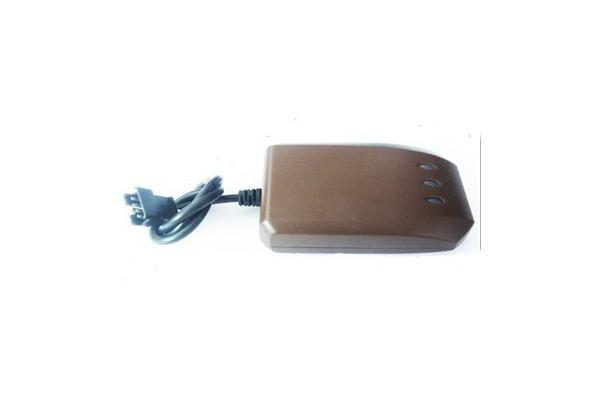

# V-SUN - TLT-2K

El V-SUN TLT-2K es un dispositivo compacto de posicionamiento para vehículos que integra posicionamiento GPS y conectividad GSM GPRS para ofrecer información de ubicación en tiempo real. Puede reportar coordenadas de longitud y latitud, responder a consultas de ubicación por SMS y mostrar la posición en servicios de mapas populares para un seguimiento visual sencillo. El equipo también incorpora funciones habituales en monitoreo vehicular, como posiciones con sello de tiempo, seguimiento de la trayectoria en movimiento, subida de datos históricos y alarma por exceso de velocidad.

Como dispositivo compatible con Plaspy, el TLT-2K puede enviar su información de ubicación y eventos a Plaspy para una monitorización y generación de informes centralizados. Su capacidad de consulta por SMS, herramientas de monitoreo remoto y función de carga histórica lo convierten en una opción práctica para clientes que desean integrar una unidad de posicionamiento simple a Plaspy para visibilidad en vivo, revisión de rutas y supervisión operativa sin requerir hardware adicional altamente especializado.

## Aspectos clave

- Posicionamiento vehicular en tiempo real mediante GPS y conectividad GSM GPRS para el reporte
- Soporte de consultas por SMS para solicitar coordenadas actuales bajo demanda
- Visualización en plataformas de mapas comunes para un seguimiento visual sencillo
- Monitoreo remoto y señal de ayuda activa para situaciones que requieran atención
- Alarma de velocidad para notificar cuando se superan umbrales preestablecidos
- Subida de datos históricos y seguimiento de la trayectoria para analizar rutas

## Cómo funciona con Plaspy

El TLT-2K puede integrarse con Plaspy para centralizar la información de ubicación y movimiento en un único entorno de gestión de flotas. Plaspy puede mostrar posiciones en vivo, visualizar rutas pasadas y generar alertas basadas en los reportes del dispositivo para apoyar la supervisión rutinaria de la flota y la toma de decisiones operativas.

- Mostrar la ubicación en vivo en los mapas de Plaspy para conciencia situacional inmediata
- Almacenar y reproducir trayectos históricos subidos desde el dispositivo para análisis de rutas
- Generar alertas y notificaciones en Plaspy por eventos de velocidad y señales de ayuda activa
- Usar respuestas de ubicación por SMS junto con los datos de la plataforma para confirmar la posición cuando sea necesario
- Agregar múltiples unidades TLT-2K en Plaspy para un monitoreo y reporte consolidados de la flota

## Casos de uso típicos

- Seguimiento en tiempo real de autos, motocicletas y vehículos eléctricos
- Verificación de puntos fijos y comprobaciones periódicas de ubicación en flotas gestionadas
- Monitoreo remoto para seguridad y supervisión de vehículos de campo
- Control de velocidad y concientización sobre el comportamiento del conductor mediante alarmas de velocidad
- Revisión de rutas históricas para análisis operativo y conservación de registros

## Por qué elegir este rastreador con Plaspy

El V-SUN TLT-2K es una opción práctica para organizaciones que requieren reportes de ubicación fiables con capacidades simples de consulta por SMS y soporte para visualización en mapas. Es ideal en despliegues donde el posicionamiento directo, el monitoreo remoto y la revisión de rutas históricas son las principales necesidades. Al combinarlo con Plaspy, el dispositivo permite a los equipos centralizar los datos de ubicación y transformar los reportes de posición en información accionable para operaciones de flota.

Si desea saber más sobre cómo Plaspy puede trabajar con dispositivos como el TLT-2K, visite https://www.plaspy.com para explorar las funciones y capacidades de la plataforma. Las especificaciones del producto, la disponibilidad y los detalles del fabricante pueden cambiar con el tiempo, por lo que le recomendamos verificar las especificaciones actuales y la documentación oficial del fabricante en http://www.v-sun.cc/.
