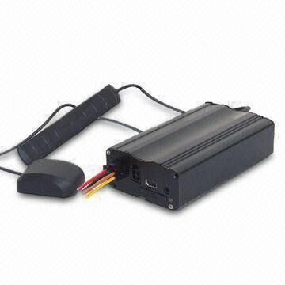

# V-SUN - TLT-6C

El V-SUN TLT-6C es un terminal compacto de posicionamiento vehicular que combina posicionamiento global por GPS con tecnología de posicionamiento móvil. Su antena en modo dual integrada y sus componentes de grado industrial están pensados para mantener una visibilidad precisa y en tiempo real de los vehículos tanto en espacios abiertos como en ubicaciones más complejas, como edificios altos o estacionamientos subterráneos. El equipo se describe como robusto, discreto y adecuado para diversos tipos de vehículos, lo que lo hace una opción práctica para operadores de flotas y proveedores de servicios.

Como dispositivo compatible con Plaspy, el TLT-6C puede enviar información de posición y estado a Plaspy para su monitoreo y administración centralizada. Su diseño y conjunto de funciones lo convierten en una opción natural para los flujos de trabajo de visibilidad de flotas en Plaspy, permitiendo a usted combinar la fiabilidad a nivel de dispositivo del TLT-6C con las herramientas de informes, mapas y supervisión operativa de Plaspy.

## Aspectos principales

- Antena en modo dual que combina posicionamiento GPS global y posicionamiento móvil para una mejor cobertura
- Módulos GPS y CDMA de grado industrial para un rendimiento robusto en campo
- Factor de forma compacto y discreto, adecuado para múltiples tipos de instalación en vehículos
- Diseñado para ofrecer visibilidad vehicular en tiempo real confiable en áreas abiertas y entornos densos o subterráneos
- Opción práctica para servicios de taxi, autobuses, transporte de larga distancia y flotas especiales
- Construido para operación continua con énfasis en bajo consumo de energía y construcción duradera

## Cómo funciona con Plaspy

Cuando se conecta a Plaspy, el TLT-6C proporciona actualizaciones de ubicación e información de estado que Plaspy muestra en mapas, líneas de tiempo e informes. Plaspy ingiere los datos del dispositivo para ofrecer a los gestores de flota una visión operativa y el contexto histórico de los movimientos vehiculares.

- Ubicación en vivo e historial de posiciones mostrado en el panel de Plaspy para monitoreo y análisis
- Alertas y notificaciones en Plaspy basadas en movimiento, cambios de ubicación u otras condiciones de evento que soporte el dispositivo
- Informes a nivel de flota y resúmenes de viajes exportables utilizando los datos de posición del TLT-6C
- Supervisión geográfica para despacho y programación mediante las herramientas de mapas de Plaspy
- Gestión centralizada de dispositivos y visibilidad para flotas mixtas desde Plaspy

## Casos de uso típicos

- Seguimiento y visibilidad para flotas de taxis y despacho
- Monitoreo de rutas de autobuses y supervisión de programación
- Rastreo de vehículos de transporte de larga distancia para coordinación operativa
- Flotas especiales que requieren hardware de posicionamiento discreto y confiable
- Prevención y recuperación en caso de robo de vehículos

## Por qué elegir este rastreador con Plaspy

El TLT-6C es una elección pragmática para organizaciones que necesitan un terminal de rastreo compacto y resistente con posicionamiento en modo dual para mejorar la recepción en entornos difíciles. Combinado con Plaspy, el dispositivo entrega la información esencial de posición y estado que usted necesita para enrutamiento, despacho y supervisión sin complejidades innecesarias.

Usted encontrará el TLT-6C especialmente útil cuando se requiere una unidad discreta y robusta para distintos tipos de vehículos y condiciones de operación. El enfoque del dispositivo en posicionamiento confiable y su adecuación a diferentes tipos de vehículos se alinean con los flujos de trabajo de Plaspy para monitoreo de flotas, alertas e informes, ayudando a mantener la visibilidad y el control de las operaciones.

Para saber más sobre cómo Plaspy puede trabajar con rastreadores compatibles como el V-SUN TLT-6C visite https://www.plaspy.com. Las especificaciones del producto, la disponibilidad y los datos del fabricante pueden cambiar con el tiempo, por lo que le recomendamos verificar las especificaciones actuales con el fabricante en http://www.v-sun.cc/ antes de tomar decisiones de compra.

