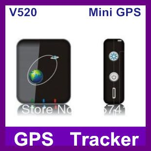

# V-SUN - V-520

El V-SUN V-520 es un rastreador GPS portátil que combina posicionamiento satelital con conectividad GSM GPRS para ofrecer reportes de latitud y longitud en tiempo real. Puede enviar actualizaciones de posición vía SMS y subir los datos de ubicación a un servidor especificado para visualización en línea. Diseñado para la movilidad, el V-520 es un dispositivo compacto y de bajo consumo apropiado para monitorizar personas, bienes y animales, e incluye una función SOS para notificaciones urgentes.

Como dispositivo compatible con Plaspy, el V-520 puede integrarse en una plataforma de seguimiento centralizada para mostrar ubicaciones en vivo y el historial de movimientos sobre mapas digitales. Plaspy puede recibir los datos que el rastreador sube a un endpoint soportado por la plataforma, permitiendo a las organizaciones consolidar las transmisiones del V-520 junto con otros dispositivos para obtener visibilidad unificada, alertas y reportes. Esto hace del V-520 una opción práctica para quienes buscan seguimiento portátil combinado con las capacidades de monitoreo de Plaspy.

## Características principales

- Factor de forma portátil y compacto, adecuado para seguimiento personal y de activos  
- Posicionamiento preciso, diseñado para funcionar incluso en zonas con menor visibilidad satelital  
- Comunicación dual mediante mensajes SMS y cargas por GPRS a servidor  
- Función de emergencia SOS para atención inmediata cuando se requiera  
- Compatibilidad con bandas GSM globales para uso en diversas regiones  
- Bajo consumo energético con diseño electrónico confiable para uso continuo

## Cómo funciona con Plaspy

Cuando se utiliza con Plaspy, el V-SUN V-520 genera reportes de posición que Plaspy puede mostrar, registrar y emplear en flujos operativos. Plaspy ingiere los datos de ubicación subidos y los presenta junto con otra información de flota o dispositivos para supervisión y toma de decisiones.

- Visualización de ubicación en tiempo real en los mapas de Plaspy para monitoreo y despacho  
- Reproducción de rutas históricas y registro de posiciones para análisis y auditoría  
- Manejo de alertas y notificaciones para eventos SOS y condiciones configurables  
- Reportes consolidados que facilitan la revisión de la actividad y patrones de movimiento del dispositivo  
- Actualizaciones por SMS que pueden servir como canal de respaldo cuando no estén disponibles las cargas al servidor

## Casos de uso típicos

- Cuidado de adultos mayores o niños mediante rastreo portátil fácil de llevar  
- Protección de bienes portátiles y equipo personal durante traslados o almacenamiento  
- Seguimiento de animales o fauna cuando se requieren rastreadores compactos  
- Monitoreo de activos temporales o de corto plazo sin necesidad de instalación fija  
- Conciencia de ubicación de personal de campo para pequeños equipos o trabajadores móviles

## Por qué elegir este rastreador con Plaspy

El V-SUN V-520 une un dispositivo de rastreo portátil y sencillo con monitoreo en la nube a través de plataformas como Plaspy. Su combinación de mensajes SMS y cargas por GPRS lo hace adaptable para usuarios que requieren tanto comunicación directa con el dispositivo como registro centralizado en servidor. Para operadores que desean incorporar rastreadores personales o de activos compactos en una implementación existente de Plaspy, el V-520 ofrece una forma simple de ampliar la visibilidad sin añadir requisitos de hardware complejos.

Si necesita información más detallada sobre la integración del V-SUN V-520 con Plaspy o cómo encaja en su configuración de seguimiento, obtenga más detalles sobre Plaspy en el sitio principal https://www.plaspy.com. Las especificaciones del producto, la disponibilidad y los datos del fabricante pueden cambiar con el tiempo, por lo que le recomendamos verificar las especificaciones actuales en el sitio oficial del fabricante http://www.v-sun.cc/.
