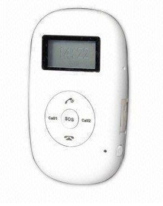

# V-SUN - V-690

El V-SUN V-690 es un rastreador GPS compacto y versátil pensado para posicionamiento, monitoreo, protección y respuesta ante emergencias. Combina seguimiento de ubicación con funciones de seguridad orientadas al usuario, como un botón SOS y teclas de alarma dedicadas, lo que lo hace adecuado para protección personal y vigilancia ligera en campo. El dispositivo admite modos de rastreo continuo y periódico, geocercas y reproducción de rutas históricas para revisar desplazamientos anteriores.

Como dispositivo compatible con Plaspy, el V-690 puede enviar actualizaciones de ubicación y eventos de alarma al entorno de supervisión de flotas y personal de Plaspy. Esta compatibilidad facilita a organizaciones y cuidadores centralizar la visibilidad y las alertas dentro de Plaspy, manteniendo al mismo tiempo las funciones integradas de SOS y alarma del equipo. Con Plaspy, los datos del V-690 se integran en flujos de monitoreo y generación de informes para la supervisión operativa.

## Principales características

- Diseñado para posicionamiento y monitoreo, con soporte para modos de rastreo continuo y discreto
- Botón SOS dedicado para señalización rápida de emergencias hacia un centro de control
- Cuatro botones de marcación rápida/alarma para contacto o alerta inmediata
- Soporte de geocercas para recibir notificaciones al cruzar límites establecidos
- Registro de trayecto y reproducción histórica para revisar rutas y auditorías
- Opciones de monitoreo activo y pasivo, incluyendo consultas directas de ubicación por mensaje

## Cómo funciona con Plaspy

Al integrarlo con Plaspy, el V-SUN V-690 entrega actualizaciones de ubicación y eventos de alarma que Plaspy presenta en mapas, reportes y flujos de alertas. Plaspy consolida la información del dispositivo para que usted, como responsable de flota, cuidador o equipo operativo, pueda monitorear el estado y responder a incidentes desde una única plataforma.

- Visibilidad de ubicación en tiempo real en los mapas de Plaspy para monitoreo inmediato
- Gestión de geocercas y enrutamiento de alertas para notificar a supervisores cuando se cruzan límites
- Manejo de eventos SOS y alarmas para destacar señales urgentes en los paneles de Plaspy
- Reproducción de trayectos históricos e informes para analizar movimientos pasados y comportamientos
- Soporte para flujos de trabajo de monitoreo activo y pasivo: consultas de ubicación bajo demanda o actualizaciones periódicas
- Configuración centralizada de alertas y notificaciones para supervisión operativa

## Casos de uso típicos

- Monitoreo de seguridad personal para niños, personas mayores o personas vulnerables
- Rastreo de trabajadores aislados o personal de campo donde las alertas SOS y la visibilidad de ubicación son críticas
- Supervisión de pequeñas flotas o personal móvil que requiere geocercas y revisión de rutas
- Uso por parte de cuidadores o tutores que necesitan consultas de ubicación directas y botones de alarma sencillos
- Empresas que requieren reproducción histórica clara para verificación de rutas

## Por qué elegir este rastreador con Plaspy

El V-690 combina funciones de seguridad prácticas con capacidades de rastreo sencillas, lo que lo convierte en una opción sensata para organizaciones y cuidadores que necesitan visibilidad de ubicación fiable sin una gestión de dispositivo compleja. Sus botones SOS y de alarma ofrecen señalización inmediata que se integra perfectamente en los flujos de alerta y monitoreo de Plaspy, mientras que la reproducción de trayectos históricos respalda las necesidades de revisión e informes.

Usted debería considerar el V-690 cuando busque un rastreador fácil de operar que complemente las funciones centralizadas de monitoreo y reporte de Plaspy. Al ofrecer modos de monitoreo activo y pasivo junto con geocercas y reproducción, encaja en escenarios donde la seguridad de las personas y la supervisión operativa simple son prioritarias.

Para obtener más información sobre cómo Plaspy funciona con dispositivos como el V-690, visite https://www.plaspy.com. Las especificaciones y la disponibilidad del producto pueden cambiar con el tiempo, por lo que le recomendamos verificar los detalles actuales y la documentación oficial del fabricante en http://www.v-sun.cc/.
