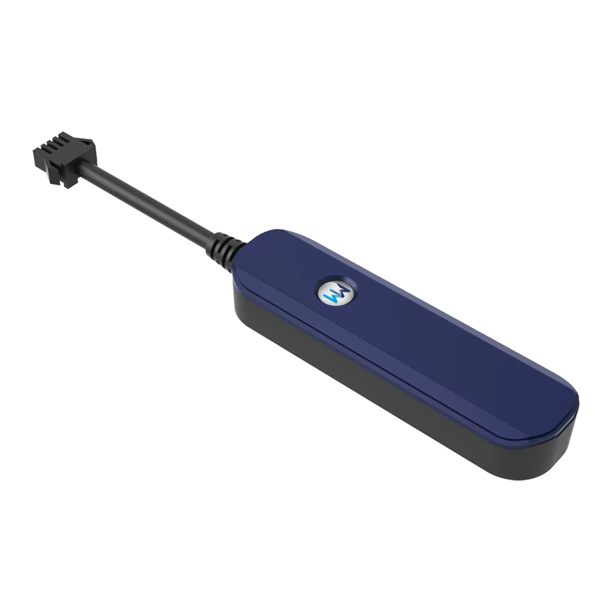

# WanWay - G18

El WanWay G18 es un rastreador GPS delgado y compatible con Plaspy, pensado para equipos de gestión de vehículos y flotas que requieren un hardware compacto con funciones telemáticas prácticas. Integra posicionamiento GPS, conectividad GSM 2G, antena integrada y varios sensores a bordo para ofrecer seguimiento en tiempo real, alertas de comportamiento de conductor, detección de manipulación y reportes de colisiones en una carcasa discreta. El G18 está orientado a operaciones diarias de flotas y programas Usage Based Insurance (UBI) donde la instalación discreta y la notificación de eventos esenciales son prioridades.

Como dispositivo compatible con Plaspy, el G18 envía posiciones y paquetes de eventos a la plataforma Plaspy para mapeo, alertas e informes. Al integrarse con Plaspy, las alarmas de manipulación y vibración, los reportes de colisiones y las funciones de inmovilizador remoto del rastreador se muestran como eventos y controles dentro del flujo de trabajo de Plaspy, ayudando a mejorar rutas, cumplimiento y visibilidad operativa sin añadir complejidad innecesaria.

## Aspectos destacados

- Rastreador GPS compatible con Plaspy para monitoreo de flotas en tiempo real y visibilidad en paneles de control.
- Monitoreo de conducta del conductor con alertas por aceleraciones bruscas, frenadas intensas, giros cerrados y reportes de colisión, útil para programas de seguridad y UBI.
- Alarmas de manipulación y vibración para detectar accesos no autorizados o impactos significativos.
- Capacidad de corte remoto de combustible o electricidad (inmovilizador remoto) para apoyar flujos de trabajo antirobo.
- Factor de forma delgado y compacto con antena integrada y sensor de luz para una instalación discreta en vehículos.
- Conectividad 2G económica y una pequeña batería de respaldo para reportes ante pérdida de energía.

## Cómo funciona con Plaspy

Integrar el G18 con Plaspy incorpora las actualizaciones de posición y las alertas de eventos del dispositivo en un único entorno de gestión de flotas donde los datos se normalizan, se muestran en mapas y se enrutan hacia reglas, notificaciones e informes.

- Flujo de ubicación en tiempo real y reproducción histórica para revisar rutas y analizar operaciones.
- Reenvío de eventos por manipulación, vibración y colisiones para que los operadores reciban notificaciones inmediatas.
- Eventos de comportamiento del conductor registrados y disponibles para puntuación, capacitación y flujos de trabajo UBI.
- Comandos de inmovilizador remoto iniciados desde Plaspy cuando la política operativa y el cableado del vehículo lo permiten.
- Informes consolidados y alertas basadas en reglas para soportar cumplimiento, planificación de mantenimiento y seguimiento de incidentes.

## Casos de uso típicos

- Anti robo y protección de activos en flotas mediante detección de manipulación e inmovilización remota.
- Programas de seguridad del conductor y despliegues UBI que dependen de eventos de comportamiento y reportes de colisiones.
- Flujos de respuesta a incidentes donde las alertas por vibración o colisión aceleran las labores de seguimiento.
- Rastreo discreto para flotas de alquiler, servicios de valet y vehículos de alto valor.
- Supervisión operativa de flotas pequeñas y medianas incluyendo rutas, utilización y telemetría básica.

## Por qué elegir este rastreador con Plaspy

El G18 es una opción pragmática para organizaciones que desean un rastreador compacto y compatible con Plaspy centrado en funciones telemáticas esenciales y antirobo. Su diseño prioriza la instalación discreta y la notificación de eventos básicos que las flotas suelen necesitar, manteniendo un perfil reducido y poco intrusivo. Para flotas que operan en zonas con cobertura 2G, el G18 ofrece entrega consistente de ubicación y eventos que se integra con los paneles y reglas de alerta de Plaspy.

Si su operación valora telemetría sencilla, alertas de manipulación y colisiones, y la posibilidad de combinar eventos del dispositivo con los flujos de trabajo de Plaspy, el G18 es una opción sensata para evaluar. Para conocer más sobre cómo Plaspy puede trabajar con dispositivos como el WanWay G18 visite https://www.plaspy.com. Las especificaciones del producto, disponibilidad y datos del fabricante pueden cambiar con el tiempo, por lo que le recomendamos verificar los detalles técnicos actuales en el sitio oficial de WanWay https://www.wanwaytech.net/.
